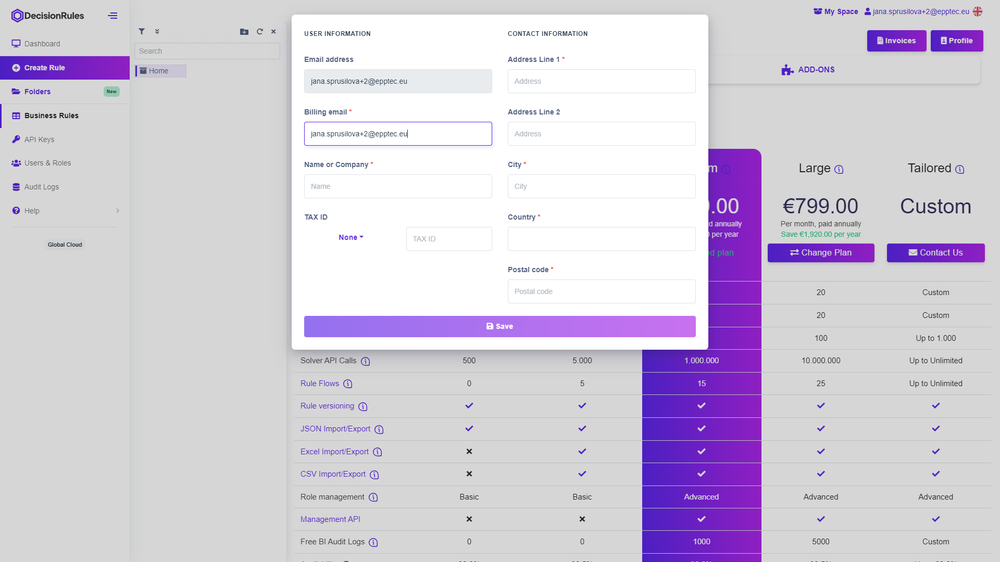

# Billing Information

To upgrade your plan to any other than Free/Tiny you need to enter some information such as:

* Billing email
* Name or Company
* Address
* City
* Country
* Postal code
* TAX ID

There are two ways to do so. First option is to fill out the billing information in your profile, the second one is to provide the information when changing to another plan.


_Some fields of the form are required or/and have a strict format._


## 1. Complete your profile

In order to fill out your billing information, you must first log into your account. At the top, click on your account and select "My Profile". Your profile page will appear. On the Billing Information tab, fill in your information and confirm your changes with the Save button.

<figure><figcaption>
<mark style="color:purple;">Complete you billing information</mark>
</figcaption></figure>

## 2. Provide the billing information when changing to a higher plan


_This option is for users who have not yet entered their billing information. Once you have completed your billing information, you will not need to enter it again if you change your plan._


In order to fill in your billing information, you must first log in to your account. At the top, click on your account and select "Plans". Page of available plans will appear. Select the plan you want to switch to. After confirming the plan change dialog, a window will appear to fill in your billing information. Confirm the completed information by clicking the Save button. After that you will be redirected to the payment gateway to change your plan.

<figure><figcaption></figcaption></figure>

<figure><figcaption></figcaption></figure>


_Some fields of the form are required or/and have a strict format._

