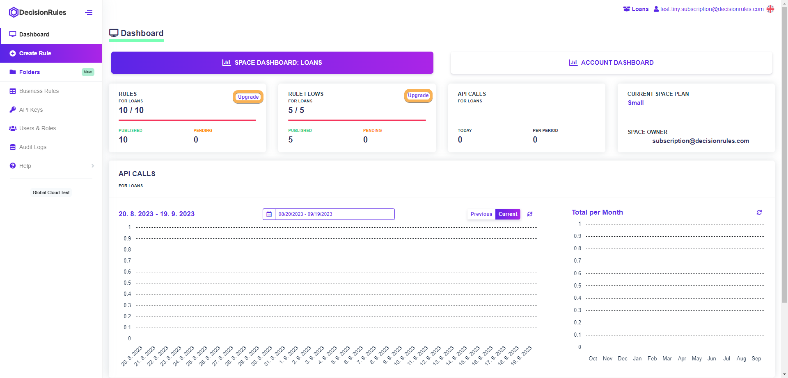
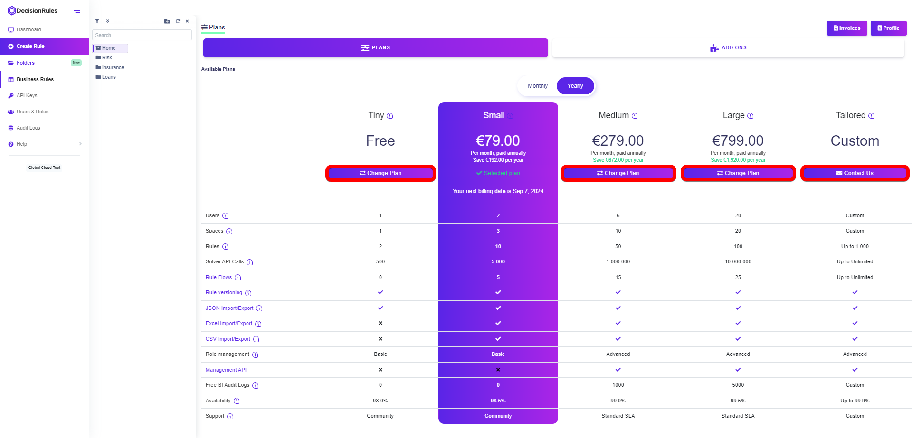

# How to change your subscription

## How to access your plan any time

To change your plan, you must first log into your account. At the top, click on your account and select "My Profile". Your profile page will appear. Click on the “Plans” button that will lead you to a page of available plans.

## How to change your subscription when the rule limit is reached

Running out of space? Clicking on the “Upgrade" button will redirect you to a page where you can easily choose from higher plans that will fit your business needs. If you choose the Medium or a higher plan, you will have access to Management API andREST API, that provide read/write access to your rules and spaces.

<figure><figcaption></figcaption></figure>


_Of course every business has its own needs, so do not hesitate to contact us for a tailored plan. You can simply click on the “Contact Us” button on a page of plans._


## Changing the plan

On the page of available plans you can see your actual plan and other plans with all permissions and limits. Choose a plan you want to change to and click on the “Change plan” button.

<figure><figcaption></figcaption></figure>

Within the paygate fill out your payment details and click the “Subscribe” button.

<figure><figcaption></figcaption></figure>

After a successful payment you will be redirected back to the plan page. Now your plan has been changed and a new invoice was created. Click the “Invoices” button to see all your invoices.


_When a plan is changed to a higher plan, the higher plan takes effect immediately. If the plan is changed to a lower plan, the lower plan will not take effect until the next billing period._

