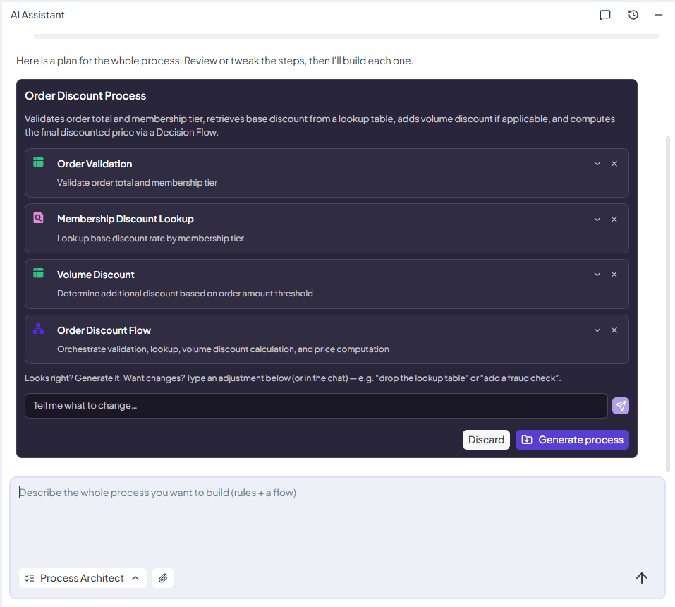

# Process Architect

Turn your business requirements into a connected set of rules and a Decision Flow with AI Assistant.



## What Can Process Architect Help You With?

A business process often involves several decisions. For example, evaluating a loan application may require checking eligibility, assessing risk, selecting an interest rate, and combining the results into a final decision.

**Process Architect helps you build these parts together.** Describe what the process should achieve, and it proposes the rules you need and how they should connect. After you review the plan, it can generate Decision Tables, Lookup Tables, Scripting Rules, and Decision Flows.

The result is a folder containing standard DecisionRules resources. You can open, inspect, test, and maintain them using the editors you already know.

## When Should You Use It?

Use Process Architect when you need several rules and a workflow that connects them. It is useful when starting a new process and you know the business requirements but need help translating them into a working rule structure.

If you only need one Decision Table, Lookup Table, or Scripting Rule, use the corresponding specialized agent. If your rules already exist and you want to connect them into one workflow, use **Decision Flow Architect**.

## Try It: Build an Order Discount Process

Imagine you want to calculate discounts based on customer membership and order value. The process must check the order, find the applicable discount, and return the final price.

Open **AI Assistant** from the **Rules List**, select **Process Architect**, and describe your requirements:

> Build an order discount process.
>
> Inputs: orderTotal as a number and membership as a string.
>
> Orders with orderTotal less than or equal to zero are invalid. Accepted memberships are Standard and Premium. Any other membership is invalid.
>
> Use a Lookup Table for membership discounts: Standard gets 0% and Premium gets 10%. Orders of 200 or more receive an additional 5 percentage points. Apply the combined discount to the order total.
>
> Return status, discountPercent, finalPrice, and reason. For invalid orders, return status Invalid, discountPercent 0, finalPrice 0, and a reason explaining the problem.
>
> Create the rules and a main Decision Flow that connects them.

Clear thresholds, calculations, and expected outputs help the Architect prepare a useful plan. If a required business decision is missing, it may ask you to clarify it.

## Review the Plan Before Generating

The Architect first proposes a plan. Each step explains the resource type, its purpose, and its dependencies.

Check that the plan covers your requirements and that the steps receive and return the right data. You can rename steps, edit their purpose, remove unnecessary steps, or request changes in the chat.

<figure><figcaption>
Review the proposed Order Discount Process, including order validation, membership discount lookup, volume discount, and the Decision Flow connecting them. Adjust the plan before selecting <strong>Generate process</strong>.
</figcaption></figure>

The plan may also offer compatible existing rules from your space. Reuse is your choice: review the exact rule version and its behavior before selecting it.

## Generate and Import Your Process

Once you are satisfied with the plan, select **Generate process**. The Architect generates the rules and then the Decision Flows that connect them.

If it needs more information during generation, answer the question and select **Continue generation**.

**Generation prepares a proposal. It does not add the resources to your space.** Review the completed result and select **Import process** to create the folder and its resources.

## Test the Result

After import, open the generated rules and Decision Flow and verify their logic and mappings.

For the example above, try these scenarios:

| Order Total | Membership | Expected Result                      |
| ----------- | ---------- | ------------------------------------ |
| 100         | Standard   | Valid, 0% discount, final price 100  |
| 100         | Premium    | Valid, 10% discount, final price 90  |
| 200         | Premium    | Valid, 15% discount, final price 170 |
| 0           | Standard   | Invalid, with a reason               |
| 100         | Unknown    | Invalid, with a reason               |

Test boundary values and invalid inputs as well as typical orders before publishing.

Process Architect helps turn your requirements into an initial implementation. Your review and tests confirm that the result follows your business policy.

_For additional options and troubleshooting, see_ [_Process Architect in the documentation_](https://docs.decisionrules.io/doc/ai-assistant/ai-assistant-features/design-and-build-a-complete-process)_._
