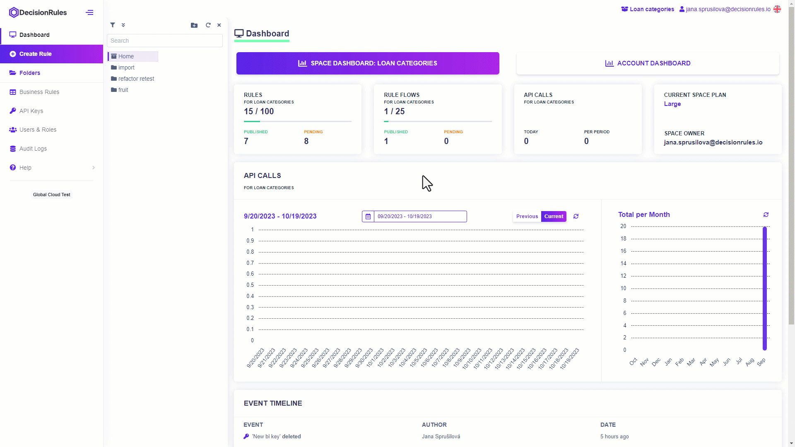
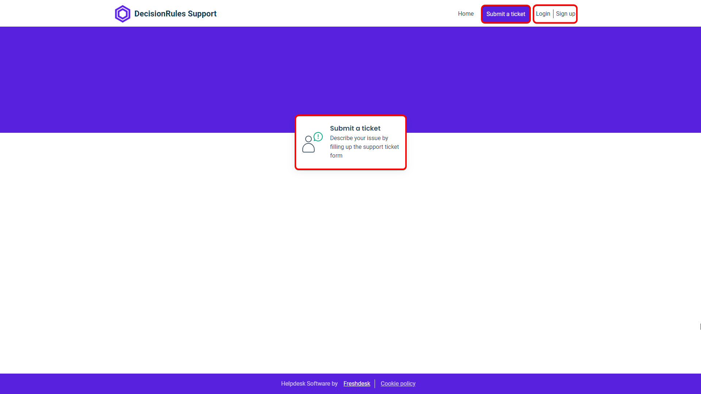

# How to Create a Support Ticket

Something went wrong? Let us know. You can submit a ticket through our support portal. Simply fill out the form detailing the issue.

## How do I get to the support site?

The link can be found in the left side bar menu. In the Help section, click on Service Desk and you will be redirected to the [<mark style="color:purple;">support site</mark>](https://support.decisionrules.io/support/home).

<figure><figcaption></figcaption></figure>

## Submit a ticket

To submit a ticket, click on the <mark style="background-color:purple;">Submit a ticket</mark> button in the top bar or in the middle of the page.

<figure><figcaption></figcaption></figure>

You will then be taken to a form page where you fill in all the details needed to describe your issue.

<figure><figcaption></figcaption></figure>


_Please keep in mind that the better you describe your work environment and the problem in detail, the easier it will be to locate the problem and eventually resolve the issue._


### Requester

Fill in your email address here where you want us to reply to you

### Subject

A brief title of what the problem concerns

### Priority

We take all reported problems seriously. However, some may be less serious than others. Please consider the priority of the problem and set it in the form.

### Deployment Model & App Version

These fields are not required, but may make it easier to solve the problem. Please specify the version if you are using our Docker Containers.

### Description

This field should include a detailed description of your problem. Be as specific as you can. Describe the environment and the area (of our application) where the problem occurred. You can take the following problem description as an example.

> _I am writing to request assistance with a technical issue I've encountered while attempting to import a JSON file into my application._
>
>
>
> 1. _I initially exported the JSON file, "InsuranceGroup.json," from another space ("Risk evaluator Space"), where it was generated and needed for my current project on target space ("Insurance Space")._&#x20;
> 2. _Upon trying to import the file into my target space, I have followed the standard procedures for importing JSON files - import in Folders._
> 3. _Unfortunately, I have repeatedly encountered an error message that prevents me from completing the import process._
> 4. _I tried importing the file using import in Business Rules as well with the same result._
>
>
>
> _To provide you with a better understanding of the problem, I have attached the following to this support ticket:_
>
> _**Plan:** Medium_
>
> _**My role:** Editor_
>
> _**Screenshots:** I have included screenshots of the error messages that appear during the import process._
>
>
>
> _JSON File: The file "InsuranceGroup.json" is also attached to this ticket, allowing you to examine its contents directly._
>
>
>
> _If there are any additional details or diagnostic information you require to assist me in resolving this issue, please let me know. I look forward to your response._

### Attachments

Include files such as screenshots and gifs. If you have a problem with one of your decision rules, export it and attach it as well.


_Cumulative file size cannot exceed 20 MB._


### Ticket submitted

Once you submit a ticket, our support team will receive it and begin analyzing your issue. You will be contacted by support no later than the next business day for further information or to resolve your issue.
