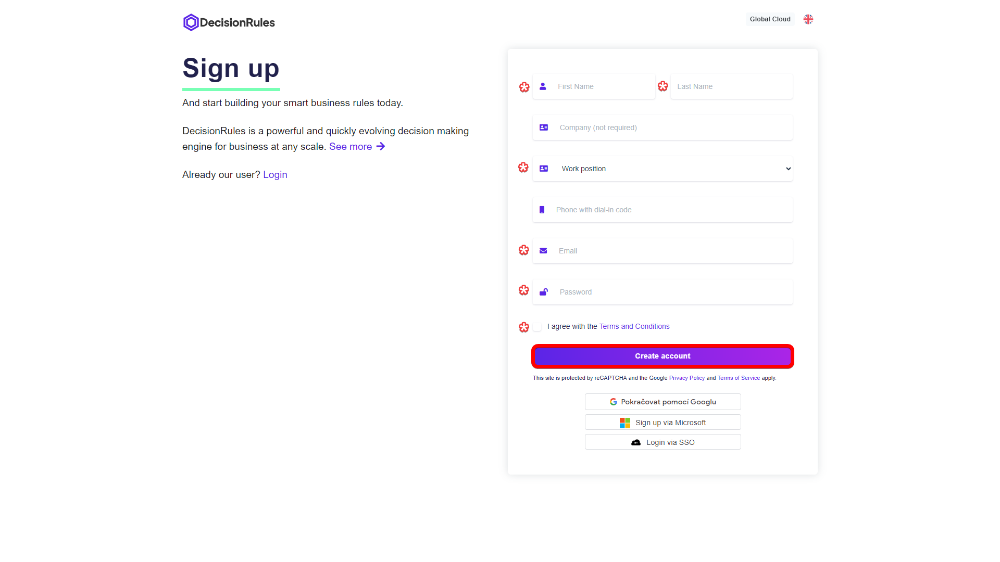
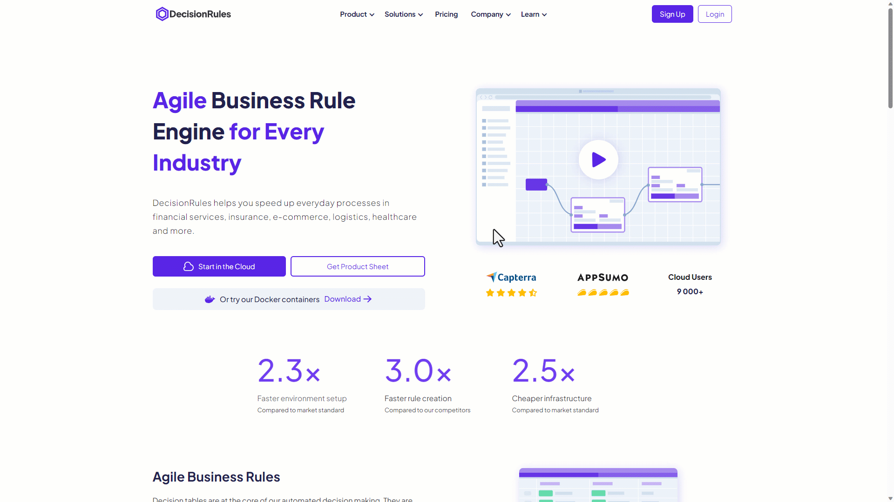
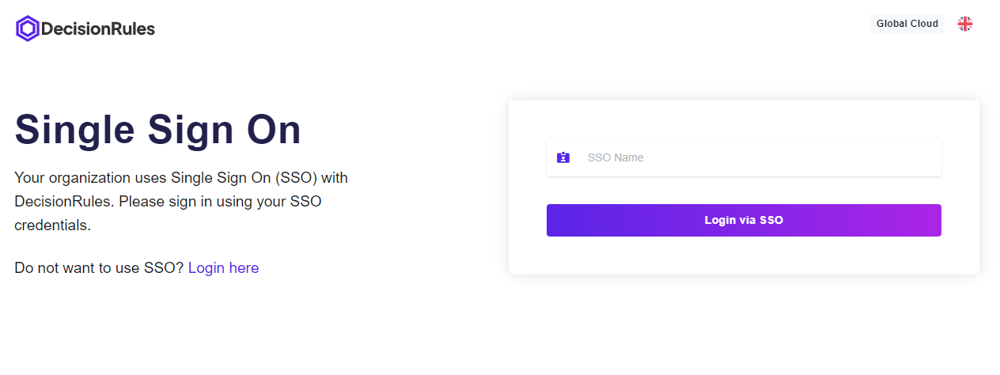
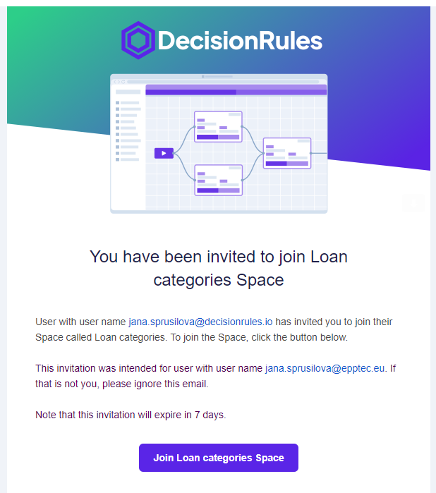

# Create an Account

To create business rules, save your work and invite other colleagues to your workspace, you need to create an account.

## Sign up with credentials

Go to the [<mark style="color:purple;">DecisionRules</mark>](https://www.decisionrules.io/) page. Click on the <mark style="background-color:purple;">**Sign Up**</mark> button at the top of the page. A form page will appear where you fill in all the required fields.&#x20;

<figure><figcaption>
<mark style="color:purple;">Sign up form</mark>
</figcaption></figure>

Then click on the <mark style="background-color:purple;">**Create account**</mark> button. You will be redirected to your new workspace and a welcome email will arrive in your inbox.

<figure><figcaption>
<mark style="color:purple;">Create a new account with email and password</mark>
</figcaption></figure>

## Creating new account using your Google or Microsoft SSO

Are you tired of inventing new logins? With one click, you can create an account on <mark style="color:purple;">DecisionRules</mark> with Google and Microsoft SSO. Go to the [<mark style="color:purple;">DecisionRules</mark>](https://www.decisionrules.io/) page. Click on the <mark style="background-color:purple;">**Sing Up**</mark> button at the top of the page. A form page will appear where Simply click the button  or .&#x20;

You will be redirected to Google or Microsoft login. After successfully logging in to your Google or Microsoft account, you'll be asked to grant permissions for application to access certain information. Review the permissions, and if you agree, click "Allow" or "Grant."

## Organization Single Sign-On

If your organization has the single sign-on (SSO) option enabled, you can use your corporate email for sign up. Go to the [<mark style="color:purple;">DecisionRules</mark>](https://www.decisionrules.io/) page. Click on the <mark style="background-color:purple;">**Sing Up**</mark> at the top of the page. A form page will appear where you click on the “Login via SSO” button and the SSO login page will show.

<figure><figcaption>
<mark style="color:purple;">Single Sign On</mark>
</figcaption></figure>

Type in your organization name and click “Login via SSO” button. You will be directed to the provider's login page to log in. After successful login you will be redirected to the Dashboard in <mark style="color:purple;">DecisionRules</mark>.


For detailed information about organization SSO please see our documentation [here](https://docs.decisionrules.io/doc/other/single-sign-on-sso).


<figure><figcaption>
<mark style="color:purple;">Single Sign On</mark>
</figcaption></figure>

#### _This part is for users that have been invited to someone’s space and do not have their account yet._

You received an invitation in your email inbox. In it you will find all the details about the invitation.

<figure><figcaption>
<mark style="color:purple;">Space Invitation in Your Inbox</mark>
</figcaption></figure>

<figure><figcaption>
<mark style="color:purple;">Invitation Email</mark>
</figcaption></figure>

Click on the <mark style="background-color:purple;">**Join Space**</mark> button. You will be redirected to create an account. Click "Create account" option. Fill in all the required fields and click  <mark style="background-color:purple;">**Create account**</mark>  button.
