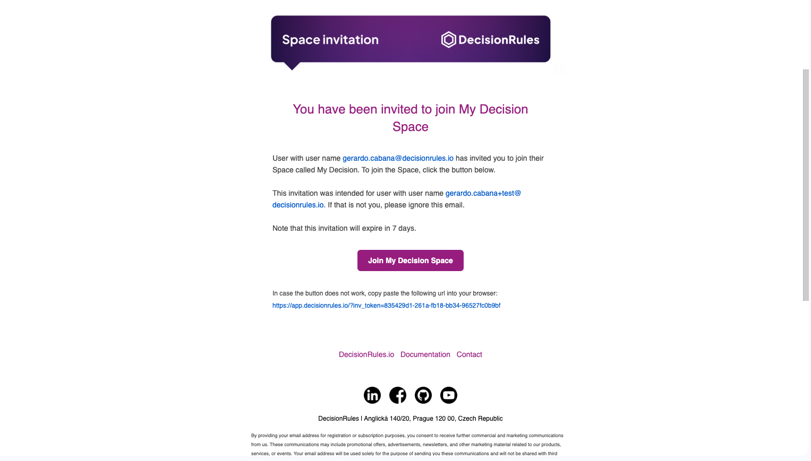

# Create an Account

To create business rules, save your work and invite other colleagues to your workspace, you need to create an account.

## Sign up with credentials

Go to the [<mark style="color:purple;">DecisionRules</mark>](https://www.decisionrules.io/) page. Click on the <mark style="background-color:purple;">**LOGIN**</mark> button at the top of the page. A login screen will appear. There, below the boxes for email and password you will find the "REGISTER ACCOUNT" link. You will be redirected to a register page where you can fill in all the required fields.&#x20;

<figure><figcaption>
<mark style="color:purple;">Sign up form</mark>
</figcaption></figure>

Then click on the <mark style="background-color:purple;">**REGISTER**</mark> button. You will be sent to your new workspace and a email verification will arrive in your inbox. Press the <mark style="background-color:purple;">**Verify email**</mark> button and set up your password.&#x20;

<figure><figcaption>
<mark style="color:purple;">Create a new account with email and password</mark>
</figcaption></figure>

## Creating new account using your Google or Microsoft SSO

Are you tired of inventing new logins? With one click, you can create an account on <mark style="color:purple;">DecisionRules</mark> with Google and Microsoft SSO. Go to the [<mark style="color:purple;">DecisionRules</mark>](https://www.decisionrules.io/) page. Click on the <mark style="background-color:purple;">**LOGIN**</mark> button at the top of the page. A login page will appear. Simply click the button <mark style="background-color:red;">SIGN IN WITH Google</mark> or <mark style="background-color:green;">SIGN IN WITH Microsoft</mark> to start the sign up.&#x20;

You will be redirected to Google or Microsoft login. After successfully logging in to your Google or Microsoft account, you'll be asked to grant permissions for application to access certain information. Review the permissions, and if you agree, click Allow or Grant.

## Organization Single Sign On

If your organization has the single sign-on (SSO) option enabled, you can use your corporate email for sign up. Go to the [<mark style="color:purple;">DecisionRules</mark>](https://www.decisionrules.io/) page. Click on the <mark style="background-color:purple;">**LOGIN**</mark> at the top of the page. A login page will appear where you click on the “SIGN IN WITH SSO” button and the Single Sign On page will show. Enter your organization's name and click “LOGIN VIA SSO” button.&#x20;

<figure><figcaption>
<mark style="color:purple;">Single Sign On</mark>
</figcaption></figure>

You will be directed to the provider's login page to log in. After successful login you will be redirected to the Dashboard in <mark style="color:purple;">DecisionRules</mark>.


For detailed information about organization SSO please see our documentation [here](https://docs.decisionrules.io/doc/other/single-sign-on-sso).


#### _This part is for users that have been invited to someone’s space and do not have their account yet._

You received an invitation in your email inbox. In it you will find all the details about the invitation.

<figure><figcaption>
<mark style="color:purple;">Space Invitation in Your Inbox</mark>
</figcaption></figure>

<figure><figcaption>
<mark style="color:purple;">Invitation Email</mark>
</figcaption></figure>

Click on the <mark style="background-color:purple;">**Join {name} Space**</mark> button. You will be redirected to create an account. Click "Create account" option. Fill in all the required fields and click  <mark style="background-color:purple;">**REGISTER**</mark>  button.
