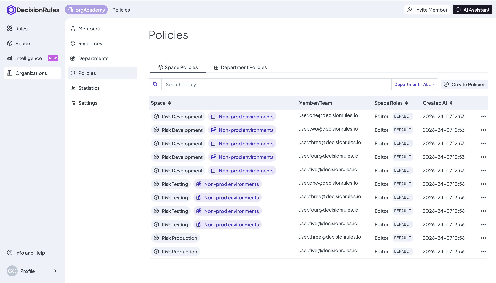
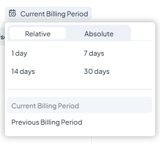
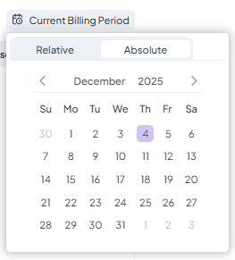
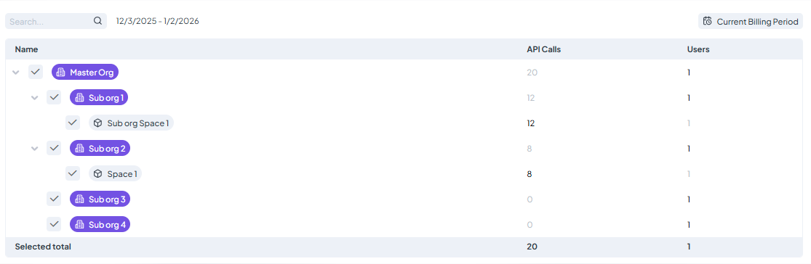

# Building an Organization Part 2

So far, the main structure of our _**orgAcademy**_ Organization has been created; it is already enough to start working and getting results. In the next three sections, we will look at a more complete management overview of our sample.

## Policies

#### Definitions

* **Policy:** A policy is a record of one role assigned to one member within a specific Scope (a Space or Department).
* **Assignments:** Based on this definition, assigning the same role to another member creates a new policy. Similarly, if you assign a new role to the same member in the same Space, you generate a new policy. In this way, policies keep a granular record of all role assignments across all Spaces.
* **Policy Types:** There are two types of policies:
  1. Space Policies
  2. Department Policies (Only for [Manager role](building-an-organization-part-1.md#four-organization-roles) assignments).


**Permission Logic:** In DecisionRules, permissions are **additive**. If a member is assigned two different roles within the same Space, the member will possess the combined permissions of both roles.


#### Construction

Click on **"Policies"** in the left-side menu. A new screen will open, and the list of all your policies will appear. This list has been populated automatically with each new Space creation.&#x20;

The utility of this section is to view the information of all members, their roles per Space, and their Space access in one single place.

<figure><figcaption></figcaption></figure>

Another advantage is the possibility to create policies directly from this section. We will show an example: We will create a policy for the next assignment.

> **ASSIGNMENT:** The **Trees Master role** to the **Devs Team** in the **Risk Production Space**.&#x20;

1. Navigate to the far right and click the top-corner button: <mark style="background-color:blue;">**+ Create Policies**</mark>.
2. In the settings module that appears, select the corresponding Space, Member(or Team), and Role.
3. Click **"Create"** and the process is complete.

<figure><figcaption></figcaption></figure>

## Statistics

The **Statistics** module provides a clear, high-level overview of your Organization’s activity, specifically focusing on API consumption metrics.

* **API Usage Dashboard:** Monitor the total volume of API calls made across the entire Organization. This data can be filtered and visualized according to your needs.
  * **Custom Time Intervals:** To view data for a specific date range, click the "Current Billing Period" button. By switching from **Relative** to **Absolute**, you can define a precise custom timeframe for your report.
  * **Granular Filtering:** You can refine your statistics to see exactly how individual Spaces are performing. Simply use the Space selector at the bottom of the dashboard to filter the records by your chosen work environments.

<figure><figcaption></figcaption></figure> <figure><figcaption></figcaption></figure>

<figure><figcaption></figcaption></figure>

By regularly monitoring these statistics, you can ensure your Organization remains within its limits and track the growth of your decision-making traffic.&#x20;

## Settings

#### Definitions

* **SSO (Single Sign-On):** A centralized authentication protocol that allows users to access DecisionRules using their corporate credentials. This enhances security and eliminates the need for users to manage individual platform accounts.&#x20;

#### Organizations Overview

The settings interface displays basic information about the Organization: Name and ID, subscription and billing details, configuration options for Single Sign-On (SSO), and the ability to delete the Organization.

In this introduction, we will simply explore how to modify the name and description.&#x20;

To finalize our setup for _**orgAcademy**_, let's update the Organization’s profile:

1. Navigate to the "Organization Info" tab.
2. Locate the details card (containing the Name and ID) and click the **Edit (pencil)** icon.
3. A configuration module will appear. Here, you can refine the Organization Name or add a professional description for your team.
4. Click "Update" to save your changes.

<figure><figcaption></figcaption></figure>


**Note:** While updating text fields is straightforward, other modules (like SSO or Billing) will require specific technical or financial data to complete.


***

## Conclusion

**Congratulations!** You have successfully built the foundation for _**orgAcademy**_. With your Members invited, Resources organized, and Policies defined, your environment is fully optimized. Your team is now ready to begin the rule-creation lifecycle.

In the next section, we will transition from Organization management to **Rule Features**, where the real decision logic begins.
