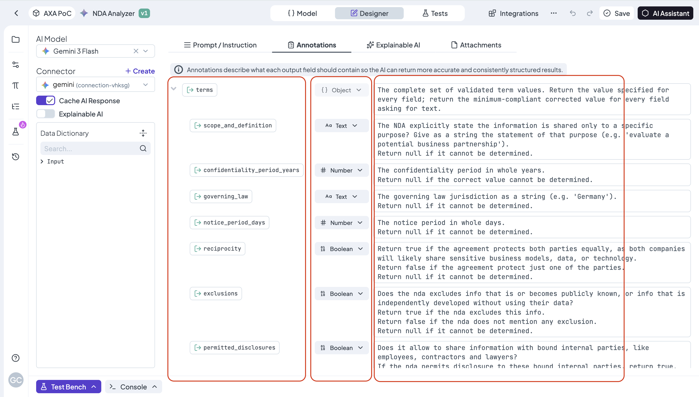
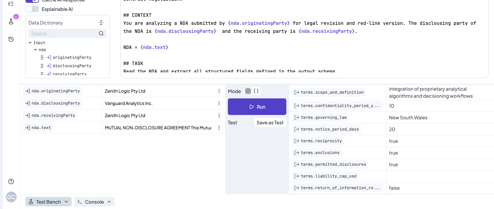
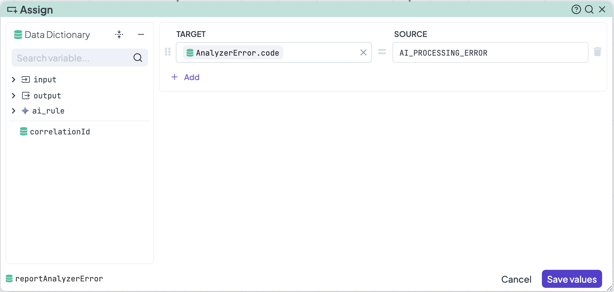
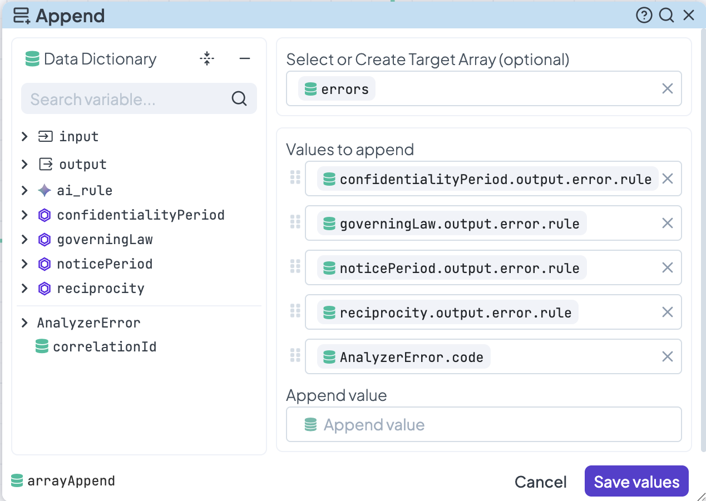
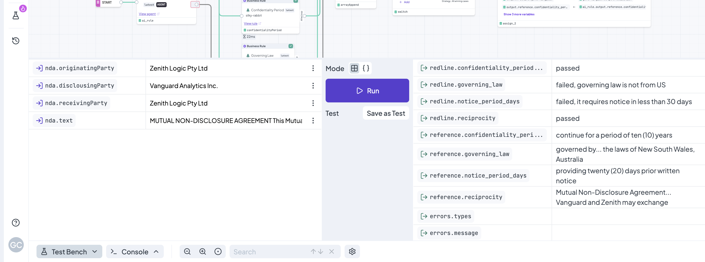

# Create a Simple AI Agent Rule


All steps in this tutorial can be created and managed directly within the DecisionRules app.


**Use Case:** The rules in this tutorial are designed to be called by a user when a new NDA arrives and the team needs to determine necessary redlines in real time.

**Goal:** The goal is to automate the process so the system sends the NDA to DecisionRules and retrieves data identifying the redlines that must be addressed.

The primary features in DecisionRules used to achieve this goal are the **AI Agent Rule** and the **Decision Flow**. In this detailed end-to-end tutorial, we will guide you through building an AI Agent Rule to analyze the unstructured data in a new NDA and return it in a structured JSON format. In the second part, we will model a Decision Flow that integrates the AI Agent Rule to achieve the goal in a predictable, deterministic way.

We will cover navigating the creation process, configuring Decision Flow nodes, and generating the final output. This includes: Identifying redlines based on rule evaluations, providing text references for those redlines, and creating personalized messages in case of misbehaviour because the unstructured data is inconsistent.&#x20;

At the end we’ll test our new rule with one mock example. This tutorial will help you understand key **AI Agent Rule** practices and data manipulation techniques.&#x20;

## 1st Part: How to create a simple AI agent rule

Let's advance one step at a time.

### 1. Create a new AI Agent Rule

To display the rules creation list, click the <mark style="background-color:purple;">**+ Create**</mark> button on the search bar. Select your rule and you will be prompted to provide a nam&#x65;**.** For this example, we will create a **AI Agent Rule** for analysing a new NDA, select a name for your rule as you wish and press "Confirm". The new rule will be created and its design interface will be displayed.

<figure><figcaption></figcaption></figure>

### 2. Create the input and output (I/O) model

We will now create the **Input/Output** model which is used to set the instructions for the AI and the fields of the output. Similar to the other rules, there are two ways to write these models:

#### Using the simple editor

First, you can switch from "Designer" to "Model" at the centre of the top bar.&#x20;

<figure><figcaption></figcaption></figure>

**Delete the default attribute "input"** by clicking the trash can icon next to the name. Then, add your own attributes: First create the root of your attributes clicking the **+Add** button. For this example, you will only need one root: <mark style="color:purple;background-color:purple;">**nda**</mark>. AAfterward, you can add all the data required for the analysis of that `nda` object: <mark style="color:purple;background-color:purple;">**originatingParty**</mark>, <mark style="color:purple;background-color:purple;">**disclosingParty**</mark>, <mark style="color:purple;background-color:purple;">**receivingParty**</mark>, and <mark style="color:purple;background-color:purple;">**text**</mark>.&#x20;

<figure><figcaption></figcaption></figure>

Now, let's proceed with the output model. It is configured in the same way. Add two root attributes: <mark style="color:green;background-color:green;">**terms**</mark> and <mark style="color:green;background-color:green;">**reference**</mark>. Then, add identical child attributes to both roots, as they are logically connected.

* **The `terms` fields** are designed to capture the precise data, indicating whether the information exists and providing the exact number, name, or sentence.
* **The `reference` fields** will store the exact words from the text that the AI used to generate the corresponding "terms" report.

Rename the new attributes according to the information you wish to obtain. A comprehensive list of attributes that will be useful for future examples and exercises includes:

* <mark style="color:green;background-color:green;">**scope\_and\_definition**</mark>, <mark style="color:green;background-color:green;">**confidentiality\_period\_years**</mark>, <mark style="color:green;background-color:green;">**governing\_law**</mark>, <mark style="color:green;background-color:green;">**notice\_period\_days**</mark>, <mark style="color:green;background-color:green;">**reciprocity**</mark>, <mark style="color:green;background-color:green;">**exclusions**</mark>, <mark style="color:green;background-color:green;">**permitted\_disclosures**</mark>, <mark style="color:green;background-color:green;">**liability\_cap\_usd**</mark>, <mark style="color:green;background-color:green;">**return\_of\_information\_required**</mark>, <mark style="color:green;background-color:green;">**return\_deadline\_days**</mark>, and <mark style="color:green;background-color:green;">**residuals\_clause**</mark>.&#x20;


You don't have to write one by one the attributes, see how to use the **JSON editor** below.


<figure><figcaption></figcaption></figure>

#### Using the JSON editor

Alternatively, **the JSON editor can reduce the time required to define your I/O model** through simple copying and pasting. You can provide the input and output models in JSON format from any external source. For this tutorial, use the following format to copy and paste into your editor:



```json
{
  "nda": {
    "originatingParty": {},
    "disclousingParty": {},
    "receivingParty": {},
    "text": {}
  }
}
```



```json
{
  "terms": {
    "scope_and_definition": {},
    "confidentiality_period_years": {},
    "governing_law": {},
    "notice_period_days": {},
    "reciprocity": {},
    "exclusions": {},
    "permitted_disclosures": {},
    "liability_cap_usd": {},
    "return_of_information_required": {},
    "return_deadline_days": {},
    "residuals_clause": {}
  },
  "reference": {
    "scope_and_definition": {},
    "confidentiality_period_years": {},
    "governing_law": {},
    "notice_period_days": {},
    "reciprocity": {},
    "exclusions": {},
    "permitted_disclosures": {},
    "liability_cap_usd": {},
    "return_of_information_required": {},
    "return_deadline_days": {},
    "residuals_clause": {}
  }
}
```



<figure><figcaption></figcaption></figure>

For now, we are done!


After creating an input and output (I/O) model, we must always confirm the changes with the <mark style="color:orange;background-color:orange;">**Save**</mark> button.



More information on the JSON editor can be found [<mark style="color:purple;">here</mark>](https://docs.decisionrules.io/doc/decision-tables/input-and-output/json-editor).


### 3. Set the configurations of the background

To set up the environment where your LLM will operate, switch back from the "Model" view to the "Designer" view. Use the left sidebar to configure the settings according to your requirements:

* **AI Model:** We will use _Gemini 1.5 Flash_ as an example. You can, of course, select any other available model from the dropdown list in your rule.
* **Connector:** For this example, our LLM is connected via a [connector](https://docs.decisionrules.io/doc/space/connectors) named _gemini (connection-vhksg)_. The options shown to you will depend on the connectors you have already created in your Space.
* **Cache AI Response (Toggle):** During the creation and testing of this new rule, you should activate the **Cache**.
* **Explainable AI (Toggle):** For this tutorial, Explainable AI is not necessary. It is better suited for more advanced exercises.
* **Data Dictionary:** Briefly check this panel to ensure you have all the information required to build your prompt.


**Best Practices:** Activating the **Cache** allows you to perform faster tests and ensures consistent analysis when using the same input repeatedly. This is highly recommended during the rule construction phase.


<figure><figcaption></figcaption></figure>


### 4. Build the Prompt

Prompt engineering practices evolve rapidly; therefore, the suggestions in this section will be continuously improved. What is relevant to notice is to apply the best DecisionRules practices for instructions: Ensure your input model is framed with precision, use the Data Dictionary as direct reference, and write with your best clarity.&#x20;

For this example, we will explicitly define the **Role** assumed by the AI, the **Context** of the analysis, and the **Task** required from the model.&#x20;


```markdown
## ROLE
You are a senior legal compliance analyst with deep expertise in NDA review, contract standards enforcement, and commercial contract negotiation.

## CONTEXT
You are analyzing a NDA submitted by {nda.originatingParty} for legal revision and red-line version. The disclousing party of the NDA is {nda.disclousingParty}  and the receiving party is {nda.receivingParty}. 

NDA = {nda.text}

## TASK
Read the NDA and extract all structured fields defined in the output schema. 

terms' fields are expecting a report: whether the data exist; what exact number, name or sentence it is; a judgemnet if the information is not clear.

reference's fields are expecting: the precise words in the text from where you are taking the report for terms. 

Use only the allowed values listed in each field annotation. Extract values directly from the nda.
For every output field that cannot be determined from the report — return null.
For every output field that can be determined and the answer is explicitely negative - return false.
```


The placeholders in the form _{a.b}_ (such as _{nda.text}_) are dynamic attributes. At runtime, DecisionRules replaces these placeholders with the actual content of your input payload. This allows a single AI Agent rule to analyze thousands of different NDAs. &#x20;

**Remark:** If your analysis requires a reference document (such as a company standard or a regulatory guideline), you can use the **Attachments** feature:

1. Navigate to the Attachments tab and click Add Attachment to upload your file (PDF, TXT, etc.).
2. Return to the Prompt/Instruction editor.
3. Drag the file from the Data Dictionary into your prompt. The AI will now be able to reason across both the input data and the attached document.


### 5. Edit the Annotations

Annotations are the most critical part of the AI Agent rule because they define the conditions of engagement for the model's response. Here you will find the most extensive work. We will cover each detail.

In the main panel, navigate to the "Annotations" tab. The interface is organised into three columns:

The first column reflects your **output model**. The second column is for the specification of the **data types** expected in each particular output attribute. The third column is **a description** of what exactly you are expecting and how.  &#x20;

<figure><figcaption></figcaption></figure>

**Setting Data Types:** Root attributes (like `terms` and  `reference` ) will always be of the **{} Object** type. For the "child" attributes under _terms_, select the type that best fits the logic. For instance, using **Number** for years or **Boolean** for the presence of a clause. This ensures your downstream Decision Flows can process the data without errors.

| Attribute                      | Data Type |
| ------------------------------ | --------- |
| scope\_and\_definition         | Text      |
| confidentiality\_period\_years | Number    |
| governing\_law                 | Text      |
| liability\_cap\_usd            | Number    |
| permitted\_disclosures         | Boolean   |
| residuals\_clause              | Boolean   |

<figure><figcaption></figcaption></figure>

**Writing Effective Descriptions:** Your descriptions should be treated as "mini-prompts." A good description includes the conditions required to satisfy the field. To exemplify this feature, we will focus on the _reference_ root, and the description of its "child" attributes.

First, ensure all its child attributes are set to the **Text** data type. These descriptions should follow a consistent pattern, instructing the AI to provide the verbatim evidence from the NDA. For instance:

| Attribute                      | Description                                                                                                                                            |
| ------------------------------ | ------------------------------------------------------------------------------------------------------------------------------------------------------ |
| scope\_and\_definition         | Return a string with the exact words in the text of the nda, where you extracted the info for the ouput above: _terms.scope\_and\_definition_.         |
| confidentiality\_period\_years | Return a string with the exact words in the text of the nda, where you extracted the info for the ouput above: _terms.confidentiality\_period\_years_. |


**Note:** The last column must be filled for every object in the output, including the root folders. Providing a description for the root helps the model understand the overall context of that data group.


### 6. Test the Agent

Now we can test our rule in the **Test Bench**. Click the **Test Bench** icon on the far left of the bottom bar. Once clicked, the Test Bench will appear at the bottom of the page.

You can then fill in some mock data using the sample NDA provided below. Use the specifications from the document to complete the input fields, and remember to paste the full text of the NDA into the nda.text field. Click the **Run** button, and the results will be displayed on the right-hand side of the Bench. Note that you can switch between the **Simple Bench** and the **JSON Bench** to view the output.



<figure><figcaption></figcaption></figure>

## 2nd Part: How to integrate **the AI Agent Rule into a Decision Flow**

In this section, we will create a Decision Flow that uses the structured data provided by the AI Agent rule to validate NDA parameters against company standards and determine which redlines are pertinent.

### Intro: Logic of the flow

#### IO Model

Our **Input Model** captures the data required to run the AI Agent rule from Part 1; therefore, it will replicate that rule's input model. This design is due to the fact that the results from the AI node contain all the information necessary to drive the other rules and nodes in the flow, and it will be the first node.

Our **Output Model** is constructed slightly different. It includes `redline` validation, the specific text `reference` used to accept or reject those redlines, and `error` handling options to manage potential drawbacks. In this sample, the company evaluates four minimal standards for accepting an NDA (more complex sets of standards will be handled in future examples).



```json
{
  "nda": {
    "originatingParty": {},
    "disclousingParty": {},
    "receivingParty": {},
    "text": {}
  }
}
```



```jsonl
{
  "redline": {
    "confidentiality_period_years": {},
    "governing_law": {},
    "notice_period_days": {},
    "reciprocity": {}
  },
  "reference": {
    "confidentiality_period_years": {},
    "governing_law": {},
    "notice_period_days": {},
    "reciprocity": {}
  },
  "errors": {
    "types": {},
    "message": {}
  }
}
```



#### Flow of the Process

When designing the Decision Flow as a decision process, establishing a logical steps ensures a faster selection and location of the nodes.&#x20;

1. **AI Analysis**: Start by converting the unstructured data of the NDA text into a typed JSON response. This step enables the precise extraction of attributes from the NDA for evaluation. At this stage, the AI analysis is key to using other strong, predictable rules over the NDA.
2. **Validation of Company Standards**: This is the core of the flow; the company's standards are saved as Rules within the Space. The flow will call four rules to evaluate a set of four minimal standards: _the confidentiality period_, _the governing law country_, _the notice period_, and _the reciprocity of the agreement_. Based on these rules, the system decides which sections of the NDA should be redlined.
3. **Error Handling:** Due to the nature of AI, it is not guaranteed that the NDA will provide all necessary data in the first call, and LLM response times can vary. With a couple of nodes, we design a path to follow in case the NDA is missing information or the LLM request times out. These nodes provide a warning and a message to help resolve the issues quickly.
4. **Generating the Final Redlines:** Use the values from the previous steps to populate the properties specified in the output model. Additionally, if there are errors, an appropriate error message is sent.

### 1. AI Analysis

It is time to add the first node to the canvas. Begin by adding an **AI Agent node** and connecting the **Start node** to it. Open the node settings, click the _Select Agent_ dropdown, and choose the AI Agent rule you created to analyze the NDA. Once selected, the rule's input model will be displayed. You now need to map the data from the Data Dictionary to the rule's input: drag and drop the `nda` root from the Data Dictionary into the _Rule Inputs_ section for the attribute named  `nda` . Save the values in the modal.

<figure><figcaption><p>Adding the AI Agent node</p></figcaption></figure>

### 2. Validation of Company Standards

Drag and drop four Business Rule nodes onto the canvas and position them in parallel to the right of the AI Agent node.&#x20;

In the first **Business Rule** we will use the _Reciprocity_ tree (A JSON file with the design of the rule is here below). The standard is simple: **The NDA must be reciprocal**. The logic of the standard can be expressed in a Decision Tree keeping the simplicity:&#x20;

1. **Missed information:** IF the field for the NDA reciprocity report is empty, THEN return error message (Remember the AI can result null if the NDA is not clear).
2. **Reciprocal NDA:** IF the NDA reciprocity report contains true, THEN return passed.
3. **No Reciprocal NDA:** IF the NDA reciprocity report contains false, THEN return failed and the reason.&#x20;



In the second **Business Rule** we will use the _Notice Period_ tree (A JSON file with the design of the rule is here below). The standard is simple: **We must have minimum 30 days to solve and communicate leaks**. The logic of the standard can be expressed in a Decision Tree keeping the simplicity:&#x20;

1. **Missed information:** IF the field for the NDA notice period is empty, THEN return error message (Remember the AI result null if the NDA misses this information).
2. **Enough Notice Period:** IF the NDA notice period is greater or equal to 30 days, THEN return passed.
3. **Not Enough Notice Period:** IF the NDA notice period is less than 30 days, THEN return failed and the reason.&#x20;



In the third **Business Rule** we will use the _Confidentiality Period_ tree (A JSON file with the design of the rule is here below). The standard is simple: **We must have maximum 15 years for confidentiality**. The logic of the standard can be expressed in a Decision Tree keeping the simplicity:&#x20;

1. **Missed information:** IF the field for the NDA confidentiality period is empty, THEN return error message (Remember the AI result null if the NDA misses this information).
2. **Under the limit period:** IF the NDA confidentiality period is less or equal to 15 years, THEN return passed.
3. **Over the limit period:** IF the NDA confidentiality period is greater than 15 years, THEN return failed and the reason.&#x20;



In the fourth **Business Rule** we will use the _Governing Law_ tree (A JSON file with the design of the rule is here below). The standard is simple: **We only accept the governing law from United States**. The logic of the standard can be expressed in a Decision Tree keeping the simplicity:&#x20;

1. **Missed information:** IF the field for the NDA governing law is empty, THEN return error message (Remember the AI can result null if the NDA is not clear).
2. **Under the limit period:** IF the NDA governing law is from US, THEN return passed.
3. **Over the limit period:** IF the NDA governing law is from any other country, THEN return failed and the reason.&#x20;



The AI Agent node features two output ports; connect the _green (success) port_ to each of the four Decision Trees you just configured.

<figure><figcaption></figcaption></figure>

### 3. Error handle

Place an **Assign node** below the column of Business Rule nodes and connect the _red (failure) anchor_ of the AI Agent node to it. The red path is triggered if the AI request times out or fails. Open the Assign node and create a target to report the LLM error (e.g. `AnalyzerError.code` ). Then, assign a static error code such as AI\_PROCESSING\_ERROR.&#x20;

<figure><figcaption></figcaption></figure>

Add an **Append node** to the right of your design and connect it to all the nodes in the preceding parallel column (the four Business Rule nodes and the error-handling Assign node). So far, we have identified two types of errors: AI timeouts and empty fields within the NDA report. This node will store a single array containing all potential issues. In the node settings, create a target array called `errors` and drag all attributes that report errors into the "Values to Append" section.

<figure><figcaption></figcaption></figure>

<figure><figcaption></figcaption></figure>

Finally, place a **Switch node** on the canvas and connect the output of the **Append node** to it. Open the Switch settings and create a case for "Errors in evaluation". The logic is as follows: IF the errors array from the Append node is not empty, THEN follow the path for error mapping; OTHERWISE, proceed to the redline mapping.

To configure this, drag and drop the `errors` object created in the **Append node** into the _Condition_ field. Select the <mark style="color:green;background-color:green;">**Contains Text**</mark> function and enter the value: ERROR. The _Default case_ will automatically handle the "otherwise" scenario, directing the flow when no errors are present.

<figure><figcaption></figcaption></figure>

### 4. Generating the final redlines

Now that all necessary values have been gathered, we can generate the final redlines, including the validation results for the four minimal standards and their corresponding text references. To map these for the final output, we will use an **Assign node**.

1. **Success Path:** Connect the _Default port_ of the **Switch node** to a new Assign node. Open the configuration.
2. **Map Results:** On the _Target_ side, add all eight output attributes for redlines and references. For the redlines, map the results from the four Decision Trees as the _Source_. For the references, map the corresponding data from the AI Agent rule.

<figure><figcaption><p>Assigning values to Decision Flow Output</p></figcaption></figure>

To manage exceptions, add a second **Assign node**. Connect the "_AI error in the evaluation" port_ of the **Switch node** to this new node.


**Note:** If errors are stored in our array, the Switch node can direct the flow to both the success Assign node (to provide any partially processed info) and the error Assign node simultaneously.


In the **error** **Assign node**, set the _Target_ to your two error output attributes:

* **output.errors.types:** Map the errors array from the Append node.
* **output.errors.message:** Enter a customized message such as:

```
Please check the list of errors.types . 
If some of the rules are mentioned, it means {input.nda.originatingParty} didn't give enough information in the NDA to evaluate the standard, request them to complete the NDA please.
If the type is AI_PROCESSING_ERROR, verify your connection to the LLM and run the rule again.
```

<figure><figcaption><p>Detail of Switch node directing the process</p></figcaption></figure>

Congratulations! :tada: You've completed the Decision Flow, which might look something like this:

<figure><figcaption><p>Decision Flow overview</p></figcaption></figure>

In the next section, we’ll test the Decision Flow with some inputs to ensure it’s functioning correctly. Before proceeding, please double-check that all Decision Flow nodes are fully configured and properly connected.

### 5. Testing the Decision Flow and the AI Agent Rule

Now we can test our rule in Test Bench.

We can click the <mark style="background-color:purple;">**Test Bench**</mark> icon at the beginning of the bottombar. After clicking the icon, the Test Bench will show up at the bottom of the page.&#x20;

Then we can fill in some mock data. We can use the same mock example from above. You can download the document here below as well. Use the specifications of the document to complete the input, and remember to paste the entire text of the NDA in nda.text. Click the <mark style="background-color:green;">**Run**</mark> button and the result will be displayed in right hand side of the Test Bench. Note that you can switch between the **Simple Bench** and the **JSON Bench**.



<figure><figcaption></figcaption></figure>



```json
//Complete the input with the Mock_NDA
{
  "nda": {
    "originatingParty": "Zenith Logic Pty Ltd",
    "disclousingParty": "Vanguard Analytics Inc.",
    "receivingParty": "Zenith Logic Pty Ltd",
    "type": "NDA for PoC information",
    "text": [
      "MUTUAL NON-DISCLOSURE AGREEMENT This Mutual Non-Disclosure Agreement (the \"Agreement\") is entered into as of October 25",
      " 2023 (the \"Effective Date\")",
      " by and between: Vanguard Analytics Inc.",
      " a corporation organized under the laws of Delaware",
      " etc, etc, etc..."
    ]
  }
}
```



```json
[
  {
    "redline": {
      "confidentiality_period_years": "passed",
      "governing_law": "failed, governing law is not from US",
      "notice_period_days": "failed, it requires notice in less than 30 days",
      "reciprocity": "passed"
    },
    "reference": {
      "confidentiality_period_years": "continue for a period of ten (10) years",
      "governing_law": "governed by... the laws of New South Wales, Australia",
      "notice_period_days": "providing twenty (20) days prior written notice",
      "reciprocity": "Mutual Non-Disclosure Agreement... Vanguard and Zenith may exchange"
    },
    "errors": {
      "types": {},
      "message": {}
    }
  }
]
```



### Summary

The rules of this tutorial were designed to be called by a user when a new NDA arrives and the team want to decide the necessary redlines in real time. The goal was to automate the process such that the system sends the NDA to DecisionRules and retrieve the evaluation of the document with the redlines that must be pointed out. The main features in DecisionRules to achieve this goal are the **AI Agent Rule** and the **Decision Flow**. In this tutorial, we built an **AI Agent Rule** for the analysis of the unstructured data given in the new NDA, getting back the data of the NDA in structured JSON format. The attributes of the JSON were designed to be precise and some of them required by the standards to be evaluated. The second part of this section was the elaboration of a **Decision Flow** to complete the goal in a predictable way. The flow uses the results of the AI rule and runs:

* The evaluation of precise NDA attributes, according to the standards of the company, using **Decision Trees**.
* Because the original NDA is unstructured, the data in the flow may misbehave, and so, the detection of information gaps and the report of times out.
* The presentation of the redlines, with the corresponding references, and in case of misbehaviours, error messages for the solution of relevant gaps or the solution of the connected LLM performance.   &#x20;

To wrap up, let’s go over the management and maintenance of this Decision Flow. Once the rules are built, the Business Users only have to manage the **Decision Trees**. In fact, the Business User not just know the company's standards, but these users have the decision capacity and knowledge to change those standards, so when some of the standards must be changed, for example:

* **The NDA must be reciprocal - to - It is not relevant if the NDA is reciprocal.**
* **We must have minimum 30 days to solve and communicate leaks - to - 20 days.**
* **We must have maximum 15 years for confidentiality - to - 20 years.**
* **We only accept the governing law from United States - to - the law from Australia.**

These changes can be done directly by them, just changing values on Decision Trees, for instance from 15 to 20. See that the roles of the users can be very different, but everyone collaborate to directly on the hand of the right expert, the capacity to make changes in the company's applications for prediction, transparency and velocity. &#x20;
