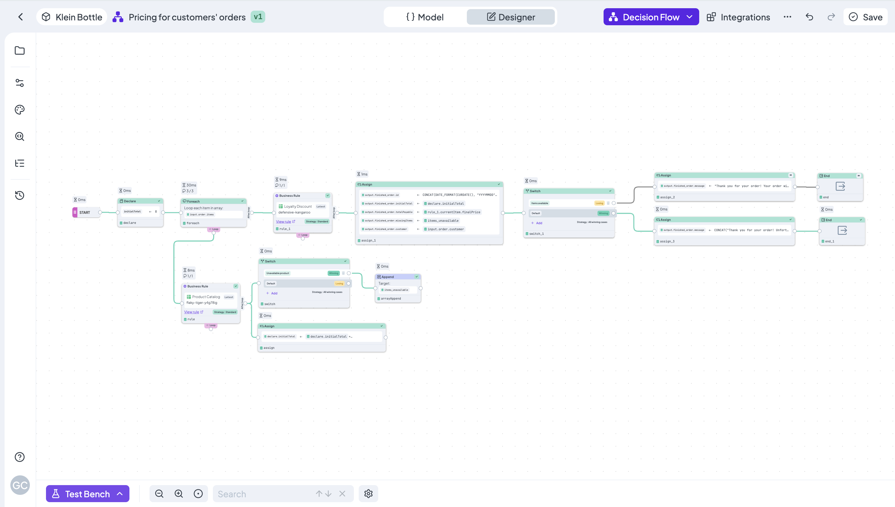

# Decision Flow

### Decision Flow Basics

Decision Flows represent a new feature category within DecisionRules, enhancing the platform's capabilities. They integrate seamlessly with existing rules, maintaining a familiar structure. Decision Flows are built by placing nodes on a canvas and connecting them with lines, with various node types available.

<figure><figcaption>
Workflow overview
</figcaption></figure>

### The Decision Flow Designer

The Designer features a canvas with a single **Start** node. On left side, you’ll find several tabs, with the **Palette** being the most important for now. The Palette lists all available node types with brief descriptions. To use a node, simply drag it from the palette onto the canvas.

Once a node is on the canvas, click it to open its detail settings. Each node type has different configuration options depending on its functionality. For detailed information on each node type, check the [**Workflow Nodes Overview**](https://app.gitbook.com/s/-MN4F4-qybg8XDATvios/rules/flow/flow-nodes-overview).

<figure><figcaption>
Nodes Palette in Decision Flow
</figcaption></figure>

With the tutorial below you will be able to create a simple Decision Flow and discover node types within the rule.


[create-a-decision-flow.md](create-a-decision-flow.md)

