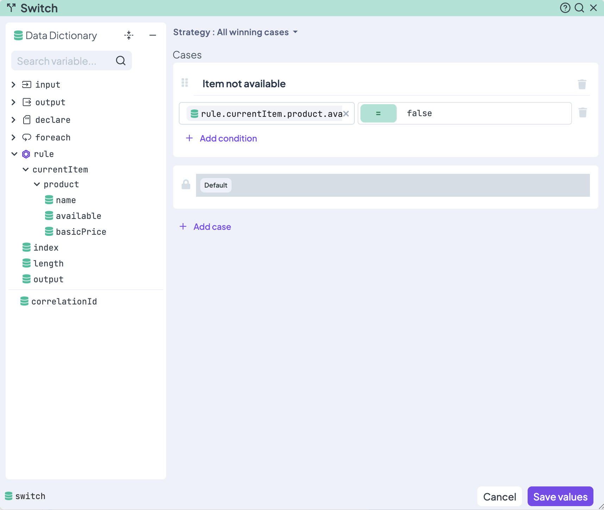
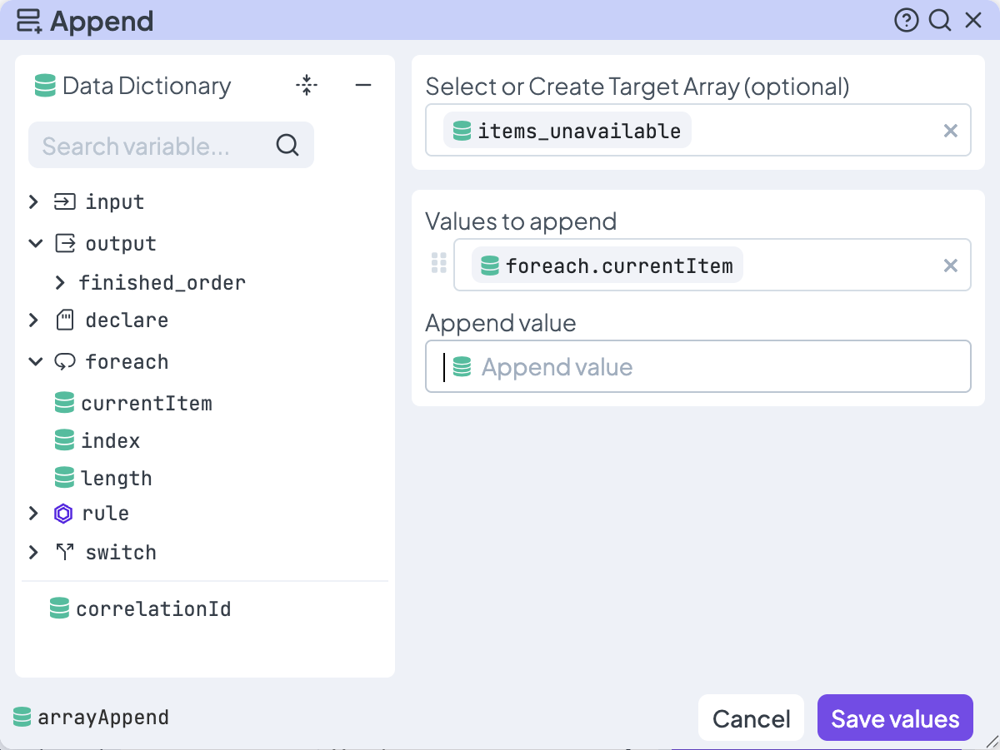
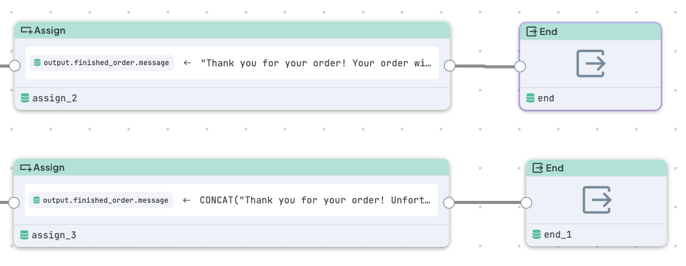
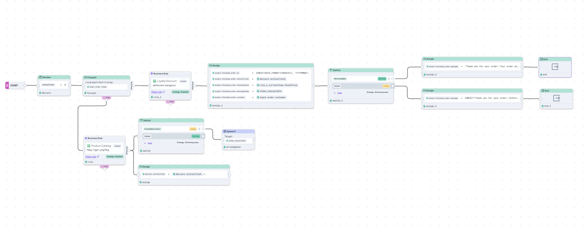

# Create a Decision Flow

In this detailed end-to-end tutorial, we’ll guide you through creating a simple Decision Flow that processes order details to calculate the total price. This Decision Flow integrates two decision tables: one that evaluates product details based on product IDs and branch, and another that applies customer discounts based on their loyalty class and credit status.


Both of those Decision Tables can be created as samples right in DecisionRules app


We'll cover navigating through the creation process, configuring Decision Flow nodes, and generating the final output, which includes missing items, the total price payable, and a personalized message for the customer. At the end we’ll test our new rule with several inputs to ensure it works as expected. This tutorial will help you understand key Decision Flow components and data manipulation techniques.&#x20;


Only a few node types are used in this tutorial. For a complete list of available Decision Flow nodes, please refer to our dedicated [documentation page](https://app.gitbook.com/s/-MN4F4-qybg8XDATvios/rules/flow/flow-nodes-overview).


## Logic of the Flow

### IO Model

Our input model captures key details of an order, including items, branch information, and customer details such as loyalty class and credit balance.

```json
{
  "order": {
    "items": {},
    "branch": {},
    "customer": {
      "id": {},
      "loyaltyClass": {},
      "credit": {}
    }
  }
}
```

The output model includes calculated values like `initialTotal` and `totalPayable`, along with any missing items and a personalized message for the customer.

```json
{
  "finished_order": {
    "id": {},
    "missingItems": {},
    "initialTotal": {},
    "totalPayable": {},
    "message": {},
    "customer": {
      "id": {}
    }
  }
}
```

### Flow of the process

When designing the Decision Flow as a decision process, establishing a logical flow ensures efficient processing of order details.

1. [**Initial Price Calculation**](create-a-decision-flow.md#id-1.-initial-price-calculation): Start by calculating the initial price of the customer’s order as a baseline for any potential discounts. This requires evaluating the price catalog decision table first. At this stage, we’ll also collect availability information for each item in the order to use later in the order message.
2. [**Discount Application**](create-a-decision-flow.md#id-2.-discount-application): With the initial price determined, check if the customer qualifies for a discount by evaluating the loyalty discount decision table. Based on this, calculate the final price, either discounted or not.
3. [**Generating the Final Order**](create-a-decision-flow.md#id-3.-generating-the-final-order): Use the values from the previous steps to populate the output properties specified in the output model. Additionally, if there are unavailable items, modify the order message accordingly.

## Building the Decision Flow

Now that we’ve outlined each step in the evaluation, it’s time to build our rule. In this section, we’ll configure the IO model, add and connect nodes to create the process flow.

### 1. Initial Price Calculation

Create a new blank Decision Flow. First, you can switch from "Designer" to "Model" at the centre of the top bar. Set up the input and output model as described above. Once set, properties of the model can be easily used in the Decision Flow.

<figure><figcaption><p>Decision Flow IO model</p></figcaption></figure>


Don't forget to save your I/O model.


Now it's time for adding first nodes to the canvas. Start by adding a **Declare** node to define `initialTotal`. In this variable we will store the price of the order before potential discount. Simple drag and drop the node from the Palette tab on the left. When the node is on the canvas click on the node, it will open, and set the variable. Save the modal and connect the **Start** node to it.

<figure><figcaption><p>Declaration of the initialTotal variable</p></figcaption></figure>

The next step is the _Initial Price Calculation_. Since orders often contain multiple items, we need to calculate each item’s price and after, to get the overall total summing of all prices. We will use the **Foreach** node to repeat the evaluation of the price of each item, eliminating the need to manually add multiple **Business Rule** nodes to the canvas.


Using the **Foreach** node, you apply a specific process to each element of an array, one by one. This allows efficient way to manage complex, repetitive tasks across datasets. More details can be found in our [documentation](https://app.gitbook.com/s/-MN4F4-qybg8XDATvios/rules/flow/flow-nodes-overview#foreach).


Drag and drop the **Foreach** node onto the canvas, then click on it to open its configuration modal. In the modal, specify the list of order items that the node will process (the list is often offered in the input as an array of names ID). You can do this by either manually entering the input variable or by dragging it from the Data Dictionary tab. When you are done, you have to connect it to the **Declare** node.


Note that Data Dictionary tab and input whisperer store all already declared variables for easy access


<figure><figcaption><p>Setting the list of order's items</p></figcaption></figure>

Now comes the part when we create a set of actions that will be performed for each item in the order list. As mentioned we need to run the Product Catalogue decision table to know and add the item price to total. In addition if the item is not available add it to the list of unavailable items.

In the first **Business Rule** we will use the _Product Catalog_ table (a template example for such a table is available in the templates section of your Rules List): &#x20;

<figure><figcaption></figcaption></figure>

First, we place the **Business Rule** node on the canvas and open it. We select the Product Catalog rule. After selected, its input model shows. We need a mapping from our data to the business rule: For the _productId_ we will use the item that will be provided by the **Foreach** node, which takes one item from the original list at time. For the _branch_ - we want the branch property passed from the main Decision Flow input.

<figure><figcaption><p>Business Rule node - item price evaluation</p></figcaption></figure>


Those mentioned actions, represented by individual nodes, must be connected to the "Loop" connector of the **Foreach node**. So all nodes that you connect in this way will be evaluated in each iteration of the **Foreach** node.


When the **Business Rule** node retrieves the item price from the product catalog, we want to incrementally add this price in each iteration of the For Each loop. To set this up, add an **Assign** node to the canvas and open its configuration modal. In the Target field, we write the variable we want to assign it a value:

```
{declare.initialTotal}
```

In the Source field, we create a formula that continuously updates the total by adding each item's price to the previous total:&#x20;

```
{declare.initialTotal}+{rule.currentItem.product.basicPrice}
```

This formula will overwrite the initial price, increasing it as each item’s price is processed. Then save the modal and connect the new node to **Business Rule** node.

<figure><figcaption><p>Incrementally Adding Each Item’s Price</p></figcaption></figure>

To collect the `productId` of each unavailable product, start by adding a **Switch** node and an **Append** node. The **Switch** node will check each item’s availability from the output of the decision table. If the item is unavailable, the **Append** node will add its `productId`, also from the output of the decision table, to an array named `items_unavailable`. This array will then be used in the order message to notify the customer about any items that are out of stock.

<figure><figcaption><p>Product availability check</p></figcaption></figure>


See that the `items_unavailable` array can be created in the **Append** node


<figure><figcaption><p>Append out of stock productId</p></figcaption></figure>

We’ve now completed the first phase by calculating the initial order price (see the reference image below). With this foundation set, we’ll move forward to evaluate whether the customer qualifies for a discount. This next step will involve applying the Loyalty Discount rule, factoring in customer-specific details such as loyalty class and credit, to determine the final payable amount. The next node will be added after the **Foreach** node, it will be connected to its "After Loop" connector, so we will continue in our process.

<figure><figcaption><p>Process of initial price calculation</p></figcaption></figure>

### 2. **Discount Application**

After calculating the initial order price, we’ll use it as the baseline for applying the loyalty discount, taking into account the customer's credit to calculate the discounted total (Also in the templates).

<figure><figcaption></figcaption></figure>

Add another **Business Rule** node to the canvas and select the Loyalty Discount decision table. Map the `initialTotal` to the `basicPrice` input field.

When mapping the customer's loyalty information, you have two options:

* **Map the entire customer object**: Use this if you want to pass all customer properties without making any alterations.

or

* **Map properties individually**: This is ideal if customer details are sourced from multiple variables, allowing you to map each property directly.

Both options work interchangeably, but note that they are mutually exclusive, as selecting one disables the other.

<figure><figcaption><p>Mapping the Business Rule input</p></figcaption></figure>

### 3. **Generating the Order details**

Now that we have gathered all the necessary values, we can create the final order, which will include the total payable price, any missing items, and a personalized message. To map these values for display in the Decision Flow output, we'll utilize an **Assign** node. In the modal we will map all the information to output properties.

To generate a simple order ID, we can utilize the [**CONCAT** function](https://app.gitbook.com/s/-MN4F4-qybg8XDATvios/rules/data-types-and-functions/operators/functions/text#concatenation-concat), which combines today's date with the user's ID. This method ensures that each order ID is unique and easily traceable back to the specific user and the date of the order.

<figure><figcaption><p>Assigning values to Decision Flow Output</p></figcaption></figure>

To personalize the message shown to the customer, we will use a **Switch** node that checks for any items in the array created by the **Append** node.

<figure><figcaption><p>Checking for any missing items</p></figcaption></figure>

If any items are out of stock, their identifiers will be stored in this array. The **Switch** node will direct the flow of the process based on the content of the array.  We will then use the contents of the array to craft a message for the customer, informing them about the unavailable items using **Assign** node to create tailored messages.

If all the items are available we can use message:&#x20;

```
"Thank you for your order! Your order will be shipped next business day." 
```

If any of the ordered items is missing, we can use the **CONCAT** function to generate a parameterized message that informs the customer specifically about the unavailable items:


```
CONCAT("Thank you for your order! Unfortunately, the following item(s) are currently out of stock: ",{items_unavailable},". We appreciate your understanding and the order will be shipped as soon as the items become available.")
```



More about functions, their types and syntax can be found in [dedicated section of our documentation](https://app.gitbook.com/s/-MN4F4-qybg8XDATvios/rules/data-types-and-functions/operators/functions).


<figure><figcaption><p>Detail of Switch node directing the process</p></figcaption></figure>

To get a complete view of how data appears at the end of the Decision Flow, add **End** nodes right after the **Assign** nodes. When you run the Decision Flow, you’ll see the final data in each End’s **Inspect** tab, showing the actual results once the rule has fully executed. This provides a clear, final snapshot of all processed data.

<figure><figcaption><p>Adding End nod for branches</p></figcaption></figure>

Congratulations! :tada: You've completed the Decision Flow, which might look something like this:

<figure><figcaption><p>Decision Flow overview</p></figcaption></figure>

In the next section, we’ll test the Decision Flow with some inputs to ensure it’s functioning correctly. Before proceeding, please double-check that all Decision Flow nodes are fully configured and properly connected.

## Testing the Decision Flow

Testing your Decision Flow with sample inputs is an essential step to confirm it works as expected. We will start with main cases that cover scenarios, such as orders with available items, orders with missing items, and orders eligible for discounts.

Run the Decision Flow with these inputs and use the **Inspect** tab in the **End** nodes or Decision Flow Testbench to review the results. This allows you to verify that each node is executing correctly and that data flows through the Decision Flow as intended.


Learn more about Decision Flow evaluation process [here](https://app.gitbook.com/s/-MN4F4-qybg8XDATvios/rules/flow#workflow-evaluation).


<details>

<summary>One item is not available, customer's first order (no discount)</summary>

```json
{
  "order": { 
    "items": ["P_0011","P_0009","P_0032","P_0021"],
    "branch": "SHOP_B",
    "customer": {
      "id": 123,
      "loyaltyClass": "FIRST_VISIT",
      "credit": 0
    }
  }
}
```

</details>

<details>

<summary>One item is not available, customer has loyalty class and credit</summary>

```json
{
  "order": { 
    "items": ["P_0011","P_0009","P_0032","P_0021"],
    "branch": "SHOP_B",
    "customer": {
      "id": 123,
      "loyaltyClass": "LOYALTY1",
      "credit": 32
    }
  }
}
```

</details>

<details>

<summary>All items are available, customer has loyalty class and credit</summary>

```json
{
  "order": { 
    "items": ["P_0011","P_0009","P_0032","P_0021"],
    "branch": "SHOP_A",
    "customer": {
      "id": 123,
      "loyaltyClass": "LOYALTY1",
      "credit": 32
    }
  }
}
```

</details>

## Summary

In this tutorial, we built a Decision Flow to process an order by calculating the initial price, checking for discounts, and identifying any out-of-stock items. We configured nodes to perform actions such as summing item prices, applying loyalty discounts, and generating a personalized message. Each node was mapped to the output model, giving us a complete order summary. Finally, we ran tests with sample inputs to validate the Decision Flow, ensuring that each component works as intended and provides accurate, actionable output for the customer.

To wrap up, let’s go over a few best practices to enhance your Decision Flow’s effectiveness and maintainability. These tips can help ensure smooth operation, improve readability, and make troubleshooting easier down the line:

* rename nodes added to the canvas to better fit your process and increase the readability
* test your Decision Flow during the process of creation to discover potentials errors as soon as possible
* use Sticky Notes to document the process for better understanding

See the Decision Flow below that you can easily import into your environment. This completed Decision Flow demonstrates all the processes we’ve covered, providing a clear example of how to configure and connect everything for effective order processing.


Clicking the file below opens the file content in current tab. Once opened, right click and choose  "Save as" option to save the content as json file. Then you can use such file for folder import.



Decision Flow tutorial folder json file

