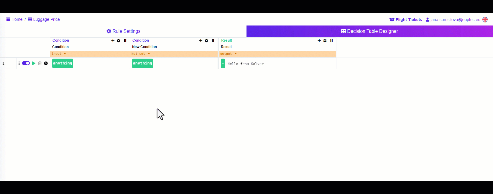
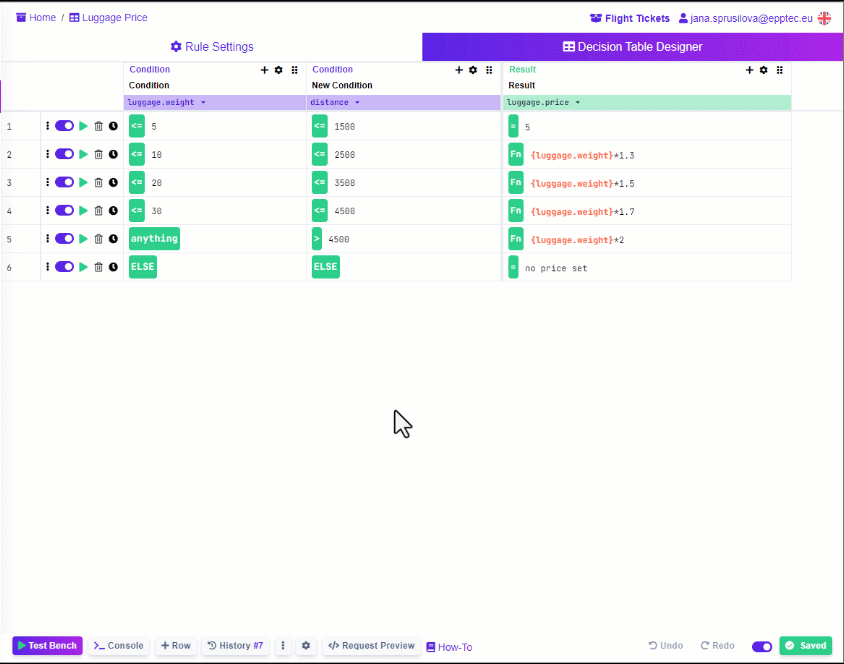

# Decision Tables

Introduction

Decision Tables are our most popular decision rule type as they are the market standard of decisioning. Thanks to their similarity to Excel and Google Sheets, Decision Tables are easy to learn, yet they can make more complex decisions. Decision Tables are by far our most scalable rule type. They can contain and perform efficiently with around 10,000 rows and 10 to 20 columns full of conditions. In case you need more, you can create an additional Decision Table and connect them using the Rule Flow.

The Decision Tables have a really friendly interface, excellent for any non-technical person who has experience with Excel or Google Sheets. As you can see here it is nearly identical to a real table.

<figure><figcaption></figcaption></figure>

### Decision Table Designer

#### How does the Decision Table look like

As already mentioned, the Decision Table is very similar to an Excel table - it is also divided into columns and rows and you can enter values or functions into cells. The table is conceptually divided into two parts, a part with conditions and a part with results. Conditions are created based on input values, so the condition columns are tied to the input model. On the other hand, the results are the values we want to obtain after evaluating the decision, so the result columns are tied to the output model. In the input-output model, you set the structure of the data and what values will go into the rule and what values will be received from it.\


_For more information about setting up the Input-Output model, see the_ [_section_](https://app.gitbook.com/s/-MN4F4-qybg8XDATvios/decision-tables/input-and-output) _dedicated to it._&#x20;


#### Adding and building conditions and results

Once you have created the Input-Output model, you go into the Decision Table Designer and start adding individual columns for conditions and results. To add more columns, click on the "+" sign in the header of the column you want to add a new column after. You can add columns at any time during the creation of your rule. To delete columns you do not need anymore, click the cogwheel, select “Remove” from the list and confirm.

<figure><figcaption>
<mark style="color:purple;">Add and remove columns</mark>
</figcaption></figure>

You can also really easily create additional conditions or result columns for the same input or output variables. Just add an additional column with the same variable.

Simply link the values from the Input-Output model to the added columns. Once the values are mapped, you can begin to create individual conditions in the condition columns.

<figure><figcaption></figcaption></figure>

The body of the table is made up of rows. It's as if we could translate each row of the table into a sentence: if all conditions are satisfied, show these results. We can think of those rows as individual scenarios. By adding more rows to the table, we gradually cover all the scenarios that can occur.

To add a row, click on the "+ Row" button in the bottom bar of the Decision Table Designer. You create a condition by selecting an operator or function in the row cell. Click on the green operator button to display a list of available operators and functions. You can find logical operators or text and mathematical functions in the menu.

<figure><figcaption>
<mark style="color:purple;">See how to select an operator or a function in Decision tables</mark>
</figcaption></figure>


_Keep in mind that conditions must be clearly evaluable with the result of true or false - a boolean value._


Now that we have the conditions set, it's time to create the results that will return if all the conditions in that row are met. As with the conditions, by clicking on the green operator button in the cell, you choose whether the result will be equal to some fixed value (at that point select the "=" sign) or whether it will be equal to the result of some function or calculation (at that point select "fn" for function) to create a dynamic value.

Continue in this way with all the scenarios that may occur in your decision process.


Once you have set up the Input-Output model, you can export your Decision Table in XLSX format. In Excel or Google Sheets, you can then add more data at once and re-import your rule into your space. For more information on creating tables using Excel or Google Sheets, click [here](https://app.gitbook.com/s/-MN4F4-qybg8XDATvios/decision-tables/manage-tables-excel-gsheets).


#### Else Row

There may be cases where the input values to the rule do not match any of your defined condition scenarios. Therefore, if none of your scenarios are met, no action is taken to return the results. If you also need to return a result in your decision that none of the above conditions were met, add a Default (Else) Row. In the bottom bar, click Show More .png>) button and select "Default row" from the list. A row will be added to the table that will be filled with the ELSE operator in all cells of the conditions. You simply add to the results either what value or message to print if none of the conditions were met.


_Note that by definition:_

* _there can always be at most one passing row containing the ELSE operator_
* _when the ELSE operator is evaluated, it only takes into account conditions above it_


<figure><figcaption>
<mark style="color:purple;">Building the Decision Table</mark>
</figcaption></figure>

#### How is the Decision Table evaluated?

The Decision Table is evaluated from top to bottom row by row. First the first row is evaluated, then the second, etc. Depending on the chosen solving strategy, you can control the output of the Decision Table.

#### Testing your Decision Rule

Test the functioning of the created Decision Table using the Test Bench tool in the bottom bar of the designer. Open the Test Bench and enter the input values, then click the "Run" button to evaluate the rule. Switch to JSON Bench to view the input and output in JSON format. This is useful if you want to test an input that you already have available in JSON format (you can simply paste into the Test Bench), or if you want to for example test the Decision Table output in your logic where the output will be processed next.

Use Debug Mode to see how rows are evaluated. Enable Debug Mode in Test Bench by clicking the "Debug" button, which will solve your rule again. In this mode you will see each condition marked as green when met and marked as red when not met.

<figure><figcaption></figcaption></figure>

Solving strategies

You can use execution strategies to define the output of the Decision Table. In the Test Bench Tool, click the Standard button to open a list of possible strategies. These are as follows:&#x20;

* **Standard** - This is the default strategy that returns the results of all rows whose conditions have been met as output. If 3 rows match in your table, all 3 will appear in the output.
* **Array** - This strategy is similar to Standard, but returns the results of all rows whose conditions have been met, in the form of an array.
* **First Match** - if there are multiple rows whose conditions have been met, only the first matched row is returned
* **Evaluate All** - The strategy allows to get results from all rows of the table even if their conditions have not been met. The results are enriched with information whether the row is matched (true) or not (false). To see this information switch to the JSON Bench, where input and output is visible in JSON format.

<figure><figcaption>
<mark style="color:purple;">Different solving strategies in the Test Bench of the Decision Table</mark>
</figcaption></figure>
