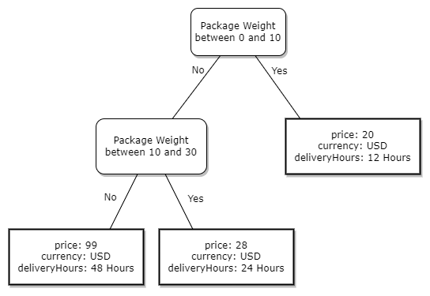
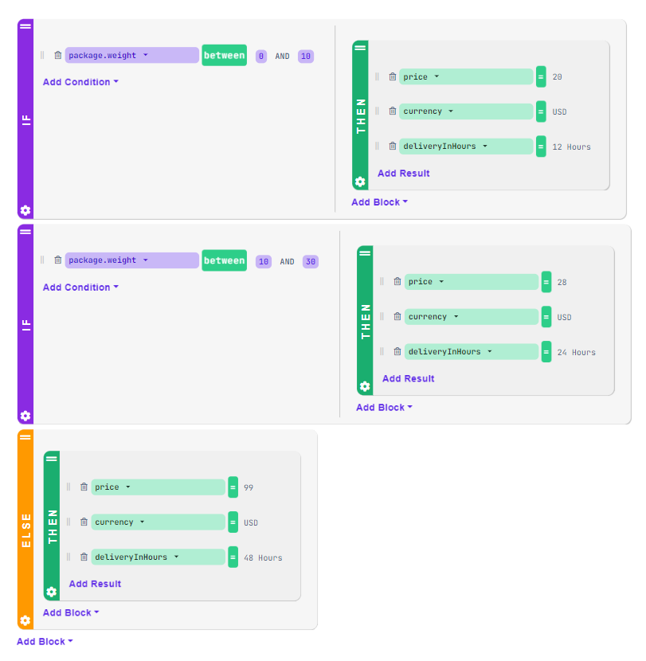
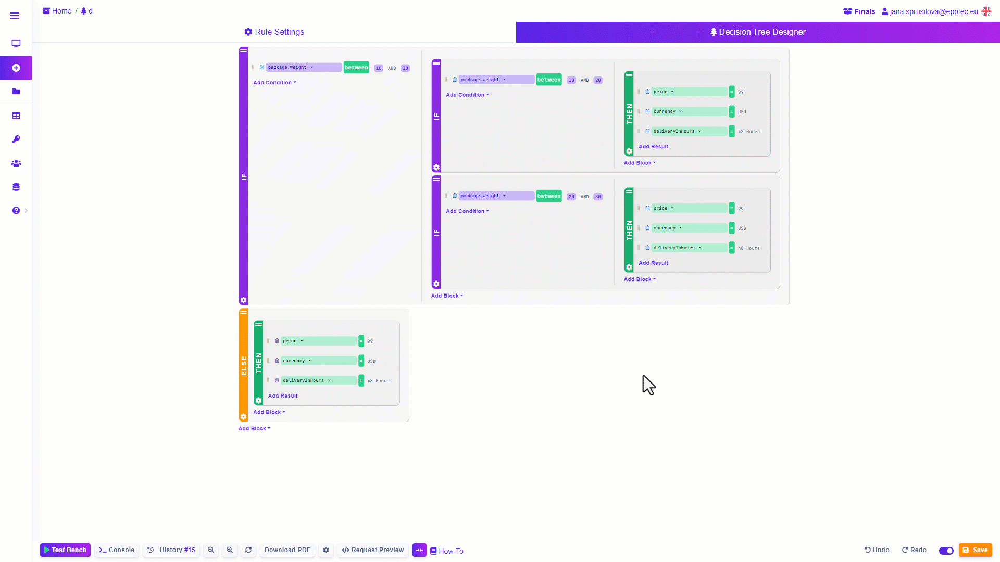
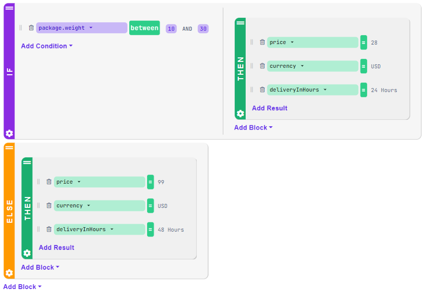
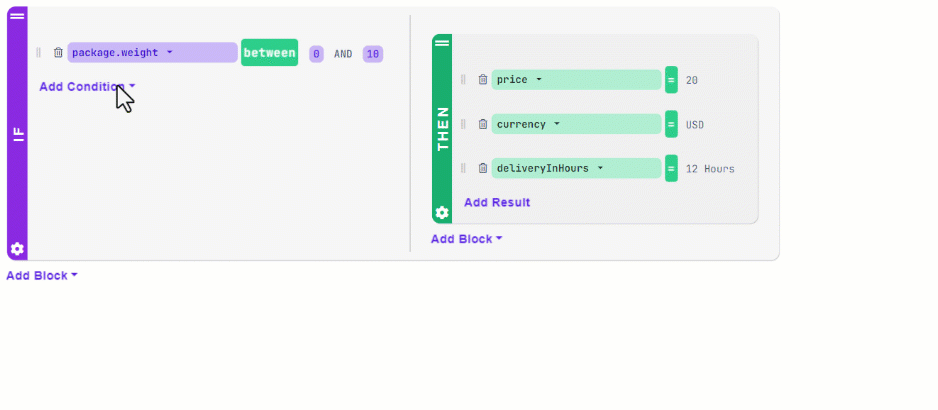
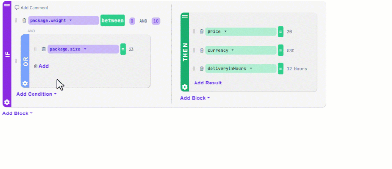
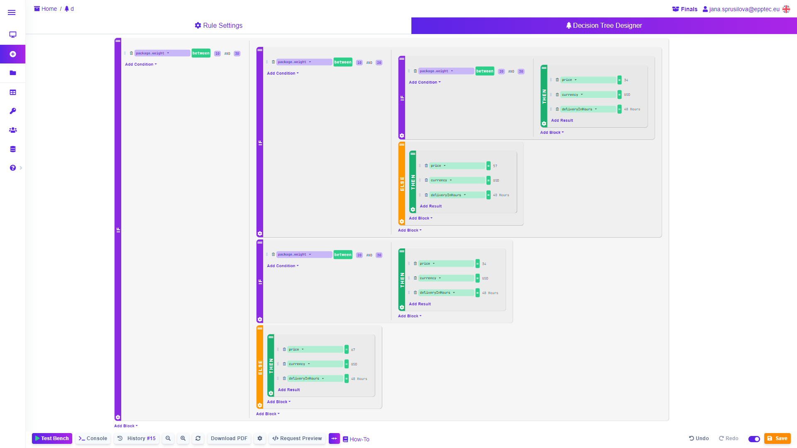
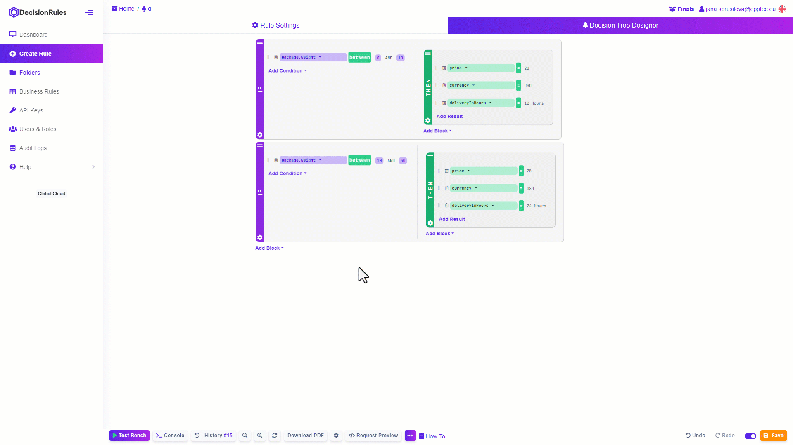
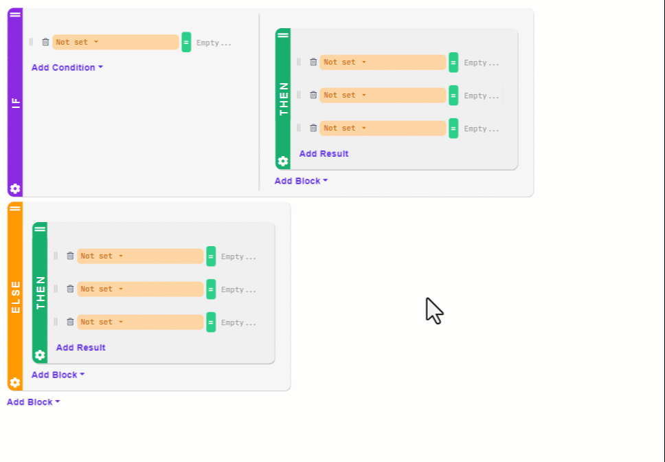
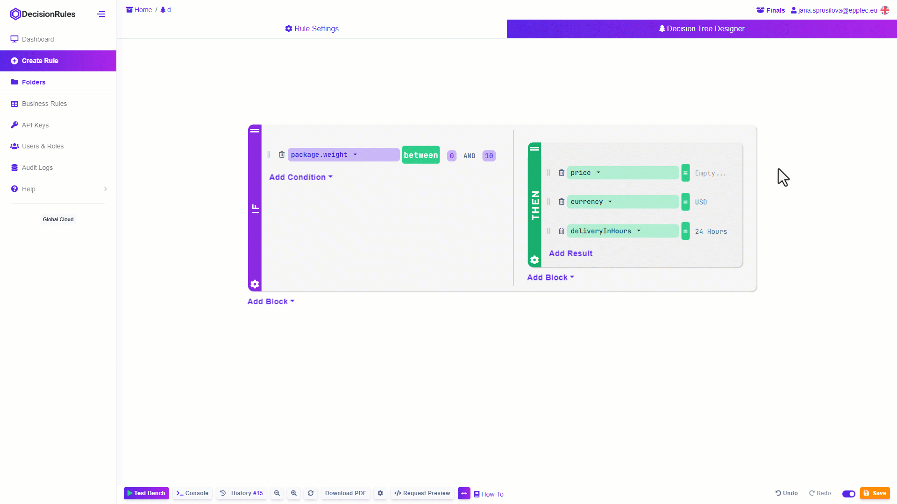

# Decision Trees

Introduction

Decision Tree is an easy to learn type of decision rule based on if this then that structure. In a simple and user-friendly visual designer, you can easily create simple yet powerful rules. Such rules can then form the entire decision process or you can link it as a sub-rule to a Rule Flow, for example. We can think of creating a Decision Tree as writing a sentence:  If this, then that. If it rains, I'll take an umbrella. This is why Decision Tree is suitable for creating very simple rules. Or rules that have multiple levels of conditional branching. Such condition nesting would require the creation of all combinations of all input values in the Decision Table.

<figure><figcaption>
<mark style="color:purple;">Simple decision tree</mark>
</figcaption></figure>

<figure><figcaption>
<mark style="color:purple;">Solution designed in DecisionRules</mark>
</figcaption></figure>

## Designer

The space where you create your decision tree looks like a canvas. Use mouse dragging to move around. Use the mouse wheel or the Zoom In and Zoom Out buttons in the bottom bar of the Designer to adjust the zoom level.

Use the Test Bench with Debug Mode in the bottom bar to quickly and easily test the functionality of your rule. In the bottom bar, you can also use the PDF export of your tree.

<figure><figcaption>
<mark style="color:purple;">Decision Tree Designer</mark>
</figcaption></figure>

## What does the Decision Tree look like and how to build it?

Decision Tree is a structure composed of individual logical blocks with conditions and results. We can think of the condition-result pair as a scenario: if a condition is met, an action will be performed. Set the variables that will form the conditions and results in Rule Settings in the Input-Output Model section.

<figure><figcaption>
<mark style="color:purple;">Decision Tree blocks</mark>
</figcaption></figure>

### Decision Tree Evaluation

The Decision Tree blocks are evaluated from top to bottom. If the condition of the block is met, the action is executed, and the property is returned with the value corresponding to the satisfaction of the condition. If we have multiple THEN blocks in the Decision Tree that return the same property, the property will eventually be overwritten by the THEN block that was evaluated last. Knowing this, it is worth adapting the architecture accordingly.

### Blocks

The block is the basic unit of the decision tree. It is marked with a colored bar on the left with the type of the block. Move blocks by clicking on the "two lines" symbol and then dragging to the desired position. Click on the cogwheel to display the drop down menu - clone the block or delete it. Below each block you will find an "add block" button to add another block. Click the button to select the type of block to add to your decision tree.

#### IF block

The If Block is divided into two parts. In the left part you always add conditions on which you build the decision process. To add conditions, click on "Add Condition" button, then select which condition you want to add. All added conditions have the AND operator between them by default.

1. Click on "Condition" to add a simple condition.

<figure><figcaption></figcaption></figure>

1. Click "Logic OR" to add the entire OR block, which by default creates OR logic between the two conditions. add conditions on both sides of the operator using the "Add" button.

<figure><figcaption>
<mark style="color:purple;">How to add OR condition</mark>
</figcaption></figure>

3. To add another OR group, click the cogwheel in the OR block's operation bar.

<figure><figcaption>
<mark style="color:purple;">How to add another OR group</mark>
</figcaption></figure>

The right part of the if block contains the action to be performed if the condition on the left side of the block is met. Depending on the structure of your decision process, you add a then block or additional if blocks to the right side of the if block. Adding more If Blocks to the right side of the If Block is called branching.

<figure><figcaption>
<mark style="color:purple;">Simple Decision Tree branching</mark>
</figcaption></figure>

#### THEN block

Then Block indicates the end of the decision process. In the Then Block you add an action to be performed if the conditions are met. Click on "add result" and assign a variable from your output model and set it to a fixed value or insert a function.

<figure><figcaption>
<mark style="color:purple;">THEN Block</mark>
</figcaption></figure>

#### ELSE block

Add an Else block as an action that will be executed if none of the conditions of the preceding If Blocks are met. You can add If Blocks to the Else Block to create another decision process, or add a Then Block and simply assign a variable from your output model.

<figure><figcaption>
<mark style="color:purple;">Adding ELSE Block</mark>
</figcaption></figure>


_By definition, it is obvious that the Else Block should be added at the end of a series of If Blocks to provide an output if none of the previous conditions is met._


### Binding to input-output model

The newly added conditions and results have no variable assigned. Therefore, there is no setting for which variable will be evaluated (in case of conditions) or returned (in case of results).

By binding the input model variables to the left side of the if blocks, you create conditions. Click to see a list of all variables from your input model. Simply click to select the variable you want to base your condition on. The newly added result also has no variable assigned. Click to see a list of all the variables you have set in your output model. Simply select the desired variable you want to return as the result.

<figure><figcaption>
<mark style="color:purple;">Binding to input-output model</mark>
</figcaption></figure>

### Building conditions and results cells

We already know the types of blocks and why we need to have an input-output model set up. Now let's see how to build the conditions and results.

#### Conditions

Once you assign a variable from your input-output model, you select an operator or function. Click on the green button to display a list of all operators and functions. Click to select the one you need. In the cell next to the operator, enter the value(s) according to the nature of the operator. If you have selected a function, fill in all its parameters and save.

<figure><figcaption>
<mark style="color:purple;">Building conditions</mark>
</figcaption></figure>


_The conditions must be evaluated as true or false, so called boolean values. Therefore, when using functions, care must be taken that the function also returns boolean values. These are, for example, boolean operators or inequality signs._


#### Results

After assigning variables from your output, assign a value to the variable. Click the green button to display the options for results. You can set the value as fixed if you choose "=". If you choose a function, you can make the value dynamic. To create more complex functions, you can nest the functions.

<figure><figcaption>
<mark style="color:purple;">Building results</mark>
</figcaption></figure>


_A list of all operators and functions with their examples can be found in the_ [_Operators_](https://app.gitbook.com/s/-MN4F4-qybg8XDATvios/decision-tables/operators) _and_ [_Functions_](https://app.gitbook.com/s/-MN4F4-qybg8XDATvios/decision-tables/functions) _section of our documentation._

