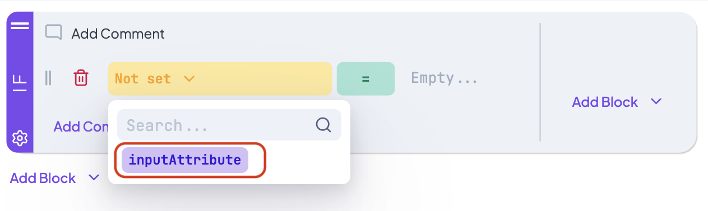
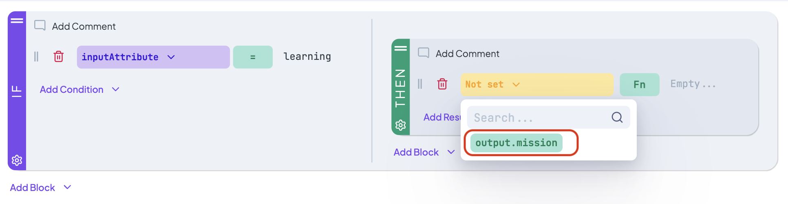
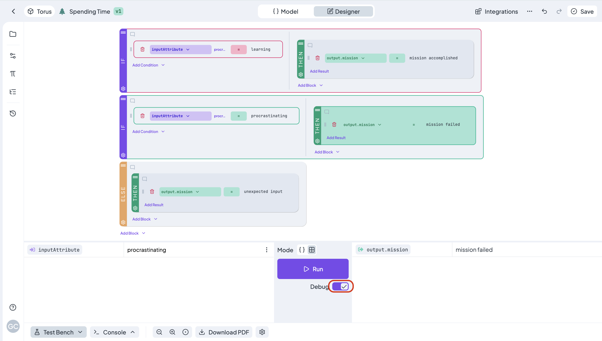

# Create Simple Decision Tree

## How to create a simple decision tree

Let's advance one step at a time.

### 1. Log in

Becoming a superhero is a fairly straightforward process. After entering our [<mark style="color:purple;">login page</mark>](https://app.decisionrules.io/auth/login), you will be able to pass your credentials and log in.

<figure><figcaption></figcaption></figure>

There are multiple options for user login. If you do not have an account yet, you can [<mark style="color:purple;">create one</mark>](https://app.decisionrules.io/auth/register?type=true-registration). After logging in to the application, the folder structure of your Rules List will be displayed.

### 2. Create a New Decision Tree

To display the rules creation list, click the <mark style="background-color:purple;">**+ Create**</mark> button on the search bar. Select your rule and you will be prompted to provide a nam&#x65;**.** For this example, we will create a tree for procrastination, select a name for your rule as you wish and press "Confirm". The new rule will be created and its design interface will be displayed. We will continue in the Rule Setting menu.

<figure><figcaption></figcaption></figure>

### 4. Create the input and output model

We will now create the input and output model which is used to set conditions and results. There are two ways to create these models:

#### Using the simple editor

Let's start with the input model. First, you can switch from "Designer" to "Model" at the centre of the top bar. Delete the default attribute "input" by clicking the trash can icon next to the name. Then, add your own attributes: <mark style="color:purple;background-color:purple;">**inputAttribute**</mark>. Create a root for each new of them by clicking the **+Add Root** button.

Now, you can continue with the output model. It will be set similarly. As root attribute, add <mark style="color:green;background-color:green;">**output**</mark> . Then, you can add a child attribute to the this root. Click the + icon within the 'output' field. Rename the New Attribute to  <mark style="color:green;background-color:green;">**mission**</mark> .

<figure><figcaption></figcaption></figure>


After creating an input or output model, we must always confirm the changes with the <mark style="background-color:orange;">save</mark> button.



More information on the simple editor is provided [<mark style="color:purple;">here</mark>](https://docs.decisionrules.io/doc/decision-tables/input-and-output/simple-editor).


### 3. Create First If Block

Click on "Create First Condition".

<figure><figcaption></figcaption></figure>

### 4. Specify Condition Inside If Block

1\. Click on the first "Add Condition" button inside the If Block.&#x20;

<figure><figcaption></figcaption></figure>

2\. Dropdown will be shown. Click on "Logic AND".

<figure><figcaption></figcaption></figure>

3\. Click on the orange dropdown <mark style="color:orange;background-color:orange;">**Not set ˇ**</mark> . Here you will choose an input that later will be evaluated when solving the decision tree.

<figure><figcaption></figcaption></figure>

4\. Now click on the empty text to the right side of the operator <mark style="color:green;background-color:green;">**=**</mark> , and edit the value.

<figure><figcaption></figcaption></figure>

5\. Now type in a value to which we will compare the input once solving the decision tree. Let's write "learning" for example.&#x20;

<figure><figcaption></figcaption></figure>

6\. Now click on the <mark style="background-color:purple;">**Add Block**</mark> button at the right-side of the If Block. And Select "Then" from the list.

<figure><figcaption></figcaption></figure>

7\. Click on "Add Result".

<figure><figcaption></figcaption></figure>

8\. Once again, click on the orange button saying <mark style="color:orange;background-color:orange;">**Not set ˇ**</mark> and choose the only Output you defined.

<figure><figcaption></figcaption></figure>

9\. Change the operator from function <mark style="color:green;background-color:green;">**Fn**</mark> to equal <mark style="color:green;background-color:green;">**=**</mark> . Now, click on the empty text to the right side of the operator and edit the value as with the 'if condition'.

<figure><figcaption></figcaption></figure>

Great, you now know how to create a simple condition :tada:.

### 5. Create Second If Block

To simplify the process, you can click on the cogwheel icon of the first If Block and select "Clone" from the dropdown list.

<figure><figcaption></figcaption></figure>

This will create an exact copy of the If Block down below.

The only thing to do now is to change the values inside the newly created If block:

<figure><figcaption></figcaption></figure>


These two If blocks are very similar to the If and Else-If behavior, if you are familiar with programming concepts.


### 6. Create Else Block

Finally we create an Else Block. The Else Block will be executed whenever none of the above If Blocks evaluate to true. In our case, if the Input is anything else than the values 'learning' or 'procrastinating'.

Now click on the <mark style="background-color:purple;">**Add Block**</mark> button under the If Block and add another "Else" block.

<figure><figcaption></figcaption></figure>

Now, inside the last Else Block simply press the <mark style="background-color:purple;">**Add Block**</mark> button and add a Then Block. Fill it out with whatever value you like. Remember to change the operator from function to equal.&#x20;

<figure><figcaption></figcaption></figure>

### 7. Test It!

Simply click on the <mark style="background-color:green;">**Test bench**</mark> in the bottom bar.

Type "learning" in the Input Property and click on <mark style="background-color:green;">**Run**</mark> .

<figure><figcaption></figcaption></figure>


The first block was evaluated as expected.


Inputting the word "procrastinating" will return "mission failed".

<figure><figcaption></figcaption></figure>

Finally, you can try the Debug toggle and see true valuations in green, false valuations in red, and no color if the block was not evaluated.

<figure><figcaption></figcaption></figure>


More information can be found [<mark style="color:purple;">here</mark>](https://docs.decisionrules.io/doc/decision-trees/decision-tree-designer).

