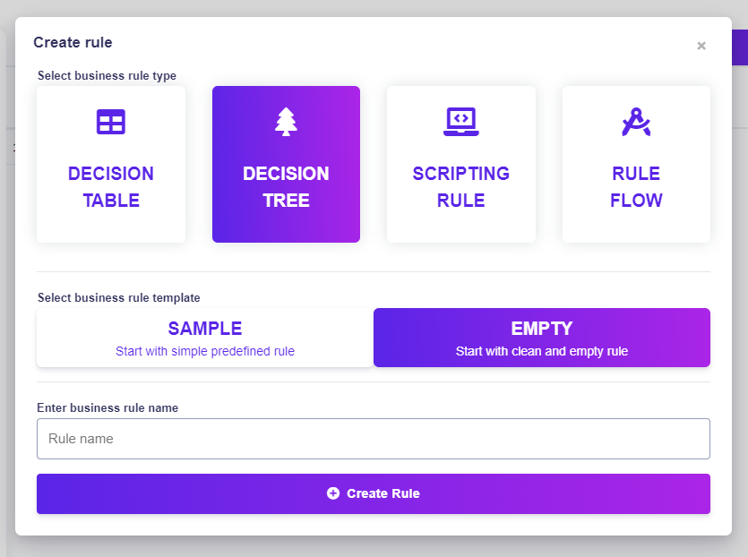

# Create Simple Decision Tree

## How to create a simple decision tree

Let's advance one step at a time.

### 1. Log in

Becoming a superhero is a fairly straightforward process. After entering our [<mark style="color:purple;">login page</mark>](https://app.decisionrules.io/auth/login), you will be able to pass your credentials and log in.

<figure><figcaption></figcaption></figure>

There are multiple options for user login. If you do not have an account yet, you can [<mark style="color:purple;">create one</mark>](https://app.decisionrules.io/auth/register?type=true-registration). After logging in to the application, the [<mark style="color:purple;">Dashboard</mark>](../../spaces/space-dashboard.md) will be displayed.

<figure><figcaption></figcaption></figure>

### 2. Go to Create rule

To display the rule creation pop-up click the <mark style="background-color:purple;">**Create Rule**</mark> button on the sidebar.

<figure><figcaption></figcaption></figure>

### 3. Create a New Decision Tree

You will be prompted to provide a name and choose between **SAMPLE RULE** or **EMPTY RULE.** For now, name the rule as you wish and choose the EMPTY RULE. The new rule will be created and its detail will be displayed. We will continue in the Rule Settings tab.


In our case, we will choose an empty tree to walk you through the whole process.


### 4. Create First If Block

Click on create business condition.

<figure><figcaption></figcaption></figure>

### 5. Specify Condition Inside If Block

1\. Click on the first add button inside the if block.&#x20;

<figure><figcaption></figcaption></figure>

2\. Dropdown will be shown.

<figure><figcaption></figcaption></figure>

3\. Click on condition.

<figure><figcaption></figcaption></figure>

4\. Click on the orange dropdown. Here you will choose an input attribute that will later be evaluated when solving the decision tree.

<figure><figcaption></figcaption></figure>

5\. For simplicity sake, the only input attribute is the "Input attribute" created automatically, when choosing the empty decision tree. Click on the "Input attribute".


To learn more about the Input/Output Model, click [<mark style="color:purple;">here</mark>](https://docs.decisionrules.io/doc/decision-tables/input-and-output)


<figure><figcaption></figcaption></figure>

6\. Now click on the empty... text to edit the value.

<figure><figcaption></figcaption></figure>

7\. Now type in a value to which we will compare the input once solving the decision tree. Let's write "learning" for example. To save the value either click on the save button or press enter.

<figure><figcaption></figcaption></figure>

8\. Now click on the second add button inside the if block.

<figure><figcaption></figcaption></figure>

9\. Click on then.

<figure><figcaption></figcaption></figure>

10\. Click on add result.

<figure><figcaption></figcaption></figure>

11\. Once again, click on the orange button saying "not set" and choose the only Output attribute which was automatically created and is called "Output attribute".

<figure><figcaption></figcaption></figure>

12\. Click on the empty... text and fill in the result value as with the if condition.

<figure><figcaption></figcaption></figure>

Great, you now know how to create a simple condition :tada:.

### 6. Create Second If Block

To simplify the process, you can click on the settings icon of the first If block and select clone.

<figure><figcaption></figcaption></figure>

This will create an exact copy of the If block down below.

The only thing to do now is to change the values inside the newly created If block.

<figure><figcaption></figcaption></figure>


These two If blocks are very similar to the If and Else If behavior, if you are familiar with programming concepts.


### 7. Create Else Block

Finally we create an Else block. The Else block will be executed whenever none of the above If blocks evaluate to true. In our case, if the Input Attribute is anything else than the value "learning" and "procrastinating".

Now click on the <mark style="background-color:purple;">**Add**</mark> button under the Else If block and add another Else block.

<figure><figcaption></figcaption></figure>

Now inside the last Else block simply add Then block and fill it out with whatever value you like.

<figure><figcaption></figcaption></figure>

### 8. Test It!

Simply click on the <mark style="background-color:green;">**Test bench**</mark> in the bottom bar.

Type "learning" in the Input Property and click on <mark style="background-color:green;">**Run**</mark> .

<figure><figcaption></figcaption></figure>


You can see that the first block was evaluated.


Inputting the word "procrastinating" will return "mission failed".

<figure><figcaption></figcaption></figure>

Finally inputting anything else than these two word will return "unexpected output".

<figure><figcaption></figcaption></figure>


More information can be found [<mark style="color:purple;">here</mark>](https://docs.decisionrules.io/doc/decision-trees/decision-tree-designer).

