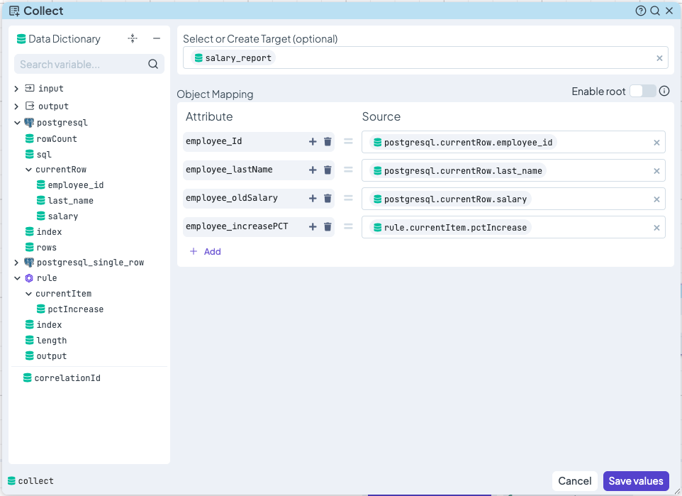
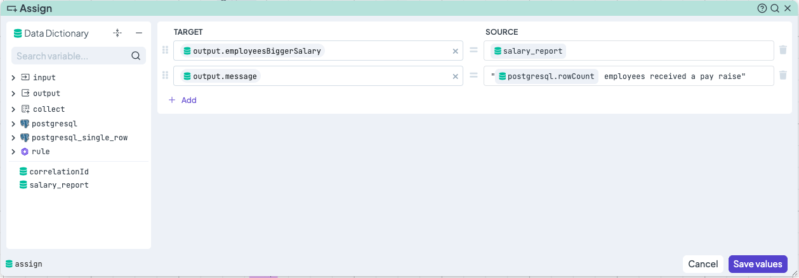
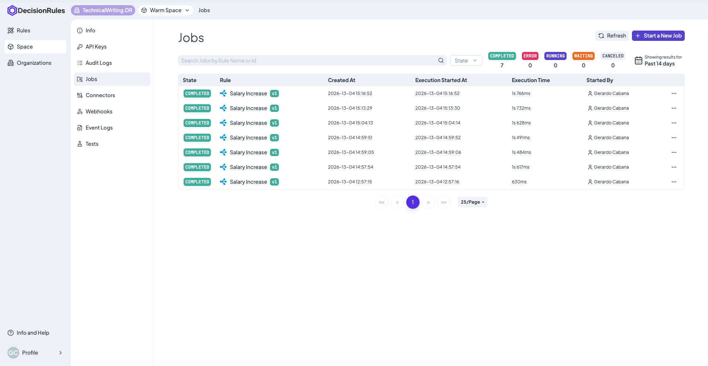

# Create an Integration Flow

In this detailed end-to-end tutorial, we will guide you through the process of creating an Integration Flow. For this use case, we will build an employee segmentation and salary increment system.

This Integration Flow orchestrates a process involving a Decision Table, where the input to the table depends on values retrieved from a PostgreSQL database based on a specific region. Finally, the same database is updated with the decision reached by that Decision Table.


The Decision Table can be created as sample right in DecisionRules platform


We'll cover navigating through the creation process, configuring Integration Flow nodes, and generating a final reporting-output containing the data updated in the database. At the end we’ll test our new rule with a couple of inputs to ensure it works as expected. This tutorial will help you understand key Integration Flow components and data manipulation techniques.&#x20;


Only a few node types are used in this tutorial. For a complete list of available Decision Flow nodes, please refer to our dedicated [documentation page](https://app.gitbook.com/s/-MN4F4-qybg8XDATvios/rules/flow/flow-nodes-overview).


## Logic of the Flow

### IO Model

Our input model captures the key region to evaluate during the Job.

```json
{
  "employeesRegion": {}
}
```

The output model contains the list of employees receiving a raise `employeesBiggerSalary` , including their names, original salary, and the percentage increase. It also includes a `message` indicating the total number of employees processed. &#x20;

```json
{
  "employeesBiggerSalary": {},
  "message": {}
}
```

### Flow Steps

Establishing clear logical steps ensures an efficient design process:

1. **Data Retrieval:** Retrieve the list of employees for a specific region and the necessary data required to determine their percentage increase.
2. **Logic Execution:** Iterate through each employee to decide the appropriate percentage increase based on business conditions.
3. **Data Update & Reporting:** Update the database with the new calculated salary and collect key values to generate a final report.

## Building the Integration Flow

Now that we’ve outlined each step in the flow, it’s time to build our rule. In this section, we’ll configure the IO model, add and connect nodes, and map data across the flow to create the process.

Create a new blank **Integration Flow**. Switch from the "Designer" tab to the **"Model"** tab at the top of the screen to set up your Input and Output models as described above. Once defined, these variables (`employeesRegion` , `employeesBiggerSalary` , `message`) will be available throughout the flow.

<figure><figcaption></figcaption></figure>


Don't forget to save your I/O model.&#x20;


### 1. Data Management Input

Now it's time for adding first nodes to the canvas. Start by adding a **PostgreSQL** node, _drag-and-drop_ this node from the palette on the left, and connect the **Start** node to it. This node will define the list of employees to be evaluated.

Click the node to open the configuration window and set the following:

* **Connector:** Select your pre-configured PostgreSQL connector.
* **SQL Statement:** Enter the query to retrieve the precise data.
* **Mapping:** Use the Data Dictionary to map the input variables.

&#x20;Recommended SQL statement:

```sql
SELECT employee_id, last_name, salary FROM australia_employees WHERE region = {input.employeesRegion}
```


The SQL statement will diverge according to the nature and structure of your database.


<figure><figcaption></figcaption></figure>


Remember that you can '_drag-and-drop_' the attributes for mapping data, from the Data Dictionary inside the nodes.


### 2. Percentage Increase Selection

We will now use a Decision Table called **"Salary Increase Table"** to decide the percentage increase for each employee.

```json
//Table Input
{"salary": {}}
```

```json
//Table Output
{"pctIncrease": {}}
```

<figure><figcaption></figcaption></figure>

Because we are processing multiple employees, we will use the _Loop hook_ at the bottom of the PostgreSQL node to repeat the evaluation for every row retrieved.&#x20;

To call the Salary Increase rule in the flow, drag a **Business Rule** node onto the canvas and connect it to the _Loop hook_ of the PostgreSQL node. Inside the Business Rule node:

1. Select the **Salary Increase Table**.
2. You can keep Strategy and Rule Version configurations as they are.
3. Since you are in a loop, in the **Input Mapping**, map the _salary_ from the _postgresql.currentRow_ to the rule input.&#x20;

<figure><figcaption></figcaption></figure>

### 3. Data Management Updating

This step is divided into two parts: pushing results to the database and generating a report.

**Part A: Updating the Database**\
To update the salary in each iteration of the loop, drag a **PostgreSQL Single Row** node onto the canvas and connect it to the **Business Rule** node.&#x20;

To set this node follow similar steps to the last Data & Integration node, but in the Query field, enter the following statement:

```sql
UPDATE australia_employees 
SET latest_salary = {postgresql.currentRow.salary} * (1 + ({rule.currentItem.pctIncrease} / 100.0))
WHERE employee_id = {postgresql.currentRow.employee_id}; 
```

Becareful mapping the attributes-variables.

<figure><figcaption></figcaption></figure>

**Part B: Generating the Report**

We’ve now completed the main goal of the Integration Flow. But as a corollary, a second part generates a simple job's report for immediate checking.&#x20;

To collect a list of all processed employees (including ID, Last Name, Original Salary, and Pct Increase), start by adding a **Collect** node. Drop it and connect it. Open the node and create a new _Target_ called  `salary_report` . Configure the data structure of this new object creating an _Attribute_ for each of the properties you want to report. After it, map the data from the Data Dictionary corresponding to the properties in the loop.&#x20;

<figure><figcaption></figcaption></figure>

<figure><figcaption></figcaption></figure>

After collecting all the information, we'll use the `salary_report` to populate the output attribute  `employeesBiggerSalary` . Drag an **Assign** node from the palette and drop it on the canvas next to the first **PostgreSQL** node. Connect the _Exit hook_ of the **PostgreSQL** node to the new **Assign** node. This ensures the branch executes only after the entire loop is complete.

Map the data for the assignment: Open the new node, move the two outputs of your model to the _Target_ fields, and use the `salary_report` for the first one; use the native _rowCount_ of the **PostgreSQL** node to paremeterize the message of the second one:&#x20;

<figure><figcaption></figcaption></figure>

Finally, add an **End** node after the Assign node. You can use the **Inspect** tab on the End node during execution to see a final snapshot of all processed data.

Congratulations! 🎉 You've completed the Integration Flow, which might look something like this:

<figure><figcaption></figcaption></figure>

In the next section, we’ll test the Integration Flow with a couple of inputs to ensure it’s functioning correctly. Before proceeding, please double-check that all Integration Flow nodes are fully configured and properly connected.

## Testing the Integration Flow

Testing your Integration Flow with sample inputs is essential to confirm it works as expected. We recommend testing with different regions (e.g., "West" and "East Australia").


The good performance of the flow depends strongly on the content and structure of your database. This example is for a possible table called "employees\_australia".


1. Open the **Test Bench**.
2. Input a sample region: {"employeesRegion": "West"}.
3. Click <mark style="color:purple;background-color:purple;">**Start a New Job**</mark> to test and review the results. This allows you to verify that each node is executing correctly and that data flows as intended.

<details>

<summary>West Australia</summary>

Input:

```json
{
  "employeesRegion": "West"
}
```

</details>

<details>

<summary>East Australia</summary>

Input:

```json
{
  "employeesRegion": "East"
}
```

</details>

<figure><figcaption></figcaption></figure>

If the database is very big or complex, the process could take several minutes. Running this Jobs you will have a dashboard to check the _status_ of each one. Navigate to the menu through Space → Jobs:

<figure><figcaption></figcaption></figure>

#### Webhooks

To complete your setup, you can integrate Webhooks to notify your external systems when a job finishes.

First, you have to link the Webhook to your Space.

1. **Global Management:** Navigate to Space → Webhooks and click the _+ Add Webhook_ button.
2. **Endpoint URL:** The destination address where DecisionRules will send the data.
3. **Alias:** A unique name to identify the webhook within your Space.
4. **Events to Send:** You can choose which Job statuses trigger the webhook. For example, you might have one webhook for _Successful_ executions and another for _Cancellations_ or _Errors_.
5. **Status:** A toggle to quickly enable or disable the webhook without deleting its configuration.

<figure><figcaption></figcaption></figure>

Second, inside your Integration Flow, click the _"Webhooks"_ button in the top-right corner and select the webhook you just created.


To verify that your setup is working correctly before connecting your production systems, we recommend using a tool like [webhook.site](https://www.google.com/url?sa=E\&q=https%3A%2F%2Fwebhook.site).


<figure><figcaption></figcaption></figure>

Test final connection of your Webhooks in similar way, starting a new Job for the flow, either in the Test Bench or through an external API call.&#x20;
