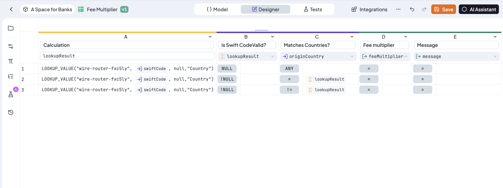
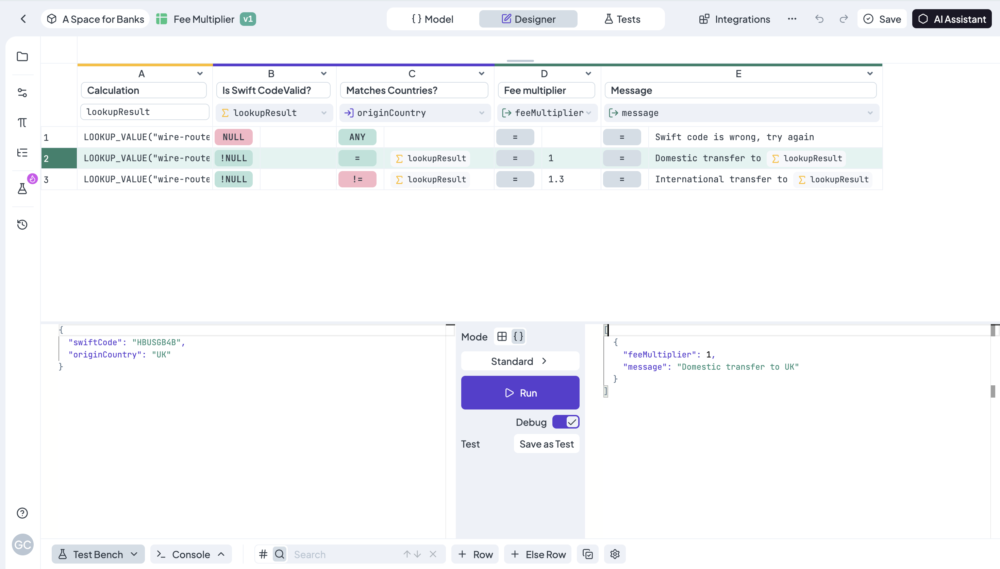

# Create a Simple Lookup Table

In this detailed end-to-end tutorial, we’ll guide you through creating a simple Lookup Table that keeps in one repository the data of different banks, that after is used for transactions. This Lookup Table integrates to a decision table for evaluating a transaction fee according to the bank's country.&#x20;

## How to create a simple lookup table

Let's advance one step at a time.

### 1. Log in

Becoming a superhero is a fairly straightforward process. After entering our [<mark style="color:purple;">login page</mark>](https://app.decisionrules.io/auth/login), you will be able to pass your credentials and log in.

<figure><figcaption></figcaption></figure>

There are multiple options for user login. If you do not have an account yet, you can [<mark style="color:purple;">create one</mark>](https://app.decisionrules.io/auth/register?type=true-registration). After logging in to the application, the folder structure of your Rules List will be displayed.

### 2. Create a new Decision Table

To display the rules creation list, click the <mark style="background-color:purple;">**+ Create**</mark> button on the search bar. Select your rule and you will be prompted to provide a nam&#x65;**.** For this example, we will create a table for Bank Data Catalog, select a name for your rule as you wish and press "Confirm". The new rule will be created and its design interface will be displayed.

<figure><figcaption></figcaption></figure>

### 3. Make basic settings

Rule Settings will be in a left-hand side menu. Let's do some settings. You can switch the toggle status between **Published** and **Pending**. Modify the Rule name or the Alias. Write a short description of the table.

To apply these changes, we have to click the <mark style="background-color:orange;">**Save**</mark> button at the top of the page, right corner.

### 4. Set the columns

To define your data columns, navigate to the first column after the Primary Key. _Double-click_ the header to rename it; enter the name of the first property, i.e.  `BankName` . To expand your table, simply click the **"+"** sign located next to your rightmost column. You can rename the next column  `Country` with the same method, or using the dropdown menu clicking the small arrow on the header. The last one must contains the specific `RoutingMethod` , repeat the same steps. &#x20;

<figure><figcaption></figcaption></figure>

### 5. Set the rows

Now, begin filling in the information for each bank. In this example, banks are indexed by their unique SWIFT Codes, so the **Primary Key** must contain these codes. This maps each Swift Code to the critical banking attributes defined in your columns.&#x20;

Let’s start with "Bank of America":

| Swift Code | BankName         | Country | RoutingMethod |
| ---------- | ---------------- | ------- | ------------- |
| BOFAUS3N   | Bank of America  | USA     | WIRE\_FAST    |

Click the  <mark style="background-color:purple;">**+ Add Row**</mark>  button in the bottom toolbar, and fill in the data for the next bank, for instance _JPMorgan Chase_. Iterate the process for each new bank you want to add to the table.&#x20;

<figure><figcaption></figcaption></figure>


You can find a JSON file of this rule containing all countries here below. You may download it and import it directly into your Space.




### 6. Using Lookup Tables within other Rules

Next, create a **Decision Table** called _Fee Multiplier_ to calculate transaction fees based on the bank in use. The Input/Output model will be:

```
// Input model
{
  "swiftCode": {},
  "originCountry": {}
}
```

```
// Output model
{
  "feeMultiplier": {},
  "message": {}
}
```

The table will evaluate two conditions: **SWIFT Code Validity** and **Country of Origin**. The three logic scenarios are as follows:

1. **Invalid Code:** IF the Swift Code does not exist, THEN the transaction is invalid.
2. **Domestic Transfer:** IF the Code exists and the bank's country matches the _originCountry_, THEN the transaction is valid with no fee.
3. **International Transfer:** IF the Code exists but the bank's country is different from the _originCountry_, THEN the transaction is valid with a 30% fee.

To evaluate these conditions dynamically, add a **Calculation Column** to retrieve the country data from your Lookup Table. Use the [LOOKUP\_VALUE()](https://docs.decisionrules.io/doc/rules/lookup-table/using-lookup-tables-in-rules) function, which requires four parameters: the table's alias, the primary key, the table version, and the column name.

```
LOOKUP_VALUE("bank-catalog-alias", {swiftCode}, null,"Country")
```

You can now use the country retrieved from your Lookup Table to set your conditions. The first condition column validates that the function result is **not null**; if it is null, the SWIFT code does not exist in our catalog. The second condition column matches the _originCountry_ from the input with the data gathered from the Lookup Table.

<figure><figcaption></figcaption></figure>

Finally, set the results. For the first row, the _feeMultiplier_ is empty (invalid). For the second row, it is **1** (no fee). For the third row, it is **1.3** (representing the 30% increase). You can customize the messages as you see fit.&#x20;

<figure><figcaption></figcaption></figure>

### 7. Test the Decision Table

You can now test the functionality of your Lookup Table by evaluating the Decision Table we just created. Open the **Test Bench** at the bottom of your the designer for your _Fee Multiplier_ **Decision Table**.

Enter your input data and click the <mark style="background-color:green;">**Run**</mark> button; the results will be displayed on the right-hand side. Note that you can switch between the **Simple Bench** and the **JSON Bench**.

<figure><figcaption></figcaption></figure>

For example, using the **JSON Bench**, input the following data:

```javascript
{
  "swiftCode": "HBUSGB4B",
  "originCountry": "UK"
}
```

Upon hitting <mark style="background-color:green;">**Run**</mark> , we will get the following response.

```javascript
[
  {
    "feeMultiplier": 1,
    "message": "Domestic transfer to UK"
  }
]
```


More information about Test Bench can be found [<mark style="color:purple;">here</mark>](https://app.gitbook.com/s/-MN4F4-qybg8XDATvios/rules/common-rule-features/test-bench).


If you have arrived here, you have successfully completed the tutorial. Congratulations!
