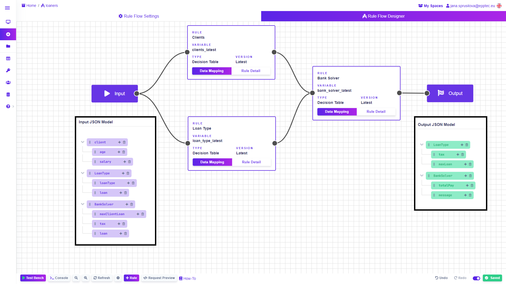
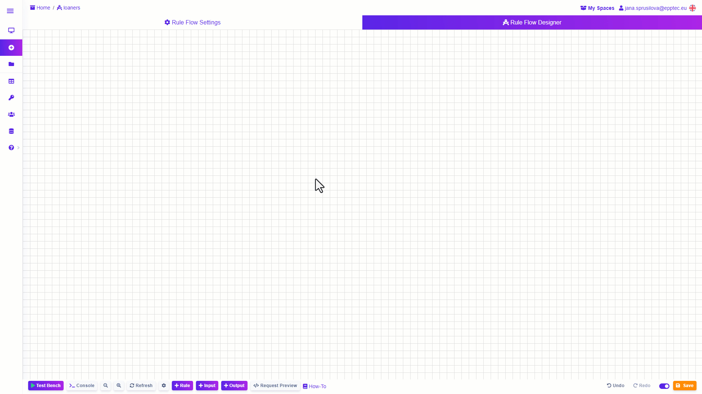
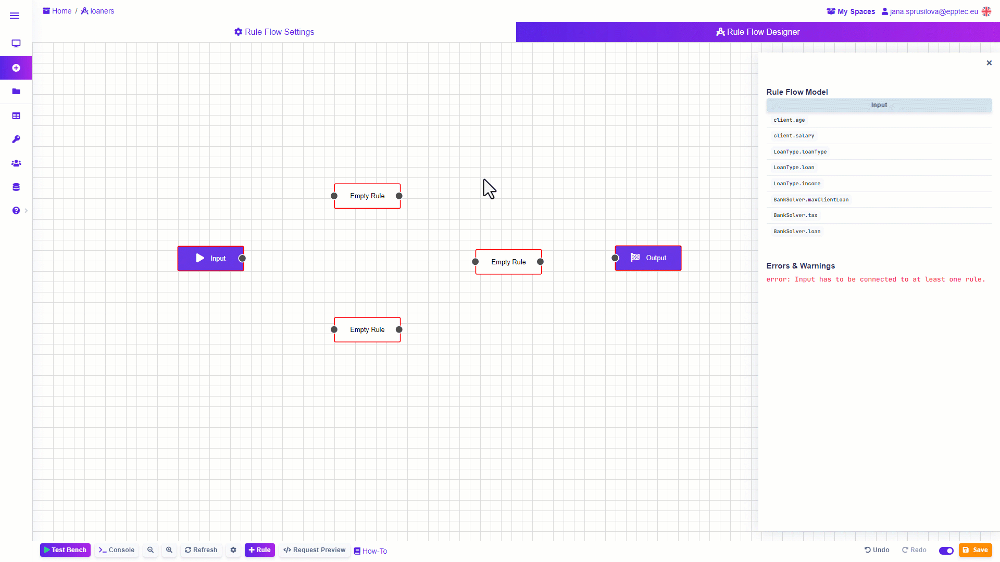
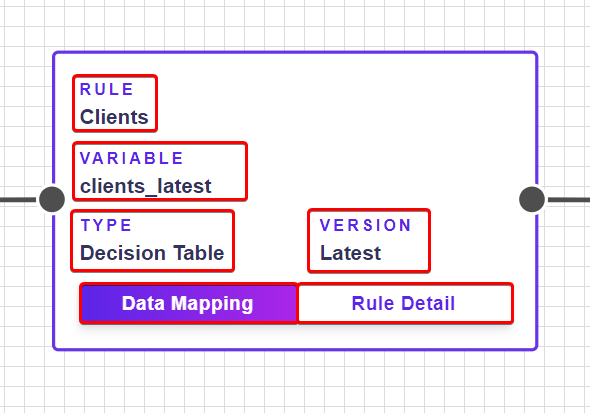
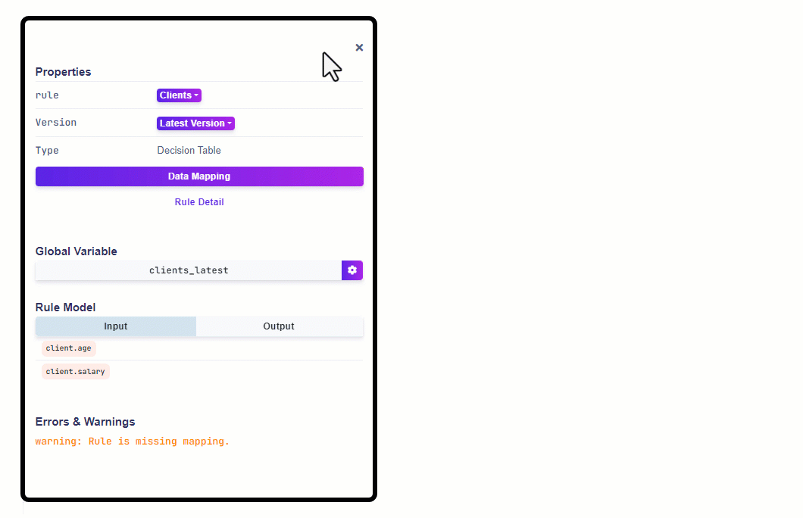
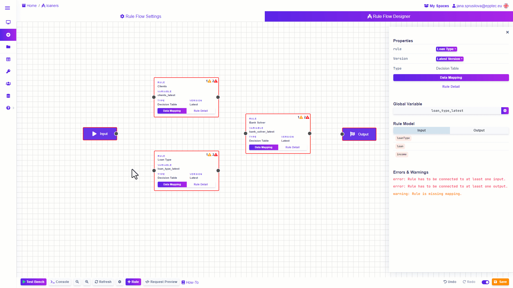

# Rule Flow

Introduction

Rule Flow is a type of rule with which you can easily create a complex decision-making process. Using a visual Rule Designer, you simply connect the individual rules that are part of the decision process. In the Rule Flow, you can use any rule type and any version of the rule. This means that a Rule Flow can be included in another rule flow, or 2 versions of the same rule can be used in the same Rule Flow.

In the images below you can see a simple business diagram of the client loan approval process. This will calculate the loan amount and the total amount payable based on inputs such as salary, age of the client and other inputs.

<figure><figcaption></figcaption></figure>

The second image shows what the solution might look like in Rule Flow. Note that our solution does not differ from the original diagram. Even complex processes can look simple thanks to <mark style="color:purple;">DecisionRules</mark>, just as you have designed them.

<figure><figcaption>
<mark style="color:purple;">Solution designed in Rule Flow</mark>
</figcaption></figure>

### From simple rules to complex decision-making process

Make individual subdecision rules simple and easy to manage, adding complexity and consistency just by connecting them in the Rule Flow. This makes it easy to maintain in case something changes in your process. For example, if one tax rate changes or a new product is introduced, you can easily update or add values in the Decision Table or Decision Tree without having to rebuild your entire decision process. Thanks to the Rule Flow you can connect rules to create even more complex decisioning logic.

### Rule Flow Designer

#### Interface

Like other rules, Rule Flow is different in Rule Designer. It is designed like a blank canvas on which you add the rules and connect them together. Use mouse dragging to move around. Use the mouse wheel or the Zoom In and Zoom Out buttons in the bottom bar of the Designer to adjust the zoom level.

#### How does the Rule Flow look like

Rule flow is actually a graphical representation, an interactive diagram, of the decision-making process in which you create one larger rule from the individual decision rules. Each rule you add to the Rule Flow will be represented by a box. In addition, the Input and Output boxes, graphical representations of the input-output model defined in Rule Settings, are an integral part of the Rule Flow. Use them to create the flow of data through your Rule Flow.

#### Adding Rules to Rule Flow

When you create a new Rule Flow, you will see a blank Rule Flow Designer where you will add and connect your rules. Down in the bottom bar, click on the "+ Input" and "+ Output" buttons to add the Input and Output boxes that will represent the I/O model mentioned above.

To add individual rules, click on the "+ Rule" button or Ctrl+click on your Rule Flow canvas. A box will appear in the Designer to which you assign the rule of your choice. To delete the box you no longer need, select the rule and press the Delete key on your keyboard or right click on a box and click black button with “x” in it.

<figure><figcaption>
<mark style="color:purple;">See how to add and remove rule boxes</mark>
</figcaption></figure>

#### Assigning Rules to boxes

Clicking on the box will bring up a side menu which will give you various information about the rule once you have assigned it. To do so, click on the "Select Rule" button in the side menu and select the desired rule from the drop-down list. To find the rule more easily, you can use the Search field. After selecting a rule, you can specify the version of the rule you want to use. The default version setting is Latest Version.

<figure><figcaption>
<mark style="color:purple;">How to assign rules to boxes in your Rule Flow</mark>
</figcaption></figure>

The assigned rule box contains basic information to easily identify rules in your Rule Flow. You will find the rule name, global variable, rule type, and rule version. You can also access the Data Mapping of the rule from the box or open the rule in a new browser tab.

<figure><figcaption>
<mark style="color:purple;">Assigner rule box</mark>
</figcaption></figure>

Rule boxes are rewritable. This means that if in your decision making process you need to replace a rule with a newer version or a completely different rule, you can easily do so by clicking on the rule box and selecting the rule you wish to add to Rule Flow from the list in the side menu that opens.

#### Rule Properties

Once you've assigned a rule to the box, you can click on it to view useful information. In the side menu, in addition to changing the rule or its version, you can see the global variable used to map the rule (see below) and the rule input/output model.

<figure><figcaption>
<mark style="color:purple;">Description of Rule Properties menu</mark>
</figcaption></figure>

#### Rule Flow mapping and rule connection

Once you have assigned the rules to the added boxes, you can start connecting them together as your decision logic requires. Each box has handles from which you drag a line to other boxes.

<figure><figcaption></figcaption></figure>

Linked rules form a path for rule input and output data. Use Rule Flow Mapping to easily set what data enters and exits a rule. The mapping can be accessed from two places - from the box where the rule is assigned or from the side menu that opens when you click on the desired rule. Click on the “Data Mapping” button to show the Mapping window.

<figure><figcaption></figcaption></figure>

The Mapping window displays information about the selected rule in the header. The main part of the window is the mapping table itself. In the "Source" section on the left, you select the source rule (its global variable) from which the input data entering your rule will come. Next, you select a specific value from the source rule's output that will input the corresponding value on the right in the "Target" section. Once you link these two values, the input values of your mapped rule will change color to green. Save the mapping using the "Confirm" button on the bottom right. If you need to delete existing mapping, open Data Mapping then click the “Delete Mapping” button and save with Confirm button.

<figure><figcaption></figcaption></figure>


Once you replace a rule in a box with another one or delete a rule from the rule flow, you need to check the mapping of the rule flow, as it is probably outdated and you will need to remap the Rule Flow to restore the dataflow.


#### Testing Rule Flow

Like other types of rules, you can test the functionality of your Rule Flow using the Test Bench in the bottom bar. Open the Test Bench and enter the input values, then click the "Run" button to evaluate the rule.

Use Debug Mode to see how the data is evaluated in each rule of your Rule Flow. Enable Debug Mode in Test Bench by clicking the "Debug" button, which will solve your rule again. You can select the "Show Data" option for each rule. The table will display the input and output data for the selected rule.

<figure><figcaption>
<mark style="color:purple;">Test your Rule Flow in the Test Bench with Debug Mode</mark>
</figcaption></figure>
