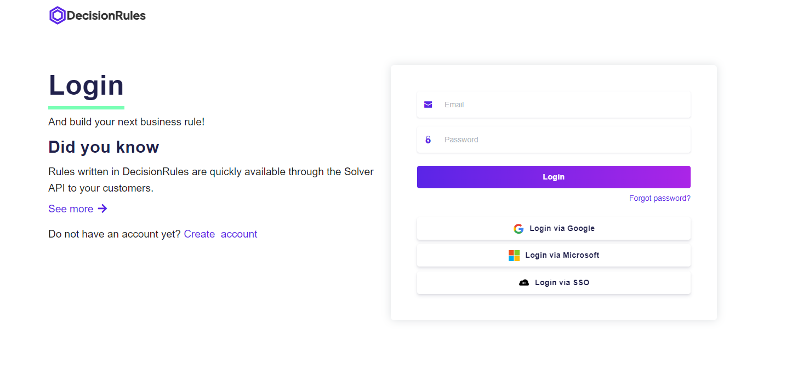
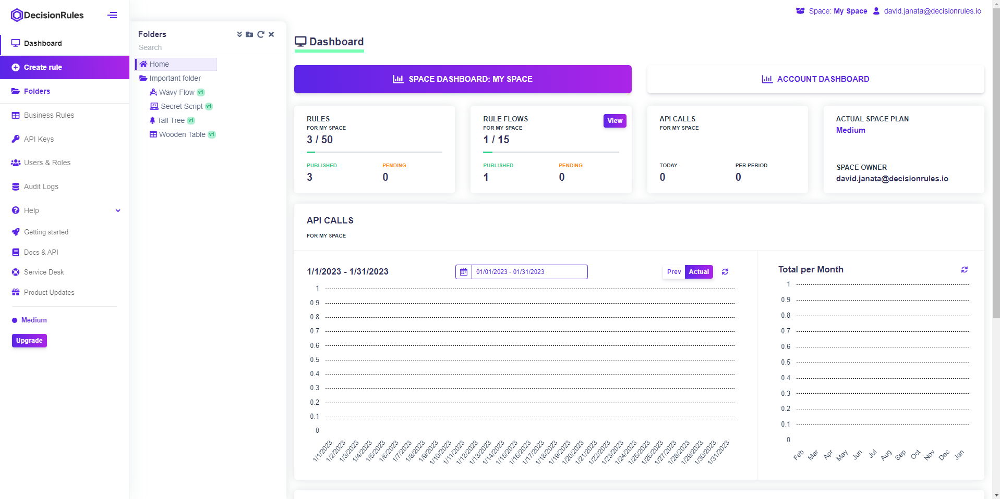
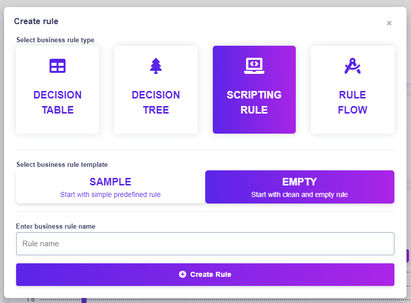
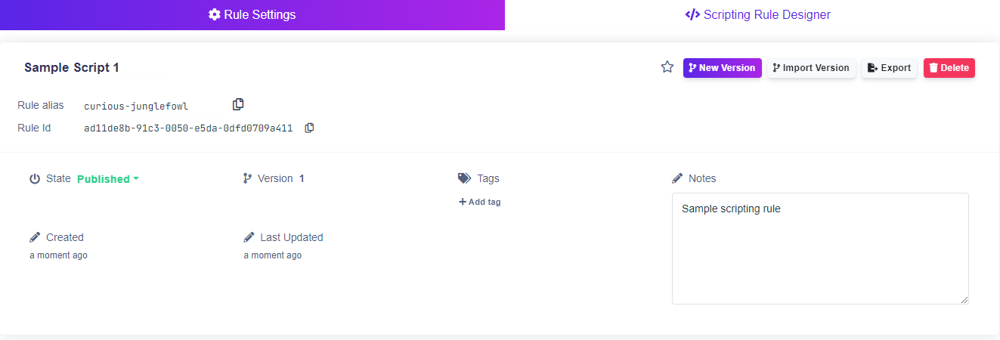
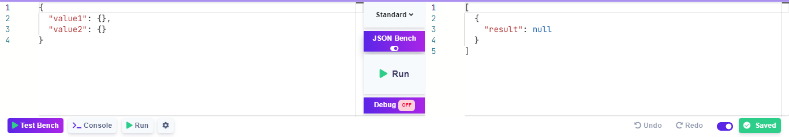

# Create Simple Scripting Rule

## How to create a simple decision table

Let's advance one step at a time.

### 1. Log in

Becoming a superhero is a fairly straightforward process. After entering our [<mark style="color:purple;">login page</mark>](https://app.decisionrules.io/auth/login), you will be able to pass your credentials and log in.

<figure><figcaption></figcaption></figure>

There are multiple options for user login. If you do not have an account yet, you can [<mark style="color:purple;">create one</mark>](https://app.decisionrules.io/auth/register?type=true-registration). After logging in to the application, the [<mark style="color:purple;">Dashboard</mark>](../../spaces/space-dashboard.md) will be displayed.

<figure><figcaption></figcaption></figure>

### 2. Go to Create rule

To display the rule creation pop-up click the <mark style="background-color:purple;">**Create rule**</mark> button on the sidebar.

<figure><figcaption></figcaption></figure>

### 3. Create a new Scripting Rule

You will be prompted to provide a name and choose between **SAMPLE RULE** or **EMPTY RULE.** For now, name the rule as you wish and choose the EMPTY RULE. The new rule will be created and its detail will be displayed. We will continue in the Rule Settings tab.

### 4. Set scripting rules information

When you click on RULE SETTINGS on the top left corner, the scripting rule's detail will appear first to set some information. We will change the name of our script. To do this, click on it's name, enter one you like and press Enter.&#x20;

Since we do not want this decision table to be available yet, we will change its status to **"Pending"**. To do this, click on the current status **"Published"** and then select **"Pending"**.

<figure><figcaption></figcaption></figure>

### 5. Create an Input and Output model

We will now create an input and output model, which we will then use to set conditions and results. We create this model with a **JSON editor**.


After creating an input or output model, we must always confirm the changes with the <mark style="background-color:purple;">**Save**</mark>  button.


#### **Input model**

First, we delete all created objects. Then we will add our specified requirements (**value1, value2**) as empty objects.


Because our model is simple, these objects do not contain any others. For more complex models, more information is [<mark style="color:purple;">here</mark>](https://docs.decisionrules.io/doc/decision-tables/input-and-output/json-editor).


#### **Input model Example:**

```javascript
{
  "value1": {},
  "value2": {}
}
```

#### **Output model**

We set the output model similarly, where we set it as root **result** (empty object).

**Output model Example:**

```javascript
{
  "result": {}
}
```

### 6. Creating rules

Now let's move on to code editor by clicking on **Scripting Rule Designer** it in the right upper corner and create individual rules.


Our code editor is based on **Monaco Editor,** using its features, like autocomplete, syntax highlight, line numbers, etc.

**Shortcut Keys** are also working, but you need to be with a cursor in the editor.

**CTRL/CMD + S** - save

**CTRL/CMD + R** - run

**CTRL/CMD + Z** - undo

**CTRL/CMD + SHIFT + Z** - redo

**CTRL/CMD + F** - find

**SHIFT + ALT + F** - format



Scripts must be written in **JavaScript** language.


For simplicity, we will remove the code from the code editor to create a new rule.

When to code editor is empty, we can start to create our own rule in **JavaScript.** It is straightforward, and you need to write your code which can look like below.


Input must always be entered as input.yourInputVariable.

Output must always be entered as output.yourOutputVariable.

To return an output, always enter **return output** at the end of your script!



**console.log()** is forbidden due to performance, but you can use **log()** instead.



You can use **log()** to print values in the console, which is at the bottom of the code editor.


```javascript
/* 
    1.  Input variables
    Input body is set in input variable 
*/
let a = input.value1;
let b = input.value2;

/*
    2.  Define simple "multiply" function
*/
function multiply(a, b) {
    return a * b;
}

/*
    3.  Execute multiply function and store value result variable
*/
let resultMultiply = multiply(a, b);

/*
    4.  Set output model which is returned in REST API
*/
output.result = resultMultiply;

/*
    Optionally: It is possible print values to console
*/
log('Result multiply:', resultMultiply);

/*
    5.  Return output  
*/
return output;
```


Always **save** your script using <mark style="background-color:purple;">**Save**</mark> (bottom of the page) or CTRL/CMD + S


### 7. Test created scripting rule


Don't forget to save your scripting rule!


Now we can test our rule. Before testing the rule, we must change the status of the rule to **"Published"**.

If we want to test a rule, we can click on the <mark style="background-color:green;">**Run**</mark> icon at the bottom of the page. An input and output window will show up at the bottom of the page.

<figure><figcaption></figcaption></figure>


You can find more information about input and result at [<mark style="color:purple;">Solver API</mark>](https://docs.decisionrules.io/doc/api/rule-solver-api).


We can either click on the run button between input and output windows or <mark style="background-color:green;">**Run**</mark> the button on the top of the code editor. The result will be displayed in the **Output window (the right one)**.


The debug mode can be turned on by clicking on [ <mark style="background-color:purple;">**Debug off**</mark>](#user-content-fn-1)[^1] . In scripting rules, it will enable to write **log()** in the console.


#### Request body example:

```javascript
{
  "value1": 2,
  "value2": 4
}
```

#### Response body example:

```javascript
{
  "result": 8
}
```


More information about Test Bench is [<mark style="color:purple;">here</mark>](https://app.gitbook.com/s/-MN4F4-qybg8XDATvios/rules/common-rule-features/test-bench).


[^1]: 
