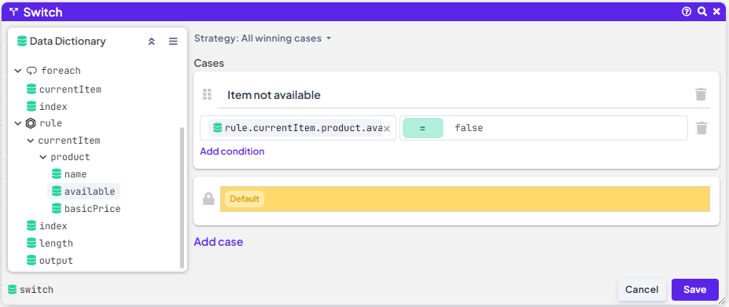

# Create a Workflow

In this detailed end-to-end tutorial, we’ll guide you through creating a simple workflow that processes order details to calculate the total price. This workflow integrates two decision tables: one that evaluates product details based on product IDs and branch, and another that applies customer discounts based on their loyalty class and credit status.


Both of those Decision Tables can be created as samples right in DecisionRules app


We'll cover navigating through the creation process, configuring workflow nodes, and generating the final output, which includes missing items, the total price payable, and a personalized message for the customer. At the end we’ll test our new rule with several inputs to ensure it works as expected. This tutorial will help you understand key workflow components and data manipulation techniques.&#x20;


Only a few node types are used in this tutorial. For a complete list of available workflow nodes, please refer to our dedicated [documentation page](https://app.gitbook.com/s/-MN4F4-qybg8XDATvios/workflow/workflow-nodes-overview).


## IO model

Our input model captures key details of an order, including items, branch information, and customer details such as loyalty class and credit balance.

```json
{
  "order": {
    "items": {},
    "branch": {},
    "customer": {
      "id": {},
      "loyaltyClass": {},
      "credit": {}
    }
  }
}
```

The output model includes calculated values like `initialTotal` and `totalPayable`, along with any missing items and a personalized message for the customer.

```json
{
  "finished_order": {
    "id": {},
    "missingItems": {},
    "initialTotal": {},
    "totalPayable": {},
    "message": {},
    "customer": {
      "id": {}
    }
  }
}
```

## Flow of the process

When designing the workflow as a decision process, establishing a logical flow ensures efficient processing of order details.

1. [**Initial Price Calculation**](create-a-workflow.md#id-1.-initial-price-calculation): Start by calculating the initial price of the customer’s order as a baseline for any potential discounts. This requires evaluating the price catalog decision table first. At this stage, we’ll also collect availability information for each item in the order to use later in the order message.
2. [**Discount Application**](create-a-workflow.md#id-2.-discount-application): With the initial price determined, check if the customer qualifies for a discount by evaluating the loyalty discount decision table. Based on this, calculate the final price, either discounted or not.
3. [**Generating the Final Order**](create-a-workflow.md#id-3.-generating-the-final-order): Use the values from the previous steps to populate the output properties specified in the output model. Additionally, if there are unavailable items, modify the order message accordingly.

## Building the Workflow

Now that we’ve outlined each step in the evaluation, it’s time to build our rule. In this section, we’ll configure the IO model, add and connect nodes to create the workflow flow.

### 1. Initial Price Calculation

Create a new blank workflow. In the Settings tab set up the input and output models as described above. Once set, properties of the model can be easily used in the workflow.

<figure><figcaption><p>Workflow IO model</p></figcaption></figure>

Now it's time for adding first nodes to the canvas. Start by adding a **Declare** node to define `initialTotal`. In this variable we will store the price of the order before potential discount. Simple drag and drop the node from the Palette tab on the right. When the node is on the canvas click the node open and set the variable. Save the modal and connect the **Start** node to it.

<figure><figcaption><p>Declaration of the initialTotal variable</p></figcaption></figure>

The next step is to add the first **Business Rule** node to evaluate the order's total price. Since orders often contain multiple items, we need to calculate the sum of each item’s price to get the overall total. We will use the **Foreach** node to repeat this evaluation, eliminating the need to manually add multiple **Business Rule** nodes to the canvas.


Using the **Foreach** node, you can define a data set and specify the processing logic to apply to each element. This allows efficient way to manage complex, repetitive tasks across datasets. More details can be found in our [documentation](https://app.gitbook.com/s/-MN4F4-qybg8XDATvios/workflow/workflow-nodes-overview#foreach).


Drag and drop the **Foreach** node onto the canvas, then click on it to open its configuration modal. In the modal, specify the list of order items that the node will process. You can do this by either manually entering the input property or by dragging it from the Data Dictionary tab.


Note that Data Dictionary tab and input whisperer store all already declared variables for easy access


<figure><figcaption><p>Setting the list of order's items</p></figcaption></figure>

Once the node is saved connect the node to **Declare** node. Now comes the part when we create a set of actions that will be performed for each item in the order. As mentioned we need to evaluate the Product Catalogue decision table to know and add the item price to total. In addition if the item is not available add it to the list of unavailable items.

First place the **Business Rule** node on the canvas and open it. In the Business rule field select _Product Catalogue Sample_ table, its input model shows. Now to the mapping to the business rule: for the _productId_ we will use the item that will be provided be **Foreach** node as only price for one item will be evaluated at a time, _branch_ - we want the property be passed right from the main workflow input.

<figure><figcaption><p>Business Rule node - item price evaluation</p></figcaption></figure>

When the **Business Rule** node retrieves the item price from the product catalog, we want to incrementally add this price in each iteration of the For Each loop. To set this up, add an **Assign** node to the canvas and open its configuration modal. In the Source field, create a formula that continuously updates the total by adding each item's price to the previous total. This formula will overwrite the initial price, increasing it as each item’s price is processed. Then save the modal and connect new node to **Business Rule** node.

<figure><figcaption><p>Incrementally Adding Each Item’s Price</p></figcaption></figure>

To collect the `productId` of each unavailable product, start by adding a **Switch** node and an **Append** node. The **Switch** node will check each item’s availability, and if the item is unavailable, the **Append** node will add its `productId` to an array named `items_unavailable`. This array will then be used in the order message to notify the customer about any items that are out of stock.


See that `items_unavailable` array can be created in the **Append** node


<figure><figcaption><p>Product availability check</p></figcaption></figure>

<figure><figcaption><p>Append out of stock productId</p></figcaption></figure>

We’ve now completed the first phase by calculating the initial order price (see the reference image below). With this foundation set, we’ll move forward to evaluate whether the customer qualifies for a discount. This next step will involve applying the Loyalty Discount rule, factoring in customer-specific details such as loyalty class and credit, to determine the final payable amount.

<figure><figcaption><p>Process of initial price calculation</p></figcaption></figure>

### 2. **Discount Application**

After calculating the initial order price, we’ll use it as the baseline for applying the loyalty discount, taking into account the customer's credit to calculate the discounted total.

Add another **Business Rule** node to the canvas and select the Loyalty Discount decision table. Map the `initialTotal` to the `basicPrice` input field.

When mapping the customer's loyalty information, you have two options:

* **Map the entire customer object**: Use this if you want to pass all customer properties without making any alterations.

or

* **Map properties individually**: This is ideal if customer details are sourced from multiple variables, allowing you to map each property directly.

Both options work interchangeably, but note that they are mutually exclusive, as selecting one disables the other.

<figure><figcaption><p>Mapping the Business Rule input</p></figcaption></figure>

### 3. **Generating the Order details**

Now that we have gathered all the necessary values, we can create the final order, which will include the total payable price, any missing items, and a personalized message. To map these values for display in the workflow output, we'll utilize an **Assign** node. In the modal we will map all the information to output properties.

To generate a simple order ID, we can utilize the **CONCAT** function, which combines today's date with the user's ID. This method ensures that each order ID is unique and easily traceable back to the specific user and the date of the order.

<figure><figcaption><p>Assigning values to Workflow Output</p></figcaption></figure>

To personalize the message shown to the customer, we will use a **Switch** node that checks for any items in the array created by the **Append** node. If any items are out of stock, their identifiers will be stored in this array. We will then use the contents of the array to craft a message for the customer, informing them about the unavailable items using **Assign** node. This ensures that the communication is tailored to each customer's order.

If all the items are available we will use message:&#x20;

```
"Thank you for your order! Your order will be shipped next business day." 
```

If any of the ordered items is missing, we can use the **CONCAT** function to generate a parameterized message that informs the customer specifically about the unavailable items:


```
CONCAT("Thank you for your order! Unfortunately, the following item(s) are currently out of stock: ",{items_unavailable},". We appreciate your understanding and the order will be shipped as soon as the items become available.")
```



More about functions, their types and syntax can be found in [dedicated section of our documentation](https://app.gitbook.com/s/-MN4F4-qybg8XDATvios/decision-tables/operators/functions).


To get a complete view of how data appears at the end of the workflow, add **End** nodes right after the **Assign** nodes. When you run the workflow, you’ll see the final data in each branch’s **Inspect** tab, showing the actual results once the rule has fully executed. This provides a clear, final snapshot of all processed data.

<figure><figcaption><p>Adding End nod for branches</p></figcaption></figure>

Congratulations! :tada: You've completed the workflow, which might look something like this:

<figure><figcaption><p>Workflow overview</p></figcaption></figure>

In the next section, we’ll test the workflow with some inputs to ensure it’s functioning correctly. Before proceeding, please double-check that all workflow nodes are fully configured and properly connected.

## Testing the Workflow

Testing your workflow with sample inputs is an essential step to confirm it works as expected. We will start with main cases that cover scenarios, such as orders with available items, orders with missing items, and orders eligible for discounts.

Run the workflow with these inputs and use the **Inspect** tab in the **End** nodes or Workflow Testbench to review the results. This allows you to verify that each node is executing correctly and that data flows through the workflow as intended.


Learn more about Workflow evaluation process [here](https://app.gitbook.com/s/-MN4F4-qybg8XDATvios/workflow/workflow-introduction#workflow-evaluation).


<details>

<summary>One item is not available, customer's first order (no discount)</summary>

```json
{
  "order": { 
    "items": ["P_0011","P_0009","P_0032","P_0021"],
    "branch": "SHOP_B",
    "customer": {
      "id": 123,
      "loyaltyClass": "FIRST_VISIT",
      "credit": 0
    }
  }
}
```

</details>

<details>

<summary>One item is not available, customer has loyalty class and credit</summary>

```json
{
  "order": { 
    "items": ["P_0011","P_0009","P_0032","P_0021"],
    "branch": "SHOP_B",
    "customer": {
      "id": 123,
      "loyaltyClass": "LOYALTY1",
      "credit": 32
    }
  }
}
```

</details>

<details>

<summary>All items are available, customer has loyalty class and credit</summary>

```json
{
  "order": { 
    "items": ["P_0011","P_0009","P_0032","P_0021"],
    "branch": "SHOP_A",
    "customer": {
      "id": 123,
      "loyaltyClass": "LOYALTY1",
      "credit": 32
    }
  }
}
```

</details>

## Summary

In this tutorial, we built a workflow to process an order by calculating the initial price, checking for discounts, and identifying any out-of-stock items. We configured nodes to perform actions such as summing item prices, applying loyalty discounts, and generating a personalized message. Each node was mapped to the output model, giving us a complete order summary. Finally, we ran tests with sample inputs to validate the workflow, ensuring that each component works as intended and provides accurate, actionable output for the customer.

To wrap up, let’s go over a few best practices to enhance your workflow’s effectiveness and maintainability. These tips can help ensure smooth operation, improve readability, and make troubleshooting easier down the line:

* rename nodes added to the canvas to better fit your process and increase the readability
* test your workflow during the process of creation to discover potentials errors as soon as possible
* use Sticky Notes to document the process for better understanding

See the workflow below that you can easily import into your environment. This completed workflow demonstrates all the processes we’ve covered, providing a clear example of how to configure and connect everything for effective order processing.


