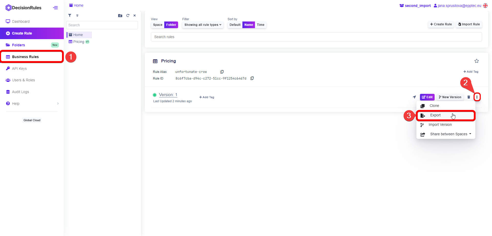
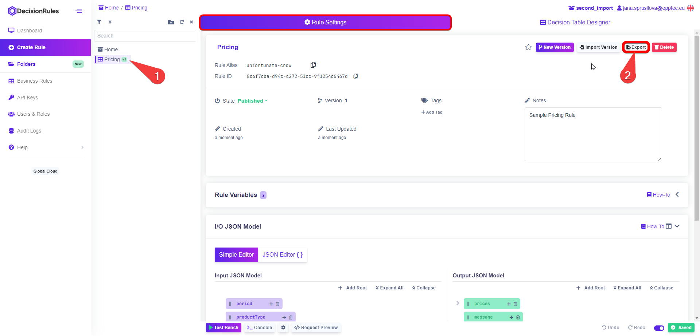
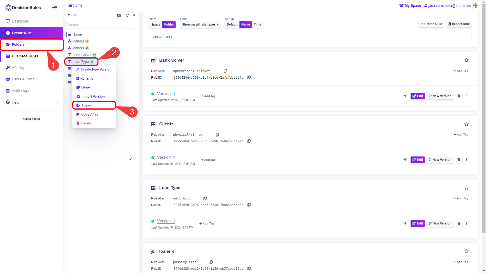
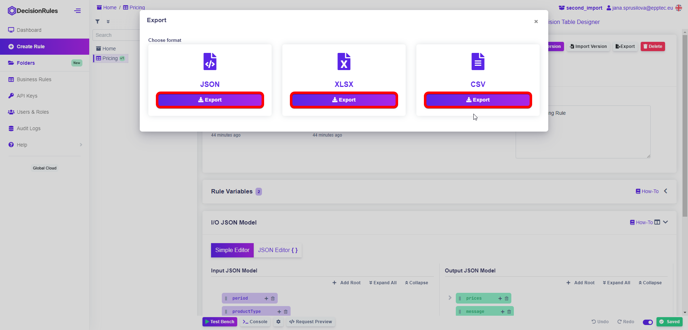
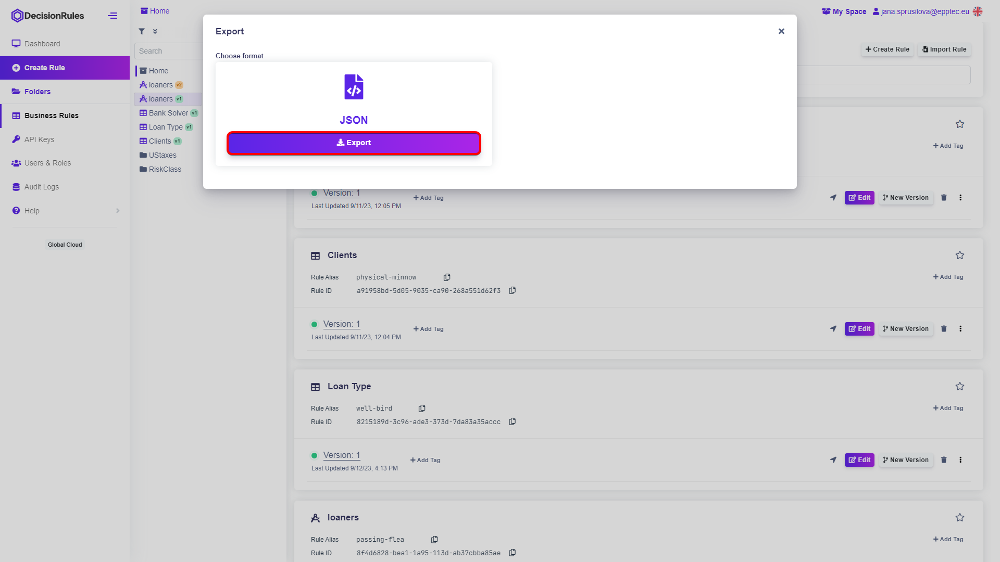

# Export Rule

### 1.1 Exporting from Business Rules

As you know, your rules can be accessed from the “Business Rules” in the left sidebar menu. From there you can export rules by clicking on the context menu button .png>) and choosing “Export”.

<figure><figcaption>
<mark style="color:purple;">Export Rule from Business Rules</mark>
</figcaption></figure>

### 1.2 Exporting from Rule Settings

In the Rule Settings tab you can do various actions such as exporting your rule to a file. At the top click on the  button.

<figure><figcaption>
<mark style="color:purple;">Export Rule from Rule Settings</mark>
</figcaption></figure>

### 1.3 Exporting from Folders structure

Make sure the folder structure is open. Right click on the rule you want to export. In the context menu simply select “Export”.

<figure><figcaption>
<mark style="color:purple;">Export Rule from Folder Structure</mark>
</figcaption></figure>

## Choose export format

### 2.1 Choosing export format of Decision Table:

When exporting the decision table you can choose from three different file formats based on your further actions. For transporting rules to another space you can choose JSON format. If you want to modify your table and for example input more data in it, choose XLSX or CSV format.

<figure><figcaption>
<mark style="color:purple;">Export Formats of Decision Table</mark>
</figcaption></figure>

### 2.2 Choosing export format of other Rule types:

Other rule types - Rule Flow, Decision Tree and Scripting rule have a single export option - JSON format. These types should be created and modified in the DecisionRules application.

<figure><figcaption>
<mark style="color:purple;">Export Formats of other Rule types</mark>
</figcaption></figure>

Once you choose the right format, your export will start automatically. The exported file can be found where your browser stores downloaded files.


_These are manual methods of exporting rules. Using Management API methods and external tools you can export rules in one click. More information about API functioning can be found in documentation link_ [_<mark style="color:purple;">here</mark>_](https://app.gitbook.com/s/-MN4F4-qybg8XDATvios/api/api-introduction)

