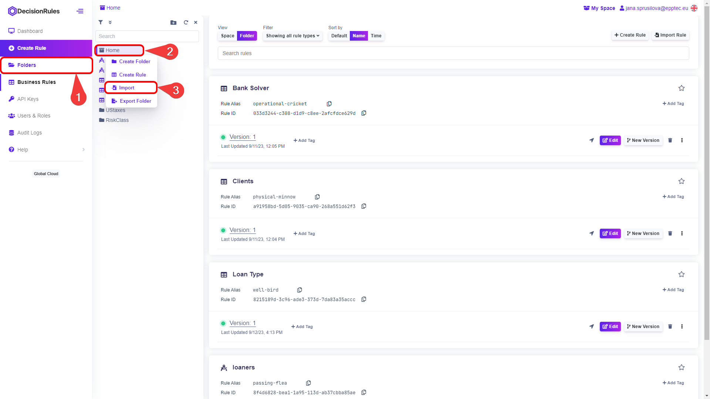
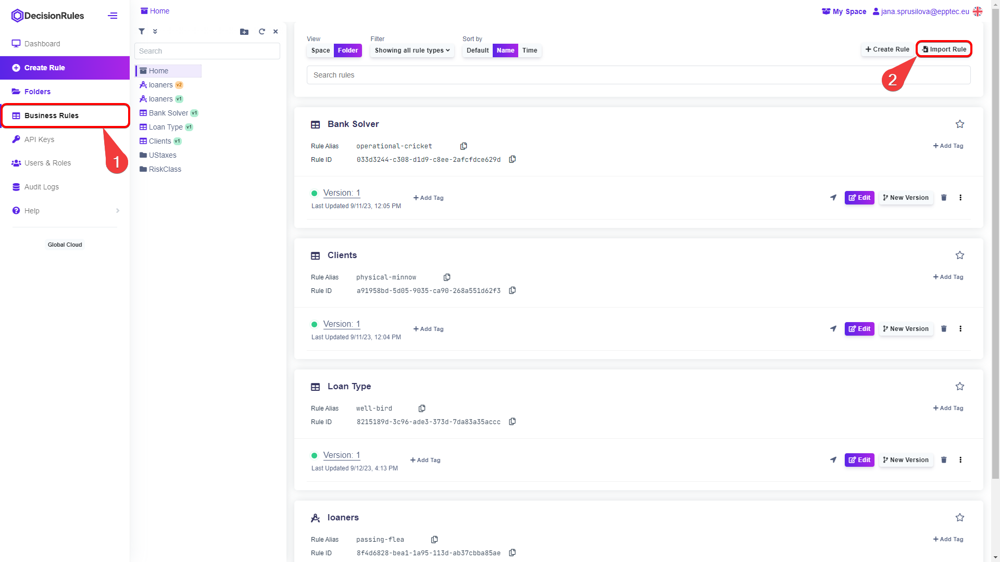
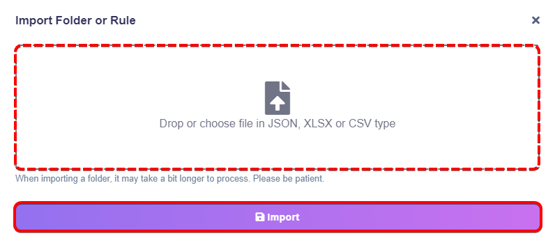
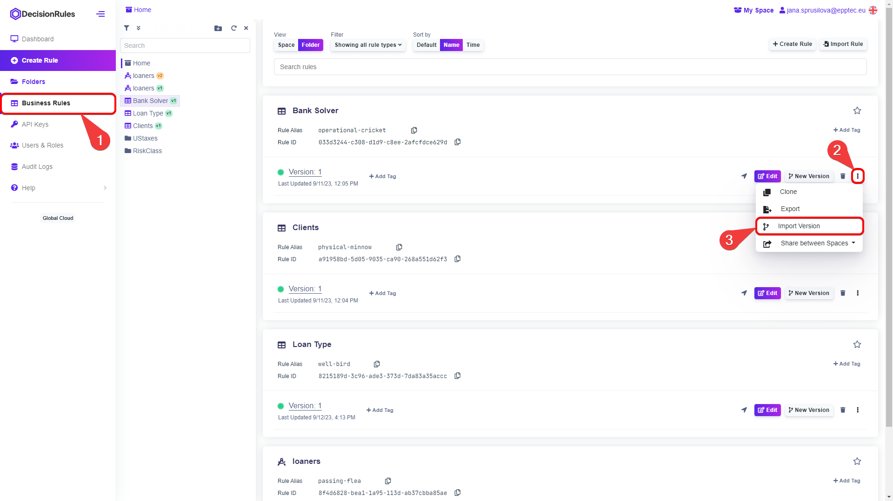

# Import Rule

When importing a rule, you can create a new rule, a new version of an existing rule, or overwrite an existing rule version.


_For Decision Tables, the rule file can have the formats: <mark style="color:purple;">JSON</mark>, <mark style="color:purple;">XLSX</mark> or <mark style="color:purple;">CSV</mark>. Other rule types: Rule Flow, Decision Tree and Scripting rule have a single export option - <mark style="color:purple;">JSON</mark> format._


### Importing a new rule

Create a new rule in two places:

1. Import the rule in the Folders structure directly into the desired folder. Open the Folders structure, right-click on the folder of your choice and select "Import Rule" from the context menu.

<figure><figcaption>
<mark style="color:purple;">Import a Rule in Folder Structure</mark>
</figcaption></figure>

2. Or you can import the new rule to the Business Rules category. Just open the Business Rule from the side menu. Click on the "Import Rule" button on the top right.

<figure><figcaption>
<mark style="color:purple;">Import a Rule in Business Rules</mark>
</figcaption></figure>

When you click on “Import”, you will be prompted to drop or choose a file from your system containing the rule.

<figure><figcaption></figcaption></figure>

Once your rule file has been selected, click the  button.


_You can import one file at a time._


### Import a new version or overwrite an existing version

#### Import to:

You can import a rule as a new version of an existing rule:

1. Add a new version of the rule directly in the Folders structure. Right-click on the selected rule. A context menu will appear and select "Import Version"

<figure><figcaption>
<mark style="color:purple;">Import a Rule in Folder Structure</mark>
</figcaption></figure>

2. Or import a new rule version to the Business Rules category. Find your rule, click on the .png>) button and select “Import Version”.

<figure><figcaption>
<mark style="color:purple;">Import a Rule in Business Rules</mark>
</figcaption></figure>

**Import version**

When you click on “Import”, “Import version dialog” will appear. There you select if you want to import the file to:

1. Create a new version of the rule
2. Overwrite an existing version


_Overwriting the version is an irreversible action, the overwritten rule is lost. Please use this option wisely._


After selecting the method of import drop or choose a file from your system containing the rule.

<figure><figcaption></figcaption></figure>


_You can import one file at a time._



_These are manual methods of exporting rules. Using Management API methods and external tools you can export rules in one click. More information about API functioning can be found in documentation link_ [_<mark style="color:purple;">here</mark>_](https://app.gitbook.com/s/-MN4F4-qybg8XDATvios/api/api-introduction)

