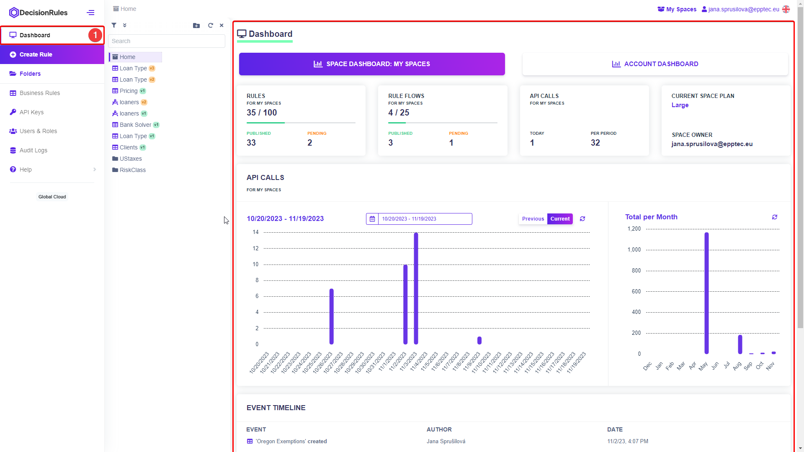
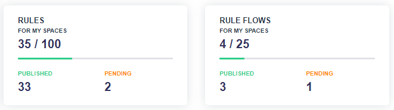
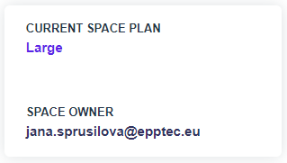
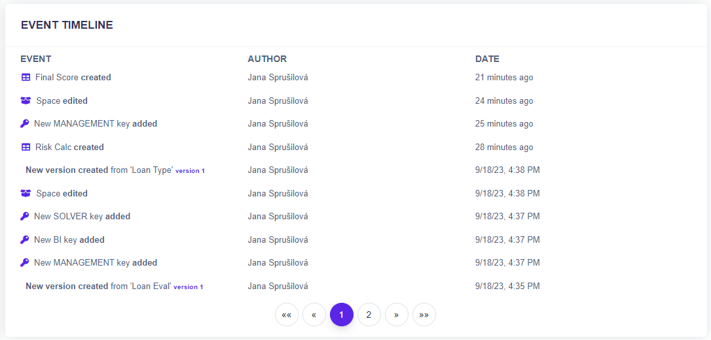

# Space Dashboard

## Introduction

The Dashboard is where you can see information and statistics about the usage of a given space. The Dashboard appears automatically when you log in to <mark style="color:purple;">DecisionRules</mark>. In case you are currently working on a rule, you can access the dashboard from the left side menu by clicking on the Dashboard button.

<figure><figcaption></figcaption></figure>

## Dashboard Sections

The Dashboard has several sections where you can easily find individual information about the selected space.

### Rules and Rule Flows

In the rules section you can see how many rules and rule flows are created on the space, and what the limit is. It also shows the number of rules with pending and published status. All of your published rules can be solved and accessed using an external tool.

<figure><figcaption></figcaption></figure>


_The number of rules is based on your schedule. In case you run out of space for rules, you can navigate directly from the dashboard to the plans page where you can simply upgrade your plan._


### Space Information

In the right section you will find the current space plan along with the email address of the owner of that space. If you are not the owner yourself, you can contact the owner on matters relating to the space.

<figure><figcaption></figcaption></figure>

### API Calls

In the API Calls section, you can keep track of your number of API calls. The graph allows you to see the number of calls for each day in the current period. Using the calendar you can select the specific period you want to track. The graph on the right summarizes the calls for each month.

<figure><figcaption></figcaption></figure>

### Event Timeline

Track changes that have been made to your space in the event timeline. Show rule creation, versioning; API key creation and more. Each event records the event name, the author, as well as the timestamp.

<figure><figcaption></figcaption></figure>
