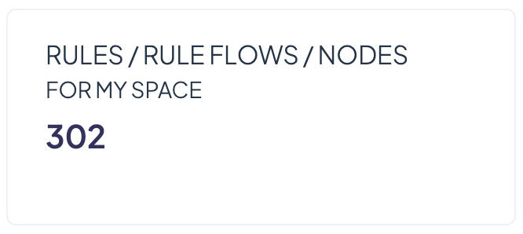
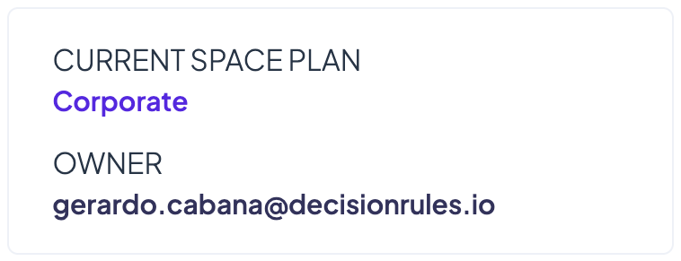
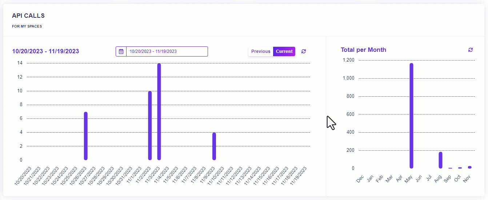

# Space Dashboard

## Introduction

The dashboard is where you can see information and statistics about the usage of a given Space. Because the rule list appears automatically when you log in to <mark style="color:purple;">DecisionRules,</mark> for a checking of the Space dashboard you first must click "Space" in the side menu. A list of configurations will open in a left sidebar and there you can press the "Dashboard" option. The Space dashboard will display.&#x20;

<figure><figcaption></figcaption></figure>

## Dashboard Sections

The Dashboard has several sections where you can easily find individual information about the selected space.

### Rules, Rule Flows and Nodes

In the rules section you can see how many [rules, rule flows and nodes](../rules/what-is-a-rule.md) have been created in the Space. Although these are different concepts, they are counted in the same manner. There is no distinction made between the number of rules with pending status and the numbers of rules with published status. In practice, the main difference is that all your published rules can be solved and accessed using an external tool, while pending rules cannot.

<figure><figcaption></figcaption></figure>


_The number of rules is based on your plan subscription. In case you run out of space for rules, you can navigate directly from the dashboard to the plans page where you can simply upgrade your plan._


### Space Information

In the right section you will find the current space plan along with the email address of the owner of that space. If you are not the owner yourself, you can contact the owner on matters relating to the space.

<figure><figcaption></figcaption></figure>

### API Calls

In the API Calls section, you can keep track of your number of API calls. The graph allows you to see the number of calls for each day in the current period. Using the calendar you can select the specific period you want to track. The graph on the right summarizes the calls for each month.

<figure><figcaption></figcaption></figure>
