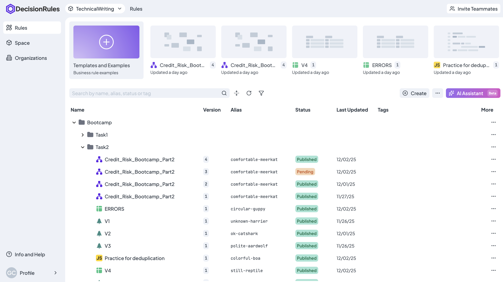
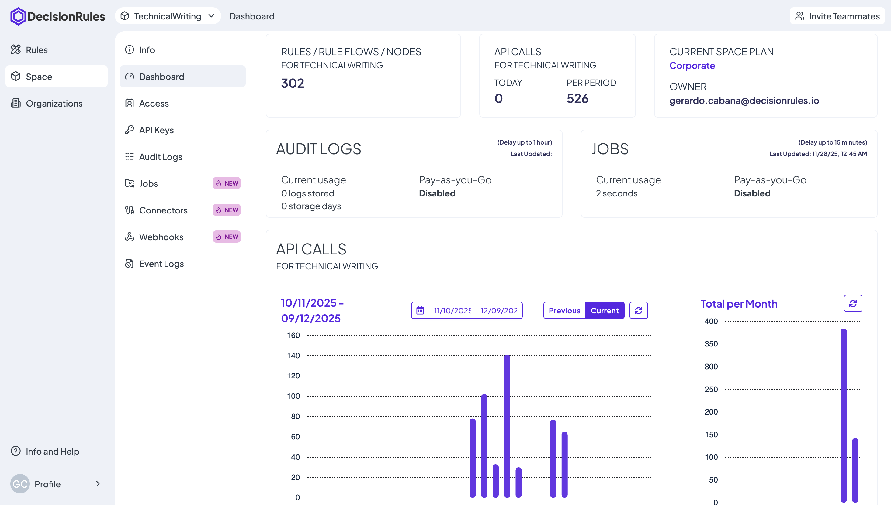

# Space Side Menu

The side menu gives you access to three main sections:&#x20;

| SECTION           | CONTENT                                 | PURPOSE                                                                  |
| ----------------- | --------------------------------------- | ------------------------------------------------------------------------ |
| **Rules**         | Your decision rules.                    | Manage the specific rules for your current Space.                        |
| **Space**         | Settings of the Space.                  | Adjust settings and features of that particular Space.                   |
| **Organizations** | Order and management of several Spaces. | Manage all capabilities of your Spaces and get a comprehensive overview. |

Simply click on "Space" and explore the menu of your Space, you will be taken to their sections as you click on the different options.

### Rules

The decision rules that you create belong to your Space. You can find your list of rules in the "Rules" section of the menu, where you can either filter the list by rule type or sort it by name or date created.

In addition, you can also organize your rules in Folder Structure, which is very similar to the file structure on your computer.


_More about the Rule List in your Space can be found_ [_<mark style="color:purple;">here</mark>_](https://docs.decisionrules.io/doc/rules/rule-list)_._


<figure><figcaption>
<mark style="color:purple;">Business Rules</mark>
</figcaption></figure>

### Space

#### Info

Manage the general information of your Space in the Info section...&#x20;

#### **Dashboard**

The Space Dashboard provides statistics related to the Space. For example, it displays the number of Rules, API calls or the Current Space Plan. The Dashboard also displays information and statistics related to Audit Logs of your rules and to Jobs.&#x20;

<figure><figcaption>
<mark style="color:purple;">Space Dashboard</mark>
</figcaption></figure>

#### Access

On this section, you can manage individual users and their roles. You can either assign predefined roles, such as Admin, Editor and Reader, or create new custom roles with the  <mark style="background-color:purple;">**+ Add Role**</mark>  button. A Role contains a list of permissions granted to the user.&#x20;

Invite new users to your Space using the   <mark style="background-color:purple;">**+ Invite Teammates**</mark>  option. First, select whether the teammate is a new user and assign the appropriate role. You can also manage the invitations in the bottom section of the page.


_The number of users you can invite is predetermined by your Tariff Limit, which is compared to the sum of existing users and unique invitations._

_This practically means that users who are already invited to one of your Spaces can easily be invited to your other Spaces._


#### API Keys

API Keys are an integral part of your Space. These are unique keys that are used for authorization when calling rules. Particularly, from an external tool.

There are three types of API Keys in <mark style="color:purple;">DecisionRules</mark>:

* Solver API Key
* Management API Key
* Business Intelligence API Key

The <mark style="color:purple;">Solver API Key</mark> is the most important, it gives you access to send requests that activate your decision rules and return output data.


_This kind of key is used every time you solve your rule using the Test Bench. You may notice that this kind of key is generated automatically when a new Space is created. So you can build and test your rules right from the start._


<mark style="color:purple;">Management API Keys</mark> are used for read and write access to your rules. They allow you to change parameters or values in your rules, add tags or change the status of a rule. You can create a new Management API Key by clicking on the  <mark style="background-color:purple;">**+ Add API Key**</mark>  button on API Keys section.

Use <mark style="color:purple;">Business Intelligence API Keys</mark> to access Audit Logs - data about the solving of your rules. In addition to output data, you will also receive additional metadata about individual rule solves. You can create a new Business Intelligence API Key by clicking on the same  <mark style="background-color:purple;">**+ Add API Key**</mark>  button on API Keys section.

<figure><figcaption>
<mark style="color:purple;">API Keys</mark>
</figcaption></figure>

#### Audit Logs

Collect information about the performance of your rules. In the Audit Logs section, you can view and manage all records you have created for each rule.


_Audit Logs are not created automatically. Turn on the Audit Logs feature for each rule individually in its Rule Settings._


<figure><figcaption>
<mark style="color:purple;">Audit Logs</mark>
</figcaption></figure>

### New Space

If you need to create a new space for another project, or for testing your rules for example, simply click on the Space Name at the top left corner, next to our logo. A list of the Spaces you are a user in will appear. At the top right corner, click the  <mark style="background-color:purple;">**+ Space**</mark>  button, select destination and enter a name for the new Space. Click on the "Create" button and the new Space will be created.

### Switching between Spaces

If you are a user of several Spaces, you can switch between them freely. Click on the Space Name next to our logo. A list of all the Spaces you are a user in will appear. The list is divided into your own Spaces and those that someone else owns and has invited you to.


_Before switching to another Space, make sure you have saved your progress._



For more information about the features in your Space Menu read our [documentation](https://docs.decisionrules.io/doc/space/spaces).

