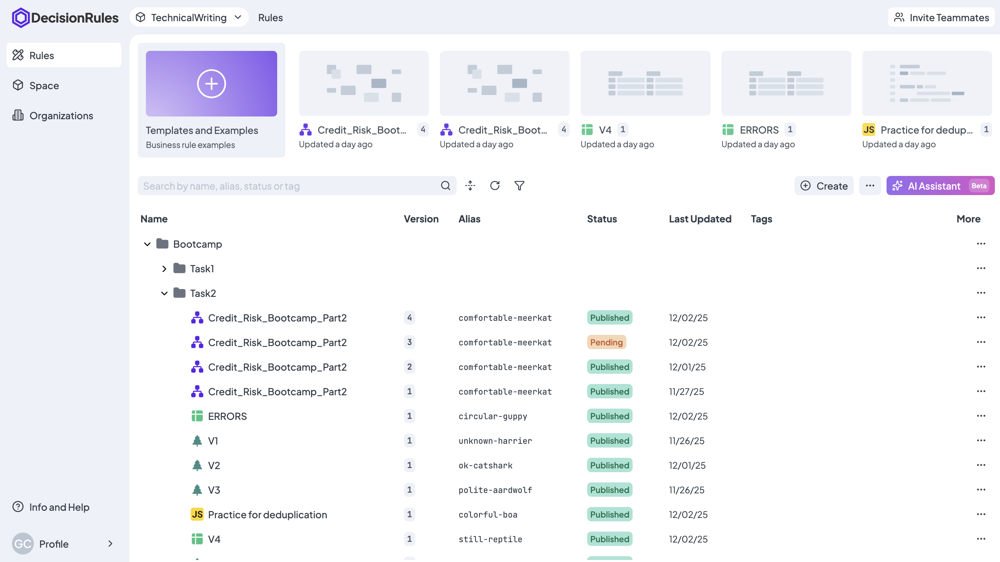

# Space Side Menu

The side menu gives you access to three main sections:&#x20;

| SECTION           | CONTENT                                 | PURPOSE                                                                  |
| ----------------- | --------------------------------------- | ------------------------------------------------------------------------ |
| **Rules**         | Your decision rules.                    | Manage the specific rules for your current Space.                        |
| **Space**         | Settings of the Space.                  | Adjust settings and features of that particular Space.                   |
| **Organizations** | Order and management of several Spaces. | Manage all capabilities of your Spaces and get a comprehensive overview. |

Simply click on "Space" and explore the menu of your Space, you will be taken to their sections as you click on the different options.

### Rules

The decision rules that you create belong to your Space. You can find your list of rules in the "Rules" section of the menu, where you can either filter the list by rule type or sort it by name or date created.

In addition, you can also organize your rules in Folder Structure, which is very similar to the file structure on your computer.


_More about the Rule List in your Space can be found_ [_<mark style="color:purple;">here</mark>_](https://docs.decisionrules.io/doc/rules/rule-list)_._


<figure><figcaption>
<mark style="color:purple;">Business Rules</mark>
</figcaption></figure>

### Space

#### Info

General data management for your Space can be found in the Info section:

* Space Name
* Space Owner
* Your Space Role
* Number of Rules
* Number of Users
* API calls per period

<figure><figcaption></figcaption></figure>

#### Access

On this section, you can manage individual users and their roles. You can either assign predefined roles, such as Admin, Editor and Reader, or create new custom roles with the  <mark style="background-color:purple;">**+ Add Role**</mark>  button. A Role contains a list of permissions granted to the user. See the [Users in Spaces](https://academy.decisionrules.io/spaces/users-in-spaces) section for more detailed information.

Invite new users to your Space using the   <mark style="background-color:purple;">**+ Invite Teammates**</mark>  option. First, select whether the teammate is a new user and assign the appropriate role. You can also manage the invitations in the bottom section of the Rules window.


_The number of users you can invite is predetermined by your Tariff Limit, which is compared to the sum of existing users and unique invitations._



If you are using an Organization, the management of access and precise roles is handled in the Organizations' settings, not in this Space menu.


#### API Keys

API Keys are an integral part of your Space. These are unique keys that are used for authorization when calling rules. Particularly, from an external tool.

There are three types of API Keys in <mark style="color:purple;">DecisionRules</mark>:

* Solver API Key
* Management API Key
* Business Intelligence API Key

The <mark style="color:purple;">Solver API Key</mark> is the most important, it gives you access to send requests that activate your decision rules and return output data.


_This kind of key is used every time you solve your rule using the Test Bench. You may notice that this kind of key is generated automatically when a new Space is created. So you can build and test your rules right from the start._


<mark style="color:purple;">Management API Keys</mark> are used for read and write access to your rules. They allow you to change parameters or values in your rules, add tags or change the status of a rule. You can create a new Management API Key by clicking on the  <mark style="background-color:purple;">**+ Add API Key**</mark>  button on API Keys section.

Use <mark style="color:purple;">Business Intelligence API Keys</mark> to access Audit Logs - data about the solving of your rules. In addition to output data, you will also receive additional metadata about individual rule solves. You can create a new Business Intelligence API Key by clicking on the same  <mark style="background-color:purple;">**+ Add API Key**</mark>  button on API Keys section.

<figure><figcaption>
<mark style="color:purple;">API Keys</mark>
</figcaption></figure>

#### Audit Logs

Collect information about the performance of your rules. In the Audit Logs section, you can view and manage all records you have created for each rule.


_Audit Logs are not created automatically. Turn on the Audit Logs feature for each rule individually in its Rule Settings._


<figure><figcaption>
<mark style="color:purple;">Audit Logs</mark>
</figcaption></figure>

#### Jobs

When an asynchronous process is required, you can run your flows and then work on something else while they are running. The Job is the ticket to check the progress of your rules. This section manages all your jobs, their descriptions, statuses and results.


To dive on the logic of asynchronous processes you can check our Integration Flow.


#### Connectors

The integration of DecisionRules with your particular database is possible through the native Connectors. If you want to access another database while making a decision, you can add a REST API or Connector section. The management of Connectors is provided in this section.

#### Webhooks

Still related with asynchronous processes, this section allows you to create webhook links to receive a real-time report when your jobs are complete. Remember, webhooks are used in Integration Flows.

#### Event Logs

History of all changes to your rules are tracked in the event logs. If you want to check when a change was made or what type of change was made by a team member, you can browse this section.


Further information on these features for the Integration Flow can be found in the [documentation](https://docs.decisionrules.io/doc/space/jobs).


<figure><figcaption></figcaption></figure>

### New Space

If you need to create a new space for another project, or for testing your rules for example, simply click on the "_Space Name"_ at the top left corner, next to our logo. A list of the Spaces you are a user in will appear. At the top right corner, click the  <mark style="background-color:purple;">**+ Space**</mark>  button, select destination and enter a name for the new Space. Click on the "Create" button and the new Space will be created.

<figure><figcaption></figcaption></figure>

### Switching between Spaces

If you are a user of several Spaces, you can switch between them freely. Click on the "_Space Name"_ next to our logo. A list of all the Spaces you are a user in will appear. The list is divided into your own Spaces and those that someone else owns and has invited you to.


_Before switching to another Space, make sure you have saved your progress._



For more information about the features in your Space Menu read our [documentation](https://docs.decisionrules.io/doc/space/spaces).

