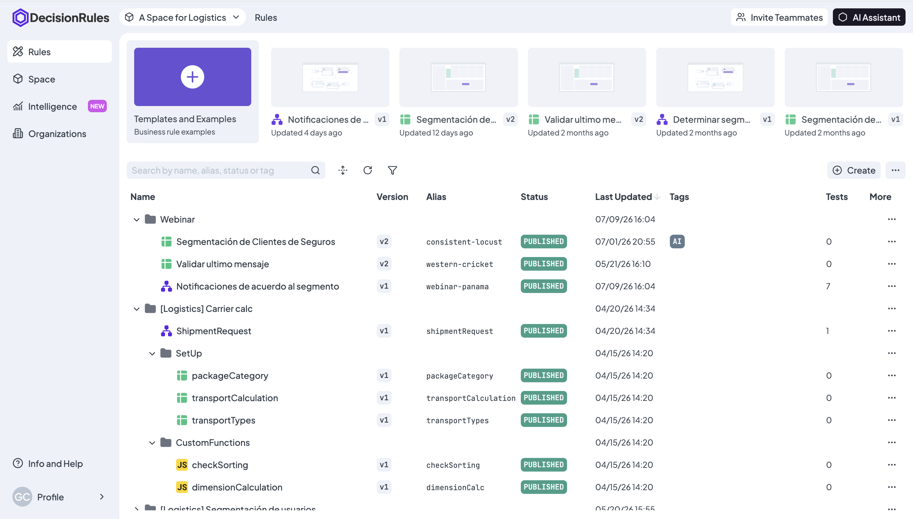

# Space Side Menu

The side menu in the main interface gives you access to four main sections:&#x20;

| SECTION           | CONTENT                                                          | PURPOSE                                                                  |
| ----------------- | ---------------------------------------------------------------- | ------------------------------------------------------------------------ |
| **Rules**         | Contains all decision rules in the Space.                        | Manage the specific rules for your current Space.                        |
| **Space**         | Contains the settings of the Space.                              | Adjust settings and features of that particular Space.                   |
| **Intelligence**  | Contains audit reports and dashboards for the rules in the Space | Analyse your rules individually or in group, create grounded strategies. |
| **Organizations** | Contains the settings to manage a set of several Spaces.         | Manage all capabilities of your Spaces and get a comprehensive overview. |

## Rules

The decision rules that you create belong to your Space. You can find your list of rules in the "Rules" section of the menu, where you can either filter the list by rule type or sort it by name or date created.

In addition, you can also organise your rules in Folder Structure, which is very similar to the file structure on your computer.


_More about the Rule List in your Space can be found_ [_<mark style="color:purple;">here</mark>_](https://docs.decisionrules.io/doc/rules/rule-list)_._


<figure><figcaption>
<mark style="color:purple;">Business Rules</mark>
</figcaption></figure>

## Space

Simply click on "Space" and explore the menu of your Space, you will be taken to their sections as you click on the different options.

### Info

General data management for your Space can be found in the Info section:

* Space Name
* Space Owner
* Your Space Role
* Number of Rules
* Number of Users
* API calls per period

<figure><figcaption></figcaption></figure>

### Access

On this section, you can manage individual users and their roles. You can either assign predefined roles, such as Admin, Editor and Reader, or create new custom roles with the  <mark style="background-color:purple;">**+ Add Role**</mark>  button. A Role contains a list of permissions granted to the user. See the [Users in Spaces](https://academy.decisionrules.io/spaces/users-in-spaces) section for more detailed information.

Invite new users to your Space using the   <mark style="background-color:purple;">**+ Invite Teammates**</mark>  option. First, select whether the teammate is a new user and assign the appropriate role. You can also manage the invitations in the bottom section of the Rules window.


_The number of users you can invite is predetermined by your Tariff Limit, which is compared to the sum of existing users and unique invitations._



If you are using an Organization, the management of access and precise roles is handled in the Organizations' settings, not in this Space menu.


### API Keys

API Keys are an integral part of your Space. These are unique keys that are used for authorization when calling rules. Particularly, from an external tool.

There are three types of API Keys in <mark style="color:purple;">DecisionRules</mark>:

* Solver API Key
* Management API Key
* Business Intelligence API Key

The <mark style="color:purple;">Solver API Key</mark> is the most important, it gives you access to send requests that activate your decision rules and return output data.


_This kind of key is used every time you solve your rule using the Test Bench. You may notice that this kind of key is generated automatically when a new Space is created. So you can build and test your rules right from the start._


<mark style="color:purple;">Management API Keys</mark> are used for read and write access to your rules. They allow you to change parameters or values in your rules, add tags or change the status of a rule. You can create a new Management API Key by clicking on the  <mark style="background-color:purple;">**+ Add API Key**</mark>  button on API Keys section.

Use <mark style="color:purple;">Business Intelligence API Keys</mark> to access Audit Logs - data about the solving of your rules. In addition to output data, you will also receive additional metadata about individual rule solves. You can create a new Business Intelligence API Key by clicking on the same  <mark style="background-color:purple;">**+ Add API Key**</mark>  button on API Keys section.

<figure><figcaption>
<mark style="color:purple;">API Keys</mark>
</figcaption></figure>

### Jobs

When an asynchronous process is required, you can run your flows and then work on something else while they are running. The Job is the ticket to check the progress of your rules. This section manages all your jobs, their descriptions, statuses and results.


To dive on the logic of asynchronous processes you can check our [Integration Flow](https://academy.decisionrules.io/rule-types/integration-flow).


### Connectors

The integration of DecisionRules with your particular database is possible through the native Connectors. If you want to access another database while making a decision, you can add a REST API or Connector section. The management of Connectors is provided in this section.

### Webhooks

Still related with asynchronous processes, this section allows you to create webhook links to receive a real-time report when your jobs are complete. Remember, webhooks are used in Integration Flows.

<figure><figcaption></figcaption></figure>

### Audit

Auditing your company's activity within the platform is possible through the **Audit** feature in your Space. All audit data generated by your team, whether changes to rules or API integrations, is kept in this section.

At the top, the main menu features two tabs: **Event Logs** and **Service Logs**. The former tracks changes made to rules, such as creation, updates, deletions, and sharing. The latter shows records of all API calls made within the Space.&#x20;

<figure><figcaption></figcaption></figure>

If you click on an Event, a right-side panel will open where you will find two additional useful features. These are based on the log data structure in DecisionRules: every Event Log entry has a parent Service Log, and one Service Log can contain multiple child Events.

* **Correlation ID:** A unique identifier shared by every record produced by a single API call.
* **Related Log:** From an Event entry, click _Inspect Service Log_ to jump to the API call that produced it. The reverse is also possible from the Service Log view.

<figure><figcaption>
<mark style="color:purple;">Audit Logs</mark>
</figcaption></figure>


For details on the different toolbar options or other functionalities in this view, our [documentation](https://docs.decisionrules.io/doc/space/events-logs-service-logs-and-notifications) offers a complete explanation.&#x20;


### Tests

A key capability in DecisionRules is **Rule Testing**. It allows you to verify rule behavior against saved scenarios. Each scenario uses a fixed input and expected output. You can rerun these same checks after any change to ensure consistency.

Individual tests belong to a single rule. At the Space level, it is possible to view all current tests by navigating to this setting.

The view has two tabs:

* **Tests:** This tab displays the structural organization of your testing assets, including individual Tests, Test Suites (groups of tests), and the Rules they are associated with.
* **Test Runs:** This tab provides a historical log of all test executions performed within the Space, allowing you to review past results and diagnose regressions.

<figure><figcaption></figcaption></figure>


For more information about the features in your Space Menu read our [documentation](https://docs.decisionrules.io/doc/space/spaces).

