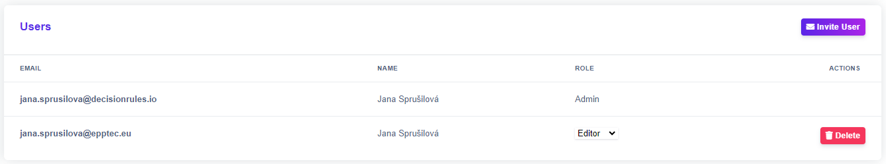
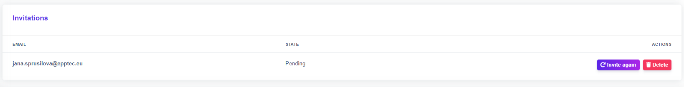

# How to invite a new User

Two heads are better than one. Invite your colleagues and teammates you want to collaborate with to your space.

## 1. You want to invite other users

Log into your account, click on the space name at the top of the page. A window will open with a list of your spaces. For the space where you want to invite other users, click on the gear symbol. Your space's settings page appears, where, in addition to inviting users, you can set their permissions according to their assigned roles.


_Note that plans have limit for number of users you can invite to your space._

_More information about Tariff Limits can be found_ [_<mark style="color:purple;">here</mark>_](broken-reference) _and <mark style="color:purple;">here</mark>._


To invite another user to your space, simply click the "Invite User" button and enter the email address of the person you want to collaborate with in the space. Select the role you want to assign to the new user and confirm with the “Invite” button. Invitation will be sent to the email address provided.

<figure><figcaption>
<mark style="color:purple;">Invite a user to you space</mark>
</figcaption></figure>

Every new invitation will appear at the bottom of the page, where you can manage them and track their status. Once a user accepts your invitation, the status of the invitation is no longer "pending" and the user is moved to "users" where you can edit their role.

To delete a pending invitation or user from the space, click on the <mark style="background-color:red;">Delete</mark> button next to the user’s name.

<figure><figcaption>
<mark style="color:purple;">Delete a user from your space</mark>
</figcaption></figure>

<figure><figcaption>
<mark style="color:purple;">Delete a pending invitation</mark>
</figcaption></figure>

## 2. You are invited

After another user invites you to the space, an invitation arrives in your inbox.

<figure><figcaption>
<mark style="color:purple;">Invitation in your inbox</mark>
</figcaption></figure>

Inside is a link that will take you to the decisionrules.io login page. After logging in, you gain access to the space you were invited to.
