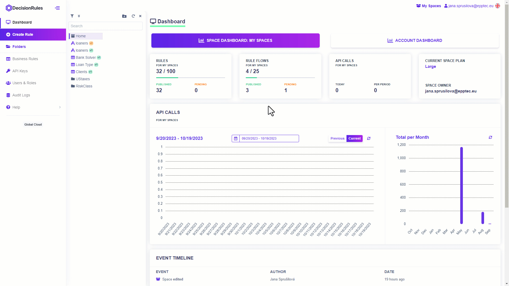
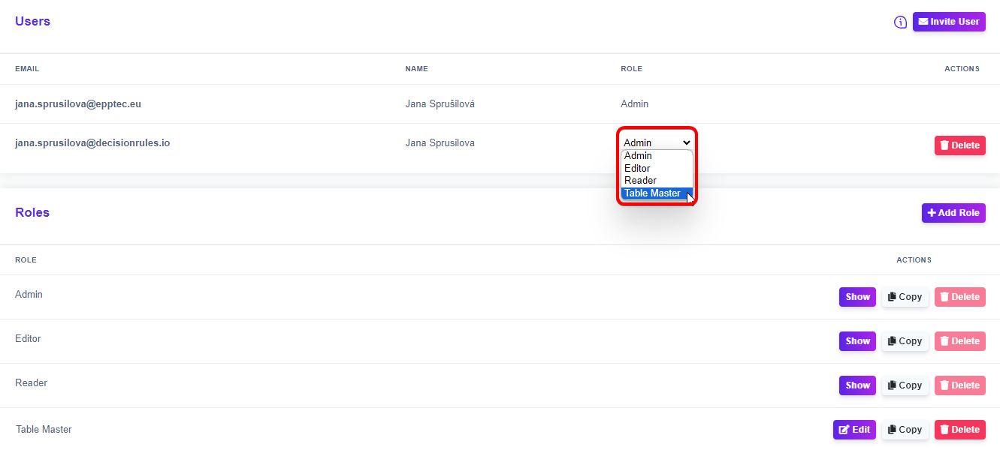

# Roles

Use Roles to assign specific permissions to users invited to your space. Create a new custom role for each user or use one of our predefined roles. You can use the predefined roles as a template that you can copy to modify just a part of the permissions to fit the needs of your team and workspace.

You can find role settings and specific permissions:

1. Under "Users and Roles" in the left sidebar menu

<figure><figcaption>
<mark style="color:purple;">Access Roles from the side menu</mark>
</figcaption></figure>

2. In the Space settings

<figure><figcaption>
<mark style="color:purple;">Access Roles from Space setttings</mark>
</figcaption></figure>

By assigning a role, you determine how individual users can interact with the space, its rules and settings. Use our predefined roles for simple permissions or create roles of your own. To assign a role to a user click on the role dropdown list next to the user’s name.

<figure><figcaption></figcaption></figure>


_You can not change the role of the space owner_


## Predefined roles

A user with the <mark style="color:purple;">Admin</mark> role is allowed to perform all activities in the space and has access to all rules and features. The <mark style="color:purple;">Editor</mark> has the same rights as the Admin except for setting up the space, managing users, and deleting API Keys. <mark style="color:purple;">Reader</mark> is allowed to just view the data and settings in each feature.

## Creating a new role

As mentioned, you can create new user roles for your project. You can create them in two ways

One way is by copying one of our predefined roles, where you can modify part of the permissions. In the example below, a new role similar to the Editor will be created, but the user will only be able to work with decision table rules.\

<figure><figcaption></figcaption></figure>

The other way is to create a completely new role where you customize the permissions as needed. For example, you can create a new role where the user is only allowed to work with Decision Trees, plus they can change the space settings.

<figure><figcaption>
<mark style="color:purple;">Creating a new role</mark>
</figcaption></figure>

If you no longer need them, you can delete any roles except the predefined ones. Click the .png>) button next to the selected role and confirm to delete the role.
