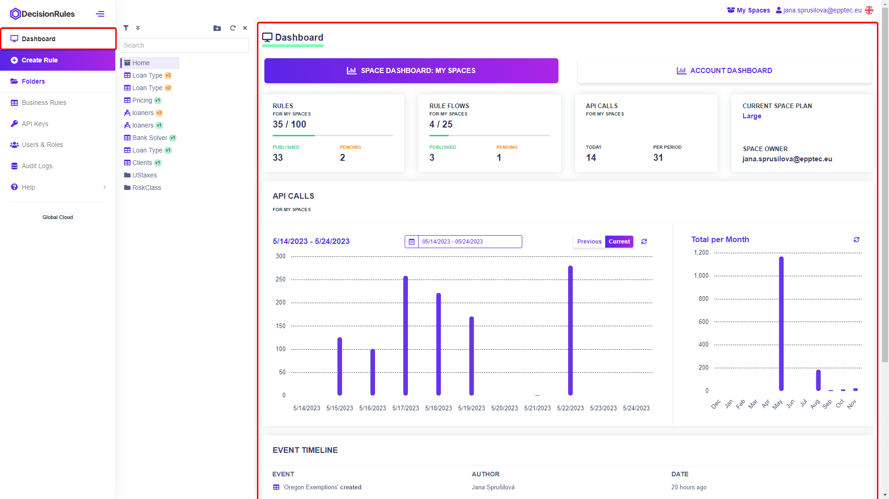
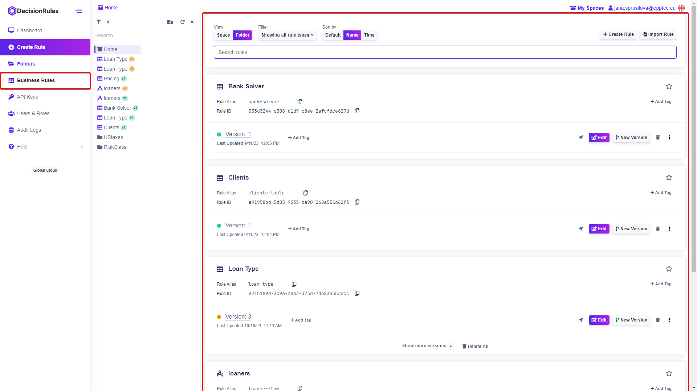
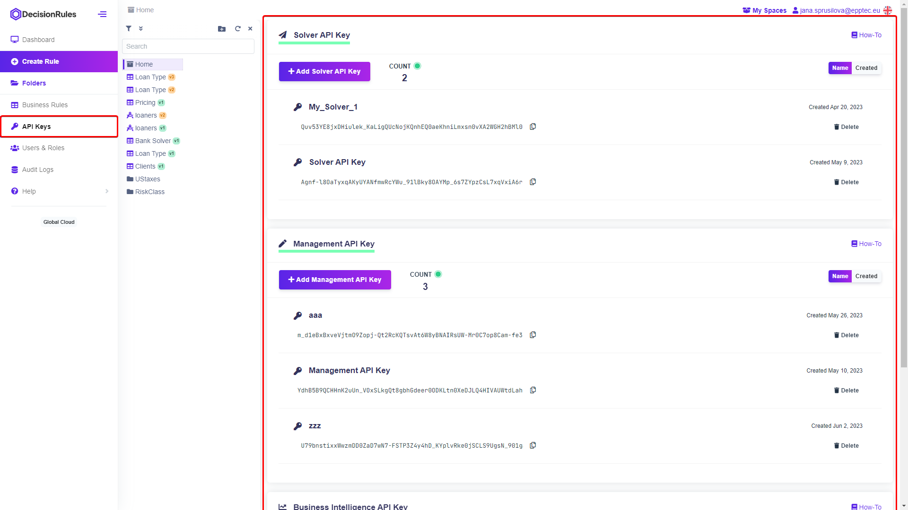
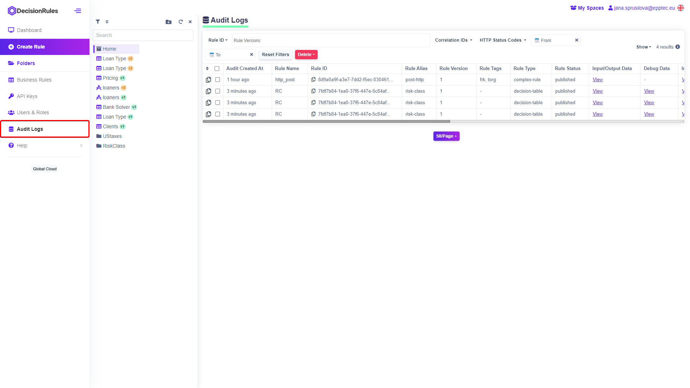

# What Is a Space

Spaces can be thought of as logically connected areas which contain individual projects or units linked by a particular logic, regardless of business department. Invite your colleagues to collaborate on individual projects, assign roles and permissions to create a seamless workflow.


_The number of Spaces and Rules you can create, the users you can invite is determined by your Subscription._


## First steps

In order to create your business rules you will need a workspace. One Space will be automatically created when you register your account, so you can start transforming your business logic into decision rules right away.

## Space description

Each Space has its own Dashboard, users and roles, its own API Keys, Audit Logs and of course Business Rules that you and other users create.

### Side Menu

The side menu gives you access to sections of your Space. Simply click on each menu item and you will be taken to that section.

**Dashboard**

The Space Dashboard provides statistics related to the Space. It displays the number of rules, API calls or for example the current Subscription Plan. The Space Dashboard also includes an Account Dashboard, which displays information and statistics related to your account. Such as the next billing date, the number of Spaces or the number of API calls.

<figure><figcaption>
<mark style="color:purple;">Space Dashboard</mark>
</figcaption></figure>

#### Business Rules

The rules you create belong in your Space. You can find your rules list in the left side menu under Business Rules, where you can filter the list by rule type or sort the list by name or date created.

In addition to the Business Rules section, you can also find your rules in the Folder Structure, which is very similar to the file structure on your computer.


_More about Sharing rules between Spaces can be found_ [_<mark style="color:purple;">here</mark>_](https://app.gitbook.com/s/-MN4F4-qybg8XDATvios/teamwork/share-between-spaces)_._


<figure><figcaption>
<mark style="color:purple;">Business Rules</mark>
</figcaption></figure>

#### API Keys

API Keys are an integral part of your Space. These are unique keys that are used for authorization when calling rules, for example from an external tool.

There are three types of API Keys in <mark style="color:purple;">DecisionRules</mark>:

* Solver API Key
* Management API Key
* Business Intelligence API Key

The <mark style="color:purple;">Solver API Key</mark> is the most important, it gives you access to send requests that evaluate your rules and return output data.


_This kind of key is used every time you solve your rule using the Test Bench. You may notice that this kind of key is generated automatically when a new Space is created. So you can build and test your rules right from the start._


<mark style="color:purple;">Management API Keys</mark> are used for read and write access to your rules. They allow you to change parameters or values in your rules, add tags or change the status of a rule. You can create a new Management API Key by clicking on the "Add Management API Key" button on API Keys section.

Use <mark style="color:purple;">Business Intelligence API Keys</mark> to access Audit Logs - data about the solving of your rules. In addition to output data, you will also receive additional metadata about individual rule solves. You can create a new Business Intelligence API Key by clicking on the "Add Business Intelligence API Key" button on API Keys section.


_Audit Logs are not created automatically. Turn on the Audit Logs feature for each rule individually in its Rule Settings._


<figure><figcaption>
<mark style="color:purple;">API Keys</mark>
</figcaption></figure>

#### Audit Logs

Collect information about solving your rules. In the Audit Logs section, you can view and manage all the logs you have created.

<figure><figcaption>
<mark style="color:purple;">Audit Logs</mark>
</figcaption></figure>

## Space Management

### Users & Roles

On this page, you can manage individual users, their roles and permissions. You can either assign predefined roles to individual users or create new custom roles.

Invite new users to your Space and manage the created invitations at the bottom section of the page.


_The number of users you can invite is predetermined by your Tariff Limit, which is compared to the sum of existing users and unique invitations._

_This practically means that users who are already invited to one of your Spaces can easily be invited to your other Spaces._


## New Space

If you need to create a new space for another project, or for testing your rules for example, simply click on the Space name next to your email in the top right corner. A list of the Spaces you are a user in will appear. At the bottom, click the <mark style="background-color:purple;">+ Space</mark> button and enter a name for the new Space. Click on the Confirm button and the new Space will be created.

## Switching between Spaces

If you are a user of several Spaces, you can switch between them freely. Click on the name of the Space next to your email in the top right corner. A list of all the Spaces you are a user in will appear. The list is divided into your own Spaces and those that someone else owns and has invited you to. In addition to the names of the Spaces, you can see small statistics in the list, such as how many rules and users the Space currently has.


_Before switching to another Space, make sure you have saved your progress._

